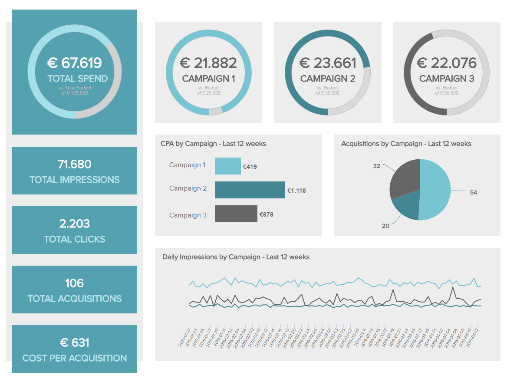

就本质而言，描绘了一幅清晰、简洁、全景的商业绩效关键领域的图景，提供了一个洞察窗口，这常常导致创造一个增强的 [商业智能战略](https://www.datafocus.ai/infos/roadmap-to-a-successful-business-intelligence-strategy) ，并最终取得持续的商业成功。

商业智能通过创建全面的数据视角逐步进入此过程，使团队能够自行生成可操作的见解。随着[在线 BI](https://www.datafocus.ai/infos/online-bi-tools)的引入，今天的公司有机会创造额外的价值，并最终获得利润。

商业智能 (BI) 的核心包括公司用于对基于业务的关键信息进行详细 [在线数据分析](https://www.datafocus.ai/infos/data-analysis-tools)的策略和技术 。BI 技术为企业运营的各个方面的历史、当前和预测性洞察，从而帮助公司就围绕财务、营销、销售、竞争对手研究、社会推广、内部流程等的活动做出明智的决策。

商业智能在我们这个数字驱动的世界中至关重要，因为它本质上给了你一种额外的感觉：一种商业愿景，它可以帮助你看到和处理远远超过表面上呈现的信息。有很多商业智能示例和见解可以证明这些观念。

为了正确看待商业智能的力量，您应该了解以下 4 个关键的见解：

- 根据 BetterBuys 上发表的一篇文章，使用分析的企业做出更好、更快决策的可能性要高出五倍。
- 对 2024 年全球商业智能软件应用市场的预测为76 亿，高于 2019 年的 149 亿。
- 到 2025 年，企业将创建和管理全球 60% 的数据。
- 85% 的商业领袖认为大数据将显着改变他们开展业务的方式，尤其是在智能的个性化潜力方面。

很明显，商业智能和促进更好的商业智能的工具对于任何在数字领域竞争的公司的未来都至关重要，无论行业或部门如何。

在这里，我们根据真实案例研究、场景、数据和发现探索 13 个 BI 示例。这些商业智能示例将展示大数据分析在现代的力量和潜力，以及它如何使您的企业更智能、更强大、更具可扩展性和更成功。

事不宜迟，这里有 13 个鼓舞人心的商业智能的例子。

### 1) 改进决策过程

BI 的主要好处之一是能够做出更好、更有价值的决策，而这个商业智能示例正是基于这个想法。

在我们的第一个业务分析示例中，一家新兴金融科技公司的 CEO 和创始人面临着改变其企业内部文化的挑战，以使所有业务数据更易于全面访问。

为了避免 IT 部门单独控制数据，从而阻止其他部门协同工作并做出有利于业务的明智决策，公司首席执行官部署了 [仪表板报告软件](https://www.datafocus.ai/infos/dashboard-reporting) ，用于自动化数据报告流程。这一决定的直接结果是，不仅公司的数据现在分散且易于消化，全面改善了决策过程，而且每周还节省了 40 小时的宝贵时间来准备报告。这是我们的业务洞察示例之一，并不止于此。

_谈到这次商业智能的胜利，这位金融科技首席执行官表示：“现在所有部门都可以访问他们自己的实时仪表板，无论他们是在办公室还是在开会。所有决策者都可以快速、轻松地访问临时分析和报告，即使在他们的平板电脑上也是如此。”_

### 2) 发现新的商业洞察力

我们的第二个业务分析示例专注于发现新的业务洞察力，这些洞察力最终可以帮助简化商业流程，从而提高生产力并提高利润。

一家有远见的在线食品订购企业希望更好地了解其客户的生命周期，同时能够以 高校、节省成本和自主的方式优化[销售报告和营销活动的能力。](https://www.datafocus.ai/infos/sales-report-kpi-examples-for-daily-reports)

通过获得对实时 [分析信息](https://www.datafocus.ai/infos/analytical-report-example-and-template) 的自助访问，公司能够简化其营销和销售活动，根据实时信息做出更好、更快的决策，并发现有助于提高客户体验水平的新见解，从而提高品牌忠诚度。

[实时仪表板](https://www.datafocus.ai/infos/live-dashboards)的使用 使这家 新兴的在线食品巨头能够通过定制的 KPI 监控所有重要的业务运营。此外，新的业务分析平台使企业能够在几天内，而不是几周甚至几个月后，应对挑战。借助[销售图表](https://www.datafocus.ai/infos/sales-graphs-and-charts-for-managers)，数据可以轻松交互并呈现在单个屏幕上。

这是我们的业务分析示例之一，它展示了商业智能的力量如何迅速影响决策过程，并为可持续增长奠定基础。

### 3) 提高生产力

今天的消费者渴望来自同行的评分、意见和评论来帮助他们做出决定，尤其是在旅行方面。也就是说，基于旅行的评级业务应该能够为其用户提供堪称典范的客户体验和支持。

在我们的第三个商业智能示例中，一家位于柏林的酒店评级公司转向商业智能分析软件，因为其数据分散，削弱了对整个公司的影响，从而降低了其生产力和服务水平。

通过推出基于 SaaS 的分析解决方案，只需最少的 IT 干预并使其在整个组织中都可以访问，这家旅游公司能够将其关键数据整合到一个可访问的空间中。

谈到现实生活中的 [大数据示例](https://www.datafocus.ai/infos/big-data-examples-in-real-life) ，这家旅游企业采取了明智的基于 BI 的举措，从而提高了内部效率，增强了部门间的凝聚力，并且新的洞察力也提高了公司的客户支持水平，超越了 CEO最大的期望。

### 4) 增加销售额

我们鼓舞人心的BI示例中的第4个示例表明，通过利用大数据分析，您可以提高销售额，这是全球所有企业的主要目标之一。通过利用完善的[销售 KPI](https://www.datafocus.ai/infos/kpi-examples-and-templates-sales)，每个企业都可以提高其底线。让我们通过使用商业智能的公司的一个顶级示例来了解这一点。

一段时间以来，一家新兴的在线零售企业一直在遭受不稳定的销售业绩的困扰，尽管付出了很多努力，但仍无法发展其战略。

在转向 BI 方法并结合 [销售仪表板](https://www.datafocus.ai/infos/dashboard-examples-and-templates-sales) 来解决这个持续存在的问题后，几乎立即发现，驱动公司销售战略的是力量，而不是数据。通过重新调整战略并深入挖掘现有数据，该公司的销售额增长了 24%，而销售人员流失率下降了 90%。更有条理的目标设定流程，以及由数据驱动的简化销售策略，确保了公司不仅继续扩大规模，而且其销售团队也持续超越目标。

### 5) 提高财务效率

毫无疑问，您的财务部门是您组织的心脏之一，因为如果没有稳定的现金流和资本投入到业务中，整个运营就会停滞不前。

也就是说，我们的第五个业务分析示例侧重于发展公司的商业智能，以识别潜在的现金流问题并提高财务效率。在这种情况下，一个疾病诊断品牌转向 [在线报告软件](https://www.datafocus.ai/infos/online-reporting) 和商业智能方法，因为尽管有一段快速增长期，但该公司的收款百分比很低，应收账款以及拒绝索赔达到了历史最高水平。

为了解决这个潜在的破坏性问题，该公司实施了一个直观的财务报告系统，使他们能够深入研究大量相关的基于账户的指标，同时还利用大量[财务图表](https://www.datafocus.ai/infos/financial-graphs-and-charts-examples)，帮助他们以直观和直接的方式查看数据。

由于这项精明的 BI 计划，很好地通过利用 [财务报告](https://www.datafocus.ai/infos/daily-weekly-monthly-financial-report-examples)的力量来诊断问题，发现索赔拒绝的来源，并在此过程中追回价值数百万美元的索赔。

### 6) 流程化内部运营

在我们的第六个分析示例中，一家快速发展的美国医疗保健公司因大量内部流程脱节和商业效率低下的困扰，而寻求 BI 的力量。

由于糟糕的数据处理、收集和分析流程导致缺乏跨部门兼容性，企业无法利用这些丰富的数字洞察优势。然而，通过与 BI 合作伙伴合作开发和部署一个将多个数据源集成到一个单一平台的统一商业智能系统，这家医疗保健公司能够以一种高效、有价值和可访问的格式分析他们的数据，使其能够做出越来越明智的决定使企业受益。这是我们的业务洞察示例之一，它向我们展示了医疗保健公司如何在更高的水平上表现。

有了更好地执行工作所需的工具，财务、计费、营销和销售等部门开始更高效地工作，不断发展内部流程并促进跨部门协作。

这个场景可能是我们最有价值的业务分析示例之一，因为它展示了 [医疗保健和商业智能中的大数据](https://www.datafocus.ai/infos/big-data-examples-in-healthcare)如何 帮助培养一种持续进化的文化，这在当今快节奏的数字世界中是一项宝贵的资产。

### 7) 节省营销费用

我们的[行业 BI 解决方案](https://www.datafocus.ai/infos/business-intelligence-bi-solutions)示例之一是仅关注公司的营销部门。一家美国电子商务公司的转化率很低，尽管他们的广告活动在传统电子表格的帮助下每天、每周和每月都受到监控。该团队分布在美国 19 个城市，他们的沟通常常很慢。当活动经理分析活动数据时，已经需要启动另一个活动。这种盲目的促销活动使他们花费了数天或数周进行合理的计划、分析和报告。在市场营销中浪费时间是一个非常重要的问题，它会耗费大量资金，最终会导致用户转化率下降。

集中式 BI 解决方案通过自动化报告流程、在活动中发生异常时向指定的活动经理发出警报以及预测未来的活动结果，每周为团队节省了 4 个工作日。

他们使用了一个与下面这个类似的[营销仪表板](https://www.datafocus.ai/infos/dashboard-examples-and-templates-marketing)：

_\*\*点击放大\*\*_

此商业智能示例显示了过去 12 周内按预算支出、总展示次数、点击次数、获取次数和广告系列的 CPA 的前 3 个广告系列。整个团队每周都会更新这个仪表板——洞察的速度很快，活动的计划也更好，美国各地的活动经理同时拥有相同的数据，因此他们的沟通和凝聚力也得到了提高。

### 8) 减少 IT 参与

一家金融公司在涉及 IT 部门的分析过程中遇到困难。他们的日常分析报告和临时报告经常迟交的，并且员工对他们收集的大量数据没有适当的了解。IT 部门因为公司各个部门的请求压得喘不过气来，当您额外添加他们需要处理的任务时，他们会因缺乏时间和效率的不足而不堪重负。

该公司希望分散决策过程，并让整个公司的业务用户能够在创建自己的报告时提取、管理和获得见解，而无需等待 IT 部门数小时甚至数天。由于他们需要结合内部和外部的多个数据源，因此商业智能解决方案是实施到他们的运营和战略管理中的合乎逻辑的一步。

该公司很快就看到了他们的报告和分析流程的改进，不仅通过自动化标准报告，而且在临时分析中，他们只需要利用搜索即可生成可操作的见解。IT 部门还可以求助于[数据库报告工具](https://www.datafocus.ai/infos/sql-reporting)，因为商业智能为跨行业和部门的业务用户提供了初级和高级功能。

这是一个业务分析示例，展示了如何减轻员工负担并创建一种可以节省时间并提高生产力的工作文化。

### 9) 连接部门

另一个真实世界的商业分析示例，以华盛顿特区的一家时尚品牌为中心，该品牌在全市拥有多家商店。

当他们需要实时结合销售和营销数据、优化促销活动以提供最佳结果，并创建客户生命周期的全面概览时，他们面临的挑战就出现了。这意味着需要管理和成功分析大量数据和 KPI， 以获得最佳结果。

他们决定在运营中实施商业智能，以便能够监控实时数据，确保员工能够访问营销和销售分析，并使用[仪表板构建器](https://www.datafocus.ai/infos/dashboard-builder)来可视化所有业务信息。

它不仅提高了客户忠诚度（我们将在另一个商业智能示例中讨论这一点），而且通过连接来自不同部门的各种数据集，公司成功将这些商业智能[KPI 工具](https://www.datafocus.ai/infos/kpi-reporting)用于各种目的，例如使促销活动与目标保持一致完成更多的销售交易。最终，销售部门可以更好地了解营销活动，营销部门可以更好地规划他们的促销活动，以适应整个客户生命周期。

### 10) 提高员工绩效

我们继续举一些公司使用商业智能的例子。一家美国公司的人力资源部门，该部门在员工开始增加加班时间时遇到问题，生产力下降，但病假天数稳步增长。这在人力资源部门是一个不寻常的情况，因为它向他们表明劳动力存在问题。但他们没有时间与每个员工交谈，因为这将花费他们数周甚至数月的时间。

经理决定利用[人力资源分析软件](https://www.datafocus.ai/infos/business-intelligence-human-resources)，为其部门利用商业智能。通过分析员工行为和绩效，该部门可以更好地了解需要解决的问题。

最突出的[人力资源 KPI](https://www.datafocus.ai/infos/kpi-examples-and-templates-human-resources)是整体劳动力效率、加班时间、缺勤率和培训成本，以查看招新员工是否有意义。在查看收集了整个部门历史和现在信息的交互式可视化数据后，经理可以清楚地得出结论：该部门人手不足，长期疲倦，公司需要新员工，否则病假天数将成倍增加，从而造成长期的业务问题。

这是我们的运营商业智能示例之一，它向我们展示了如何简化和升级劳动力管理，以便整个公司不会因为员工需要更多帮助而恶化。

他们使用了类似于以下示例的[人力资源仪表板：](https://www.datafocus.ai/infos/dashboard-examples-and-templates-human-resources)

_\*\*点击放大\*\*_

这使他们能够提高员工的生产力和整体绩效，因为分析流程使经理能够做出更明智的决策，并创建提供准确数据的定期[人力资源报告。](https://www.datafocus.ai/infos/monthly-and-annual-hr-report-templates/)这并不需要几周或几个月的时间，只需点击几下即可生成可视化。

现在，我们将重点介绍改善位于法国的制造业务的业务分析示例。

### 11) 改进制造工艺

制造业管理着大量数据，再加上对机器人和人工智能的使用增加，该行业是利用商业智能的先驱之一。

这家德国公司所面临的问题与简化生产流程有关，由于他们的设备开始出现更多问题，因此产量下降，业务问题开始出现。

通过对成功运行生产过程所需的所有[制造分析](https://www.datafocus.ai/infos/manufacturing-analytics)进行鸟瞰，该公司设法充分利用智能[数据警报](https://www.datafocus.ai/infos/business-intelligence-data-alerts)，使生产工人能够在发生异常时立即发出警报。这确保了不再有任何机器出现故障，因为在实际故障发生、生产过程停止和巨额收入损失之前，它们的维修和管理可以立即接受检查。

这是我们在现实世界中的业务分析示例之一，它重点关注人工智能，以及人工智能如何改善生产设施的维护，生产设施的维护需要尽可能低生产停机时间，这是最重要的[制造 KPI](https://www.datafocus.ai/infos/kpi-examples-and-templates-manufacturing)之一，与此同时，还有产量和费用。

现在我们来看看下一个商业智能解决方案示例，重点是零售和基于网络的电子产品供应商。

### 12) 提高客户忠诚度

在我们的商业分析案例中，第12个，是一家服装零售商，该零售商正处于其日益成功的早期阶段，正努力进一步扩大其业务规模。在经历了一年令人印象深刻的增长后，该公司的利润和客户获取水平趋于稳定，同时客户流失率也有所上升。该公司为了能够保持其发展势头，所以他决定借助外部帮助，来继续取得成功。

通过选择定制的 [零售仪表板](https://www.datafocus.ai/infos/dashboard-examples-and-templates-retail) 来显示有关其现有用户和目标受众的大量宝贵人口统计数据，并且[零售 KPI](https://www.datafocus.ai/infos/kpi-examples-and-templates-retail)侧重于提高客户价值和新客户获取，该公司开始再次扩大其受众。

该企业能够识别其优势和劣势，发现新兴趋势并准确细分受众，以确保向正确的消费者群体提供正确的个性化交易或优惠，从而显着增长其客户群并提高品牌忠诚度。

### 13) 优化库存

我们的第十三个也是最后一个运营商业智能示例（或业务分析示例）以库存或库存优化为中心。大约 46% 的 中小企业（SMB）要么不跟踪他们的库存，要么使用费力的手动方法来跟踪他们的库存，这会耗费时间、金钱和大量其他宝贵资源。

一家网络电子产品供应商，处理着一个库存不断变化的大型仓库，当它开始失去对高价值物品的追踪，并且内部损坏越来越多时，它开始感受到库存管理流程不善的影响。

在局势失控之前，该公司采用了 [决策支持系统](https://www.datafocus.ai/infos/decision-support-system) (DSS)，，这样它就可以使用所有基于库存的数据，在可持续的基础上对库存的存储、量化和管理方式做出明智的选择。除了仓库产品的盘点指标之外，这种对历史数据的详尽且令人难以置信的智能分析，不仅有助于企业跟踪其各种物品，而且还可以防止损坏并确保其所有热门产品始终保持库存。

我们生活在一个数据丰富的时代，今天明智地使用数据的人将在明天及以后获得无尽的回报。这些业务分析的例子证明BI不再仅用于特定行业的使用，它的实现受到了管理者、员工、普通业务用户和IT专家等希望使用[SQL 报表生成器](https://www.datafocus.ai/infos/sql-report-builder)并用流行语言构建分析的人的欢迎。

我们希望这些 BI 示例能够启发您改进组织的流程，并为进一步阅读，探索这 10 种基本的 [数据可视化技术](https://www.datafocus.ai/infos/data-visualization-techniques-concepts-and-methods)。

总结我们的主题，以下是企业使用的最突出的商业智能示例：

**1) 改进决策过程**

**2) 发现新的商业洞察力**

**3) 提高生产力**

**4) 增加销售额**

**5) 提高财务效率**

**6)流程化内部运营**

**7) 节省营销费用**

**8) 减少 IT 参与**

**9) 连接部门**

**10) 提高员工绩效**

**11) 改进制造工艺**

**12) 提高客户忠诚度**

**13) 优化库存**

如果您想成为自己商业智能故事的一部分，您可以试用我们的 [在线数据可视化](https://www.datafocus.ai/infos/data-visualization-tools) 软件， [试用 30天](https://www.datafocus.ai/console/)，完全免费！
