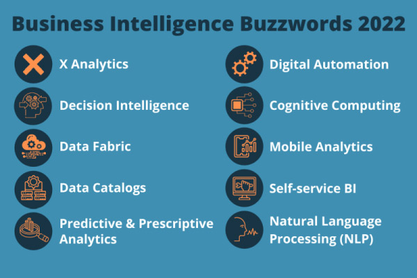
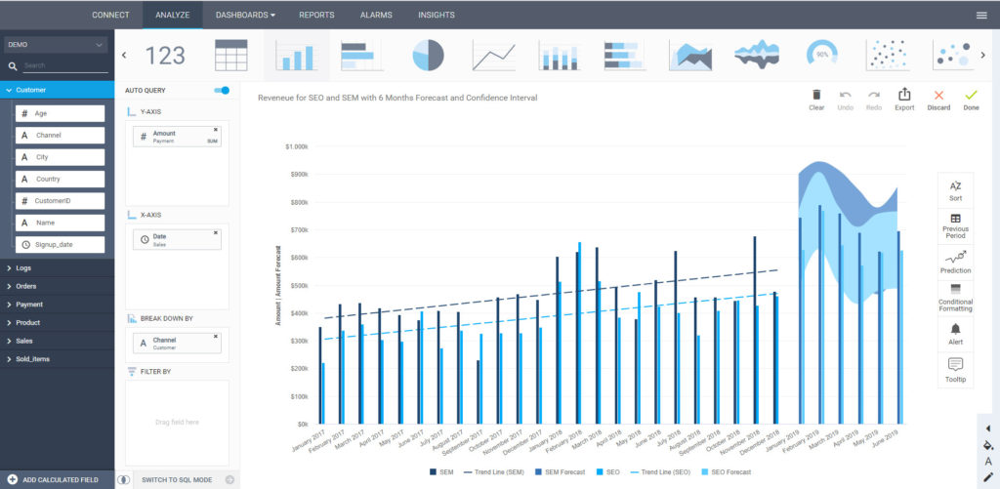

在过去十年中，商业智能发生了许多变化。每年，我们都会听到一些流行词汇进入社区、语言、市场，并推动企业和公司向前发展。这就是为什么我们准备了一份将在 2022 年占据主导地位的最突出的商业智能流行语列表。

话不多说，让我们开始吧。

## 1.X分析

X分析是 Gartner 创造的一个术语，它指的是“不同的结构化或非结构化内容，例如文本分析、视频和音频分析”等的 X 变量。“X”代表上述任何类型的分析，这将在 2022 年引发颠覆性的变化，因为许多公司仍然没有充分利用分析提供的各种可能性。但另一方面，我们看到企业通过[在线数据分析](https://www.datafocus.ai/infos/data-analysis-tools)采用了这些新机会，其中业务用户和分析师不必使用大量的 IT 技术能力，相反，无论地点或设备，他们可以实时分析数据。

这些分析解决方案是在最近十年发展起来的，随着新的强大软件进入市场，企业比以往任何时候都更加智能。例如，创新的[BI 解决方案](https://www.datafocus.ai/infos/business-intelligence-bi-solutions)创造了利用 AI 探索数据、连接点和发现新商机的机会。通过让用户在智能分析解决方案的帮助下自行分析和解释数据，公司已将分析作为其战略发展的支柱。

不仅在商业中可见，而且在整个社会中可见，公共卫生专家今年使用了多种资源来确定疾病管理的最佳解决方案，并帮助弱势群体。规划能力、寻找新疗法和控制 Covid-19 受到人工智能及其梳理数千篇研究论文、社交媒体帖子、新闻来源等能力的影响。也就是说，这是我们在2022年肯定会听到更多的数据分析术语之一。

## 2\. 决策智能

继续我们的 2022 年数据流行语列表，决策智能无疑是值得包括的一点，因为各种规模的企业都必须具备通过数据和分产生可操作见解的能力，同时做出更好的决策。近年来，公司已开始采用[自助式 BI](https://www.datafocus.ai/infos/self-service-bi-tools)等解决方案，这些方案促进决策智能路线图：观察、调查、建模、情境化和执行。这种模式在当今竞争激烈的环境中变得越来越重要，在这个环境中，无数的信息正在生成，但决策的质量可能会受到影响。

但是，让我们回到最基本的。在机器学习算法的帮助下，决策智能提供了一个“组织决策和流程的结构”。这一领域还包括描述性、诊断性和规范性分析等方法。此外，它包含 3 种类型的模型：基于人的决策、基于机器的决策和混合决策，每种模型都有自己的一组特征，其中数据是核心力量。但是，众所周知，人类无法每天处理这么多的数据，并期望获得积极的业务成果。这就是为什么人工智能支持管理人员成功[进行数据驱动决策，](https://www.datafocus.ai/infos/data-driven-decision-making-in-businesses/)并帮助他们做出准确、快速和充分知情的商业决策。

实际上，决策智能是 2022 年的商业流行语之一，它已经发展并将推动不同行业的公司发展。例如，美国的一家散货船使用 IBM优化其物流流程和运输，从而节省了数百万美元。智能决策处理方法使公司节省了不必要的驾驶并实时优化路线。另一个例子来自银行业，决策智能帮助他们将电信技术转变为更先进的技术，并节省了无数美元。他们的数据库非常大，更新会导致一系列事件，可能会影响系统的许多其他部分。由于决策智能模型的因果联系，该银行成功地对其系统进行了无缝升级。

## 3\. 数据结构

企业收集数据的来源越来越多。随着这种需求的增长，对分布在多个位置信息更快速访问的需求也在增长。这就是数据结构成为 2022 年最重要的 BI 流行语之一的原因。

Gartner将数据结构定义为“作为数据和连接过程的集成层的设计概念”。简而言之，数据结构是一种数据管理架构，旨在帮助组织访问和连接来自多种类型、位置和来源的数据，以关闭可用数据与从中提取的知识之间的缺口。这使企业能够以结构化的方式更快地访问他们的数据，包括收集、摄取和集成。这些数据还可以与内部或外部应用程序共享，并用于产品开发、销售和市场优化等诸多场景，以及预测等更高级的流程。

数据结构在 2022 年对企业如此有用的主要原因是，它将帮助企业充分挖掘现有信息的潜力。研究表明，企业只分析他们拥有的数据的[12%](https://leftronic.com/blog/big-data-statistics/)，这意味着 88% 的有价值信息被忽略了。有了数据结构战略，从普通业务用户到数据科学家，都可以快速、合规地访问改进决策所需的所有数据。这样，企业就可以在复杂的多云环境中简化数据管理、治理和自动化多个流程，同时降低成本和风险。

数据结构的目标很简单。为来自任何位置的所有可用数据提供一个单一的环境，以确保优化和统一的数据管理流程。它是关于利用人员和技术来最大化他们信息价值。使他们能够产生更具吸引力的客户体验、更好的产品和服务，并提高整体业务效率。

## 4\. 数字自动化

数字自动化的总称侧重于智能技术的兴起对跨行业的业务产生影响，提供自动化流程，使大数据和分析分析更易于使用和理解，从而获得有价值的见解。整合人工智能和智能自动化工具以解决业务挑战，同时提高生产力，将成为下一阶段数字化转型的关键点。

企业速度的重要性不必多说，而是获取适当数据的工具和方法，无论是在编制[管理报告](https://www.datafocus.ai/infos/management-reporting-best-practices-and-examples/)、确定要研究、学习和选择的[KPI 示例](https://www.datafocus.ai/infos/kpi-examples-and-templates/)，还是在特定行业利用哪些AI自动化过程，肯定会在2022年影响到各种规模的企业。

在使用神经网络警报和模式识别警报的同时利用人工智能和机器学习，可以为企业带来快速、有价值和可持续的自动化。由于像麻省理工学院这样的巨头正在投资一所价值 10 亿美元的专注于人工智能的新学院，我们将把数字自动化作为 2022 年值得关注的商业智能流行语之一。

## 5\. 数据目录

随着企业使用来自多个来源的大型数据集时，为实现高效的数据管理流程组织信息的需求变得至关重要。为此，在2022年，数据目录的使用将成为数据分析的主要流行语之一。

简单来说，数据目录是在映射过程之后完成的有组织的数据“清单”。通过使用元数据，目录可帮助企业管理数据集，并对其进行组织，以方便从任何存储位置（云存储、仓库或者任何其他位置）访问和收集相关数据。可以将其想象为全国所有图书馆的通用目录，您需要做的就是访问目录，查找所需的书籍，并访问其中的所有可用信息。这就是数据目录可以为企业做的事情。

如果使用得当，数据目录将使您能够灵活地以有效的方式从大量数据中提取见解。将所有数据集组成目录将使浏览所有信息成为一项快速任务。数据目录提供可见性，可以轻松地从任何存储位置查找和评估相关数据。

如前所述，成功的数据编目过程的基础是利用元数据。您可以使用软件来抓取您的数据库，并从您的存储位置收集所需的信息。并且，在您获得所需的元数据后，您可以构建一个字典，作为索引来识别和检索所需的信息。数据字典对于非技术用户来说也是一个有用的工具，因为它可以帮助他们在不深入的情况下识别数据的相关性。

对您的数据进行分类不仅可以使所有内容井井有条，而且还有助于帮助您遵守隐私法规。您可以设置与数据隐私相关的标签，并以兼的方式检索数据。此外，数据目录将帮助企业专注于最相关和更新的数据，这也将确保每个人都在使用高质量的数据进行报告和分析。

所有这些，再加上企业每天都在收集越来越多的数据，使得数据目录成为 2022 年最有趣的商业智能流行语之一。利用数据目录的优势可以帮助您节省成本，提高运营效率，提供更好的客户体验，并获得竞争优势。

## 6\. 预测性和规范性分析

**_预测分析：会发生什么？_**

我们在[商业智能趋势](https://www.datafocus.ai/infos/business-intelligence-trends/)文章中提到了预测分析，我们也将在这里强调它，因为我们发现它对 2022 年极为重要。预测分析是从现有数据集中提取信息以预测未来概率的实践。应用于商业，它用于分析当前和历史数据，以便更好地了解客户、产品和合作伙伴，并识别公司的潜在风险和机遇。毫无疑问，这是一项重大的技术进步，也是统计学的流行语之一，但人们认为它已经应用的程度被过分夸大了。

预测分析的商业用途是一个相对较新的事物。预测的准确性取决于用于创建模型的数据。例如，如果一个模型是基于一家公司的固有因素​​创建的，那么它不一定适用于第二家公司。同样的情况也可能发生在同一公司内的今年和明年的模型比上。方法需要考虑到这种动态性质。此外，由于当今可用的大多数预测分析功能都处于起步阶段——它们根本没有被足够多的公司在足够的数据源上使用足够长的时间——因此构建预测模型的材料非常稀缺。

最后，还有人为因素。人们做出决定背后的心理模式不能归结为简单的逻辑，而往往是复杂且不可预测的。

尽管如此，预测分析一直在稳步将自己构建成真正的自助服务能力，供企业用户使用，他们希望了解未来趋势并在整个业务运营中创建更可持续的数据驱动决策流程，2022 年将带来更多对其功能的需求和使用。

**_规范性分析：我们应该怎么做？_**

规范性分析迈出了下一步，但也分析并包括行动。这些分析使用优化和模拟算法来就可能的结果提供建议并回答：“我们应该怎么做？” 这允许用户“规定”许多不同的可能行动，并引导他们找到解决方案。规范性分析试图量化未来决策的影响，以便在实际做出决策之前就可能的结果提供建议。在最好的情况下，规范性分析不仅可以预测会发生什么，还可以预测为什么会发生。分析还提供有关将利用预测的行动的建议。我们很高兴看到规范性分析在 2022 年将如何向前发展。

## 7\. 认知计算

认知计算是 BI 领域的流行语，我们将在 2022 年更频繁地听到它。它被认为是计算和 BI 行业的新热点，它能够消化大量的结构化和非结构化数据，并转化为可管理的内容。它模仿人类的大脑，并创造了一条技术捷径，将在比以往更复杂的水平上模仿人类的信息处理。公司可以使用[BI 工具](https://www.datafocus.ai/infos/best-bi-tools-software-review-list)中的算法来识别消费者行为、趋势和模式，到 2022 年，我们将听到更多关于这个有趣流行语的成功案例。

借助自然语言处理、机器学习等技术的发展，模式识别认知计算被认为是下一代系统，它将帮助专家在医疗保健、零售、安全和电子商务等行业做出更好的决策。预计今年总收入为 873.9 亿美元，到 2026 年将达到31.6% 的复合年增长率。IBM Watson 是该领域的领导者，紧随其后的是谷歌和 Facebook，它们正在迅速构建系统来应对这一市场。

商业智能的一个例子是[数据警报](https://www.datafocus.ai/infos/business-intelligence-data-alerts)的实施。基于神经网络、模式识别和阈值警报等技术，一旦达到目标或发生业务异常，该软件会立即通知用户。这只是已经成为业务运营标准的计算可能性的开始。其他示例包括脑机接口、机器人假肢、机器人助手、自动驾驶汽车等等。这些系统已经可以说、写、读和学习；因此，这也是 2022 年将继续颠覆行业的大数据流行语之一。

## 8\. 移动分析

移动设备的使用正在成为 BI 日益增长的一个因素。随着每年有越来越多的供应商在其软件中提供移动解决方案，公司也开始实施移动数据管理，到 2022 年将会增加更多。事实上，据 Research Nester 称，到2024 年底，市场规模预计将达到 60 亿美元。这只能证明，这是一个将继续其增长和市场扩张的分析流行语之一。Research Nester 表示，虽然北美在移动分析市场中占据主要份额，但欧洲和亚太地区也将见证利润丰厚的增长。

移动性是增长的关键，这是毋庸置疑的，公司需要意识到如何实施他们可以充分利用的移动解决方案。在商业智能领域中，移动分析意味着为用户提供随时随地快速访问其数据的能力，无论身在何处，只需要连接互联网。这样，用户可以随时随地使用和他们在桌面上的相同功能来利用他们的数据，从而使移动分析成为全球企业的附加值。亚马逊、谷歌、IBM 和雅虎等巨头已被确定为主要参与者，这证实了移动设备在当今竞争激烈的数字世界中的重要性。

为什么移动设备变得无处不在？可以简单地通过平板电脑、笔记本电脑和移动设备的快速扩展和实施来解释，用户可以在这些设备上轻松访问分析，而无需亲临公司。任何人都可以使用企业帐户访问他们的分析数据，只需登录云服务，就可以即时了解性能、数字、[在线仪表板](https://www.datafocus.ai/infos/online-dashboard)和报告。移动 BI 最常见的用例是，用户通过个人帐户登录一个网页，这是一个与网页类似的 HTML5 站点，但有一些改进，例如不依赖专有标准。最后，最复杂和最昂贵的一种，即通过一款可以下载到任何移动设备的本机应用程序。

移动分析正成为公司的一项巨大优势，因为他们有机会做出更快的决策、立即回答业务问题，并对数据进行即时分析，同时为每个需要它的人提供访问权限。到 2022 年，移动业务只会继续扩大，我们还不知道具体会扩大多少。

## 9\. 自助式 BI

SQL 专家、数据科学家和系统分析师处理数据以尽可能多地提取数据的形象已经过时。BI 已经帮助许多业务用户简化了数据分析，并且自助服务[在线 BI](https://www.datafocus.ai/infos/online-bi-tools)的广泛采用使组织内的数据民主化。通过使用诸如拖放界面和[业务仪表板](https://www.datafocus.ai/infos/dashboard-examples-and-templates/)形式的交互式可视化等技术，自助式 BI 为任何想要将数据用于决策过程而无需培训的人打开了分析之门。您可以在此示例中看到自助式 BI 界面：

自动化的商业智能增加了这一过程，并使每个人都可以访问 BI：它将不再局限于一范围的专业人士，“人均数据科学家”将成为常态。现代 BI 意味着更少的专业化、更多的自动化，以及对每个人来说都是一种简单的数据分析方法。

通过创建更简化的流程来深入挖掘业务数据，生产力将会提高，并且还有助于克服技能差距。因此，到 2022 年，商业智能将变得比以往任何时候都更容易获得、更加民主化的数据。

用户独立性和自给自足是自助式 BI 的核心。公司内部信息的使用带来更多的数据去中心化和每个人的可访问性。但去中心化的程度还取决于需求和用户角色——虽然它可以帮助完成各种任务，但肯定需要考虑哪些任务以及为谁服务。在 2022 年，我们将看到越来越多的供应商开始提供公司中每个人都可以使用的工具（分析师、部门经理或普通业务用户）。

在 BI 中采用自助服务方法之前，公司需要聘请 IT 或数据科学团队来执行复杂的分析和导出数据报告。随着对更敏捷报告和分析的需求增加，这成为一个巨大的挫折。借助自助服务解决方案，所有知识水平的用户都可以使用数据，只需单击几下即可生成报告，并提取可行的见解，从而提高性能。在接下来的几年里，自助服务的水平预计会发展，专家预测明年的重要性只会上升。这是 2022 年的数据流行语之一，我们将听到更多关于它的信息，因为公司正在寻找以最有效的方式清理数据的方法。

## 10\. 自然语言处理 (NLP)

自然语言处理正在以惊人的速度改变商业智能。不仅是 NLP，还有它的所有表现形式，例如自然语言理解 (NLU)、自然语言生成 (NLG) 或自然语言交互 (NLI)。每一个都以人工智能解决方案为基础，旨在使人机交互更容易、更高效。NLP 是一个发展中的领域，吸引了来自世界各地的专家的关注。事实上，预计 2021 年 12 月，第二届自然语言处理和计算语言学国际会议将在中国北京举行。在那里，来自世界各地的专家将分享他们关于 NLP 的知识、发现和项目。

什么是真正的 NLP？从本质上讲，自然语言处理是计算机科学和人工智能的一个分支领域，它使计算机能够理解任何形式的人类交流，无论是文本还是口语。机器学习领域的基础是中复杂的计算和数学方法，这一领域发展始于近 50 年前。传统上，NLP 在促进文本分析方面取得了最大的成功，但 NLP 的应用程序将变得更容易被普通商业用户及其日常使用的 BI 访问。

商业智能正在改变我们与自然语言处理交互的方式，尤其是在大型数据集中。它使非技术用户能够在软件的帮助下执行复杂的分析，而无需 IT 团队的特殊干预。NLP 有助于揭示一些原本可能未被发现的模式，因此该行业预计到2023 年将以 18.78% 的复合年增长率增长也就不足为奇了。认知计算的通信能力不会停滞，只会增长，这将是我们在 2022 年听到更多的数据分析流行语之一。

一些采用了NLP的简单示例包括自动更正、机器翻译、机器人、虚拟助手，以及不要忘记Siri 或 Alexa 等巨头。在商业智能中，一种流行的用法是意见挖掘。大品牌使用 NLP 技术来执行社交媒体监测，以帮助分析和反映客户情绪。例如，衡量一个新产品的接受度是好是坏。数据分析的另一个常见用途是使用一种称为词干提取的方法来清理数据。本质上，这种方法使用算法将单词简化为最基本的形式。例如，如果您的数据集有单词changeing、changes、changer，它们都会变成简单的形式change。这使分析过程更加清晰和快速。综合考虑，NLP 肯定会在 2022 年成为流行语，继续在许多行业中采用它，并为各种规模的企业提供附加价值。

## 2022 年 10 大 BI 流行语！

我们希望您喜欢我们的 2022 年商业智能和分析流行语列表。毫无疑问，在未来一年里，这些流行语将会发展和改变 BI 环境。总结一下，我们为您带来我们讨论过的清单：

1. X 分析
2. 决策智能
3. 数据结构
4. 数字自动化
5. 数据目录
6. 预测性和规范性分析
7. 认知计算
8. 移动分析
9. 自助式 BI
10. 自然语言处理 (NLP)

为了让您开始自己的商业智能冒险，您可以t试用我们的软件，免费[试用](https://www.datafocus.ai/console/)30天！
