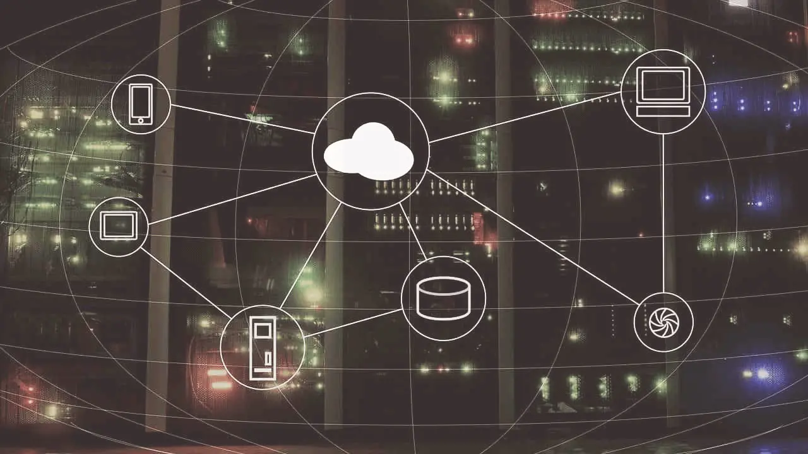

目录

[1）消除3个常见的SaaS神话](https://www.datafocus.ai/infos/the-10-essential-saas-trends-you-should-watch-out-for-in-2023#saas-myths)

[2） SaaS 关键特征](https://www.datafocus.ai/infos/the-10-essential-saas-trends-you-should-watch-out-for-in-2023#saas-characteristics)

[3） 2023 年 10 大 SaaS 趋势](https://www.datafocus.ai/infos/the-10-essential-saas-trends-you-should-watch-out-for-in-2023#saas-trends)

软件即服务 （SaaS） 正成为组织在残酷的商业环境中寻求可访问性、功能性和多功能性的越来越可行的选择。

公司可以运行SaaS软件解决方案和[在线数据分析](https://www.datafocus.ai/infos/data-analysis-tools)，而无需依赖在自己的计算机系统和数据中心上安装和运行应用程序。因此，这些令人难以置信的创新每年都在流行。

SaaS现在主导着云计算市场。Gartner 预测，到 2023 年，基于服务的云应用行业价值将达到 [1437 亿美元](https://www.linkedin.com/pulse/cloud-software-service-saas-jenny-liow/)，这一增长水平将塑造 2023 年的 SaaS 趋势。

SaaS 是一种软件分发模型，为公司提供了很大的敏捷性和成本效益，使其成为众多商业模式和行业的非常可靠的选择。由于其简单性、用户可访问性、安全性和广泛的连接性，它也在企业中很受欢迎。反过来，软件即服务平台简化了业务模式，从而实现了全面的最高效率。如今，大多数公司都在实施各种商业智能策略，转向[SaaS BI](https://www.datafocus.ai/infos/saas-bi)工具来帮助他们完成工作。

去年在很多方面都是SaaS世界突破性的一年。随着新的一年即将到来，在本文中，我们将探讨将在 10 年脱颖而出的 2023 个基本 SaaS 趋势 - 这些发展正在进一步推动 SaaS 行业的发展。

但是，在我们这样做之前，我们将讨论围绕行业的一般特征，这将有助于进一步了解 2023 年 SaaS 趋势。

很快，我们将更深入地挖掘改变游戏规则的软件即服务概念。但在查看我们 2023 年的主要 SaaS 行业趋势之前，让我们消除围绕该行业的一些常见神话。

您的机会：[想要测试专业的 SaaS 分析软件吗？](https://www.datafocus.ai/console/)立即探索我们的 14 天免费试用版，体验这些趋势！

## 消除 3 个常见的 SaaS 神话

为了让您全面全面地了解软件即服务对专业领域的影响，并获得最新 SaaS 趋势的最佳背景，在这里，我们将消除三个最常见的 SaaS 神话——认为它们被打破了：

- SaaS 工具仅提供一种应用程序：相反，SaaS 工具的形式和功能范围与当今可用的任何其他类型的软件一样多，因此您可以构建 SaaS 仪表板工具或使用基于[SaaS](https://www.datafocus.ai/infos/saas-dashboard-examples-metrics-templates-)的电子邮件营销解决方案，例如。
- SaaS不如本地应用程序健壮且安全性低：尽管Google等公司报告了一些基于SaaS的初期问题或技术问题，但这些情况在软件即服务应用程序中非常罕见 - 并且迄今为止没有记录SaaS操作的重大妥协。
- IT专业人员反对SaaS：同样，这是一个完整的神话，就像任何值得一提的颠覆性开发一样，一些IT专业人员不愿意接受SaaS作为一个概念。有大量的行业专家认为 SaaS 使他们摆脱了传统软件的日常单调乏味，同时帮助他们更好地管理自己的 IT 运营。苹果多产的创始人史蒂夫·乔布斯（Steve Jobs）的这句话从技术专业人士的角度总结了SaaS的普遍观点：“如果我能更快地访问服务器，我的电脑就不需要硬盘......相比之下，随身携带这些未连接的计算机是拜占庭式的。

## SaaS：关键特征

在我们探索 2023 年的基本软件即服务趋势之前，重要的是要考虑将 SaaS 定义为不仅是技术发展，而且是一种有效的商业模式。

- 灵活的付款方式：企业不必花费购买软件和硬件的费用。相反，他们可以选择使用各种定价结构。例如，支付模式的灵活性，即他们只为所需的资源使用付费，对于当今竞争激烈的世界中的许多组织来说很有吸引力。
- 可扩展性：基于云的 SaaS 由于其固有的可扩展性，使企业能够轻松扩展。公司可以选择他们想要的功能和选项的类型。
- 更新：SaaS提供商处理必要的软件更新并随着时间的推移开发新功能，因此企业不必在这个特定的运营领域投入大量时间。
- 可访问性：借助 SaaS，企业可以从任何数字设备和位置访问应用程序的移动性，这对于移动平台来说特别方便。此外，它易于使用且用户友好。
- 适应性：由于SaaS创新提供的可扩展性，可访问性和洞察力似乎无限，使用此类工具或平台的企业将更加适应不断变化的或不可预见的组织障碍。
- 增加协作：SaaS 开发增强了企业促进跨团队和部门协作的能力，因为文件共享的便利性，以及跨系统的明显易读和理解。
- 安全性：大多数 SaaS 模型以其企业级安全性而闻名，这是一种比许多集中式本地解决方案更全面的安全方法。在云 SaaS 中，预先存在的灾难恢复协议已经到位，以管理潜在的系统故障。这意味着无论数据泄露或系统故障如何，您[企业的数据都是可用且安全的](https://www.forbes.com/sites/forbestechcouncil/2017/05/19/the-benefits-of-moving-to-the-cloud/?sh=724ab1a74733)。

随着企业继续依赖创新[的数据发现工具和](https://www.datafocus.ai/infos/what-are-data-discovery-tools/)技术来提高生产力和效率，以及新的软件即服务趋势不断涌现，这个年轻的突破性行业只能不断发展壮大。

即使数字有些不同，但对 2023 年 SaaS 行业趋势进行的许多预测也证明了一个明显的现实：SaaS 市场将变得越来越大。事实上，据彭博社报道，公共云平台、商业服务和应用程序 （SaaS） 将在 2020 年至 2023 年间以[9%](https://www.businesswire.com/news/home/20190626005438/en/Software-Service-SaaS-Market-Worth-USD-60.36) 的复合年增长率（复合年增长率）增长，价值 603.6 亿美元。Betterbuys的一份报告显示，到2026年，美国SaaS行业的具体支出预计将达到550亿美元。根据Gartner的数据，全球公共云服务市场预计将在2023年及以后大幅增长。

事不宜迟，让我们深入了解来年SaaS行业最重要的趋势！

## 2023年10大 SaaS 趋势

现在我们已经探讨了软件即服务创新的关键特征，是时候深入了解 2023 年的主要 SaaS 趋势了。

从人工智能的引入到增强的移动优化等等，这些 2023 年的 SaaS 趋势将在新的一年到来时塑造该行业。

### 1）人工智能

我们在 SaaS 中最具影响力的第一个趋势是自主、自学的多样性。

今天，人工智能（AI）深深植根于我们社会的血管中。人工智能在我们 2023 年[的商业智能趋势](https://www.datafocus.ai/infos/business-intelligence-trends/)列表中排名前 3 位——预计在未来一年，它将掀起一些重澜。人工智能技术正迅速成为标准的SaaS行业固定装置。自主创新使各行各业的企业能够推动更好的产品、服务或内容个性化，同时更深入地了解受众的需求，数据驱动。以更少的投入获得更多回报的完美风暴意味着，借助人工智能，企业可以用更少的资源变得更高效、更智能。

人工智能技术在 2021 年取得了一些重大发展，现在，它将成为真正的游戏规则改变者，[预计到 2027 年市值将达到 7337 亿美元](https://www.grandviewresearch.com/press-release/global-artificial-intelligence-ai-market)。

在业务场景中，人工智能（以及机器学习，在许多情况下）在业务、客户和技术之间提供了高度的响应能力和交互，将基于 AI 的 SaaS 趋势 2023 推向一个新的水平。

现代软件提供商基于人工智能开发了许多功能，例如[数据警报](https://www.datafocus.ai/infos/business-intelligence-data-alerts)。借助使用最先进的神经网络进行异常检测的 AI 算法和用于模式识别的机器学习算法，这些数据警报会从趋势和模式中学习，并在发生重要事件时立即通知您。

这样，当达到预设目标或发生意外情况时，您将收到通知，使您能够持续控制您的业务。由于当必须监控如此多的 KPI 时，通常很容易忘记真正重要的内容，因此[在线报告工具](https://www.datafocus.ai/infos/online-reporting)将安全地关注您的数据并预测任何波动和变化，并在偏离轨道时提醒您。

人工智能可能会以各种方式颠覆SaaS领域，全面改善SaaS模型的关键特征。当 SaaS[与 AI 功能相结合](https://resources.unbabel.com/blog/ai-changing-saas-landscape)时，它使企业能够从其数据中获取更好的价值、自动化和个性化服务、提高安全性并补充人员能力。

人工智能将如何帮助建立一个闪亮的SaaS未来？

- 个性化：通过自然语言处理 （NLP） 等技术，软件更易于使用，这些技术可自动处理人类语音模式和语音控制。这可以跨客户服务功能进行部署，以改进自定义并更好地满足客户需求。
- 速度：支持人工智能的 SaaS 加快了内部流程和运营，使企业能够快速获得问题的答案、快速预测并加快整体响应速度。
- 安全性：由于人工智能支持的自动化以及机器学习识别模式的能力，SaaS 安全性通过内置的自我恢复快速识别和补救潜在威胁得到增强。
- 数据智能：基于 SaaS 的现代人工智能平台的复杂性意味着可以调查新兴的消费者意图、兴趣和行为，同时整合来自各种来源的宝贵数据并进行清理，并以提供最佳业务价值的方式对其进行细分。
- 集成：到 2023 年，我们可能会看到人工智能技术与更广泛的软件类型集成。因此，可以创建高度价值驱动的基础架构，为几乎所有可以想象的内部职能或部门提供业务提升价值。

### 2） 机器学习

机器学习 （ML） 是 AI 的一个子集，在 SaaS 中用于自动响应客户服务[报告](https://www.datafocus.ai/infos/customer-service-reports/)和应用程序，例如使用实时聊天机器人进行 AI 驱动的聊天操作。它还将使SaaS的入职流程自动化。由于ML建立在自主运营模型之上，新的创新将促进软件和平台的发展，使企业能够自动化重要的内部运营，而不仅仅是客户服务或体验。

ML创新的新注入将使SaaS风格的产品能够自我改进，提供一定程度的智能和运营效率，从而推动许多行业向前发展。

机器学习是软件中增长最快的部分之一，因此，它是 SaaS 2023 的热门话题。随着ML成为基于AI的软件即服务模型不可或缺的一部分，将出现越来越多的平台，这些平台将帮助各行各业的企业：

- 训练他们的软件从每项任务或交互中学习，在此过程中获得更高水平的智能和效率。
- 深入了解上下文数据和见解 - 可以帮助您在竞争中获得真正的优势。
- 通过更复杂的通信模型改善内部协作和运营。
- 通过不断调整语言、语气和实用功能，根据客户、合作伙伴或客户不断变化的需求，增强消费者沟通和服务输出。

在高度商业化的层面上，Netflix的个性化内容建议和[Waymo的](https://waymo.com/)自动驾驶汽车可以计算随着时间的推移增加的潜在风险因素或旅程阻碍，这些都是SaaS类型模型中ML的例子。随着我们进入 2023 年，这些创新将被证明只是自动化的冰山一角。

### 3） 集中分析

我们重要的第三个SaaS行业趋势是数据驱动。随着各行各业数字化转型的加速，各行各业的企业都希望通过数据来简化其组织，同时更深入地了解其客户或用户。对分析驱动的软件即服务创新的投资预计将飙升。

事实上，行业专家认为，[到 2023 年](https://www.forbes.com/sites/louiscolumbus/2019/04/07/public-cloud-soaring-to-331b-by-2023-according-to-gartner/#49871a785739)，以分析为中心的 SaaS 模型的投资和价值将增长 23.3%。在 2023 年及以后，分析将成为几乎所有基于服务的软件平台的核心组成部分，使商业智能和数据驱动的决策对于任何希望在竞争中领先的人来说都更加强大。

这种集中分析将使用户能够从单一事实点查看他们的数据，通过利用[性能仪表板](https://www.datafocus.ai/infos/performance-dashboard-examples/)等现代解决方案发现隐藏的见解，团队的每个成员都可以访问最重要的业务信息。

此外，SaaS模型的集中性将使用户能够随时从任何设备访问数据。现代[在线商业智能](https://www.datafocus.ai/infos/online-bi-tools)借助高级软件功能和在线环境实现这一目标，团队的每个成员都可以访问他们的分析。

### 4） 垂直 SaaS

我们对 2023 年 SaaS 趋势的第四个预测是垂直 SaaS。水平SaaS专注于任何部门和行业的客户，而垂直SaaS是完全可定制的，针对特定行业和供应链中的客户。

一些示例包括[医疗保健](https://www.datafocus.ai/infos/healthcare-analytics)分析软件、[零售](https://www.datafocus.ai/infos/retail-analytics)分析或现代[物流分析](https://www.datafocus.ai/infos/logistics-analytics)。希望从专业化中受益的公司发现垂直SaaS是一种具有成本效益的行业特定选项，允许他们完善某些功能的定制。

为什么垂直 SaaS 趋势会在 2023 年产生如此大的影响？

垂直SaaS提供商还能够根据客户需求和行业调整功能，并有效地满足其利基市场中的客户需求。这带来了更大的灵活性和追加销售机会，并降低了客户获取成本。

这些发展中的垂直 SaaS 趋势还提供了以下好处：

- 客户智能：使企业能够获取特定于行业的客户数据和情报，这在获得以客户为中心的见解方面起着关键作用。
- 预定义的指标和 KPI：垂直 SaaS 已经与预定义的指标、KPI 和分析集成在一起，企业可以利用这些指标、[KPI](https://www.datafocus.ai/infos/kpi-examples-and-templates-) 和分析来评估和解决日常和长期流程和绩效。
- 商业价值：软件旨在满足行业要求;因此，它为公司运营和绩效提供了更高程度的商业价值。
- 改进数据治理：垂直 SaaS 的定位是通过包含特定于行业的合规性功能来解决数据治理程序，这具有提高透明度的额外好处。
- 新的利基市场：随着对垂直SaaS解决方案的需求持续上升，令人难以置信的利基产品和解决方案将进入市场，以解决非常具体的行业痛点。最近，一款儿童保育管理应用程序推出，非常有价值，几乎立即筹集了数百万美元的资金。
- 更高的标准：来自行业特定垂直SaaS提供商的更高质量的服务将继续出现，因为每个开发人员都旨在从不断增长的人群中脱颖而出。竞争加剧将迫使垂直领域的SaaS提供商正面满足其用户的需求，这将催生大量创新的利基解决方案。

### 5） 对 API 连接的需求不断增长

多年来，API（应用程序编程接口）一直是软件开发的基本组成部分，这正是我们的第五个SaaS趋势所关注的。随着SaaS解决方案的爆炸式增长和市场的采用，出现了将它们集成到现有业务系统中的需求。一些公司可能希望将所有数据迁移到云平台，但许多公司实际上更愿意将其与现有基础架构协调以对其进行改进 - 这就是问题所在。

起初，SaaS 提供商没有提供完整的集成解决方案。这种失败使工作复杂化，并导致他们因此让客户失望。然后，他们将客户重定向到第三方，以提供特定的API，使客户能够将云解决方案集成到其现有系统中。对于SaaS开发人员来说，最好不要重新发明轮子，并依靠第三方API赢得一些宝贵的时间和资源。他们的上市时间更短，他们可以专注于其核心功能来开发差异化功能。

然而，越来越多的SaaS供应商倾向于提供更大的集成功能，而不是将客户重定向到第三方。

如果您希望投资云供应商的服务，则应事先提出以下问题以确保无缝集成：

- 提供商为我提供了哪些功能来将 SaaS 集成到我现有的业务系统中？
- 该提供商还可以集成我使用的旧系统吗？
- 在完成集成过程时，我的数据是否受到保护？

您的机会：[想要测试专业的 SaaS 分析软件吗？](https://www.datafocus.ai/console/)立即探索我们的 14 天免费试用版，体验这些趋势！

### 6） 营销技术变得触手可及

营销技术（或营销技术）是一个术语，指的是通过促进更好的洞察力、改进的流程和增强的创意能力来帮助品牌或企业改进促销活动的丰富工具。

虽然营销技术行业在大流行期间显示出放缓的迹象，部分原因是过时的做法，如复杂的特性或功能、不灵活的订阅或联系人以及糟糕的产品演示，但重大变化即将到来。

随着 SaaS 行业的扩展，越来越多的提供商将重点放在改善客户体验 （CX） 上——营销技术提供商也不例外。

许多martech SaaS提供商没有推出复杂的一刀切的企业解决方案并提供几乎无限（而且大部分是冗余）的功能，而是希望简化其界面并使其解决方案更易于访问。

这种前景的巨大转变意味着营销技术提供商将专注于做好一件事，同时使日常用户能够获得宝贵的见解或执行曾经遥不可及的任务。数据分析和BI平台以及图形设计解决方案几乎不需要或不需要技术知识，是Martech领域SaaS平台更具包容性的新章节的主要例子。

更好的品牌、更公平的定价、通过营销 BI 改善的移动体验以及更低的进入门槛都是未来几年将引领潮流的关键[营销](https://www.datafocus.ai/infos/business-intelligence-marketing)技术属性。

这是最令人兴奋的软件即服务趋势之一，可能有助于在 2023 年及以后进一步催化行业。

### 7） 迁移到 PaaS

随着软件即服务行业的发展和创新的增加，许多开发人员或提供商将在客户获取的基础上关注客户保留。

也就是说，在 2023 年，我们预计 SaaS 将进一步迁移到PaaS（平台即服务）领域——这些发展使企业能够构建自定义应用程序作为其原始服务的附加组件。Salesforce和Box等公司最近推出了以PaaS为中心的服务，以在其利基市场中占据强大的市场份额，我们预计这种SaaS趋势将在来年变得更加普遍。

2023 年 PaaS 发展的主要重点之一将是帮助初创公司和相对较新的企业快速成功扩展。

一个很好的案例研究是英国的食品配送应用程序Deliveroo之一。他们使用亚马逊的AWS工具帮助扩大其地理覆盖范围，同时通过使用大量内置平台功能获得优于直接竞争对手的优势。该应用程序的扩展计划被证明是成功的，计划在 2023 年推出更多计划。这证明了PaaS日益增长的力量。

为了正确看待这一趋势的相关性，以下是使用 PaaS 开发的三个关键优势：

- 敏捷性：增强的特性、功能和自定义能力将增强您的整体业务敏捷性，为您提供更多时间和创意空间来进行创新和专注于您的核心商业计划。Datapine 等通行费提供直观的客户保留[指标](https://www.datafocus.ai/infos/customer-retention-dashboard-metrics/)和仪表板，以便集中查看您的保留数据。
- 可扩展性：PaaS 产品本质上是健壮、灵活且可访问的，这意味着您将能够通过使用平台即服务更轻松地扩展您的业务。
- 安全性：PaaS模型的一个明显优势是安全性，因为绝大多数此类开发都会定期执行大量自动更新。

### 8）更加关注保留和流失

随着 SaaS 行业增长的不断加速，Saas 平台提供商正在研究多种方式，为平台用户提供最大价值，以提高保留率并减少客户流失。

这一发展意味着许多现有平台和新兴创新将配备完全可定制的功能和工具，提供对大量见解的访问，旨在帮助企业优化其内部流程，同时满足客户的需求。

除了扩大SaaS产品的内在价值外，对客户流失和保留的更多关注还将带来个性化的入职教程和视频，更好的移动优化以及高级平台功能通知等。

从这个角度来看，更加关注保留和流失意味着作为 SaaS 用户，您有更多的空间来发展和发展您的业务。

相反，如果您是 SaaS 提供商，通过创建解决方案，使其他企业能够创建工具和内容，例如定制教程、入门视频或高级功能，您将进入市场的一部分，这可能会导致令人难以置信的兴趣、参与度和收入增长。

这是 SaaS 趋势之一，将在 2023 年及以后塑造行业，激励和激励提供商以用户价值作为其创新、想法和运营的核心。

### 9）更多跨平台组织工具的出现

现代企业（尤其是快速扩展的大公司和企业）面临的最紧迫问题之一是数据稀释和碎片化。

根据研究，数据“分散”或碎片化是业务增长或发展的最大障碍之一，因为它会减慢组织的速度，造成混乱，并导致大量错失机会。

由于数据管理不善仍然是一个普遍存在的问题，大量新的 SaaS 提供商正在涌现，以帮助企业在一个集中位置整合、组织和访问质量数据（来自一系列来源）。

除了扩大平台集成能力外，包括文档管理系统和数字资产管理系统在内的新概念也将在 2023 年及以后崭露头角。

文档管理工具允许员工从一个视觉上易于理解且功能强大的位置（例如[在线仪表板](https://www.datafocus.ai/infos/online-dashboard)）访问来自各种来源的文件和文档。数字资产管理解决方案共享类似的模型，只是它们专注于帮助企业从各种地点或来源找到并利用其最有价值的品牌资产。

另一个快速兴起的数据碎片解决方案以集成平台即服务（iPaaS）的形式出现。这里的概念是帮助公司连接零散的数据孤岛或“管道”，并轻松连接信息点 - 因此变得更加智能、精简和成功。

iPaaS 专注于使公司能够将其数据发挥最佳功能。预计到 2025 年，该行业将达到 103 亿美元，这是未来 12 个月 SaaS 值得关注的趋势之一。

### 10） 低代码功能

软件即服务平台继续逐年扩大其覆盖范围，2023 年也不例外。特别是由于“白标”、“无代码”和“低代码”平台的出现，科技初创公司可以用较少的技术经验将其基于 SaaS 的内容带入生活。

白标

SaaS 白标将在 2023 年继续增长，这是一个基于软件的企业创建一个完全开发、测试和最终确定的平台，然后将其出售给另一家公司，以便他们可以定制并以自己的品牌销售的过程。它也可以是[嵌入式BI工具](https://www.datafocus.ai/infos/embedded-bi-tools-and-business-analytics-software/)的一部分，公司将解决方案集成到自己的应用程序中。

白标对于希望快速获得市场份额并减少物流或财务成本的初创公司来说特别有价值。如果平台或开发的框架开箱即用，初创公司可以专注于他们的价值主张、战略和品牌，而不必从头开始。在实践中，[BI仪表板软件](https://www.datafocus.ai/infos/bi-dashboard-tools)可以用作SaaS解决方案，该解决方案完全贴上白标并根据公司或部门的特定品牌需求进行调整。

低代码演进

低编码解决方案是开箱即用的数据中心（SaaS平台提供商的SaaS平台，如果你愿意的话），不会消除对开发人员或工程师的需求。

但是，为形成平台或解决方案的基础而编写的代码更少，这意味着技术人员或承包商可以花更多的时间推动创新或挥汗如雨，从而获得真正的竞争优势。

例如，您可以实施完全根据您的行业和部门进行调整的[BI 解决方案](https://www.datafocus.ai/infos/business-intelligence-bi-solutions)，并减轻您的技术团队无休止的支持任务。这样，他们将有更多时间专注于开发和工程本身，最终为您的业务带来可持续发展。

无代码 SaaS 功能将在 2023 年提高生产力并更快地将新参与者推向市场，这意味着令人兴奋的新解决方案将从数字木制品中出现。

低代码和无代码创新根据不断增长的市场需求不断发展和出现。根据一系列研究，各行各业的企业（尤其是初创公司）选择“低代码”解决方案的原因如下：

- 加速数字化转型和创新
- 减少当前的 IT 或技术积压并提高响应能力
- 减少对难以雇用的技术技能的必要性或依赖性
- 保护企业免受激进的技术流失
- 改进内部流程

作为我们名单上最全面的 SaaS 市场趋势之一，低代码革命值得在 2023 年进行监控——尤其是随着几乎每个月都有新的提供商从数字木制品中崛起。哦，预计到2030年，它的价值也将达到1870亿美元。

这是一个令人兴奋的 SaaS 行业趋势，如果您希望创建新平台或增强现有解决方案，值得拥抱。

您的机会：[想要测试专业的 SaaS 分析软件吗？](https://www.datafocus.ai/console/)立即探索我们的 14 天免费试用版，体验这些趋势！

## 2023 年增强型 SaaS 解决方案

SaaS 的这 10 个基本趋势将塑造 2023 年的格局。从去年开始，许多发展已经蔓延，有些已经发展，为全新的概念铺平了道路，这些概念将推动该行业达到令人眼花缭乱的新高度。

人工智能支持的 SaaS、先进的 ML 功能、垂直 SaaS、对 API 连接的需求和发展不断增长、思想领导力的提高、向 PaaS 的迁移、大量利基垂直产品、越来越容易访问的营销技术解决方案、广泛的低编码功能和跨平台组织创新将继续存在。这些前瞻性的概念将在未来几年改变各行各业商业智能的面貌。

最重要的是，这些鼓舞人心的 SaaS 行业趋势是该行业进步未来的承诺。当今的企业和消费者需要强大、可访问且有价值的以软件为中心的解决方案，以实现一系列任务、目标和成果。随着全球数字化转型的持续加速，SaaS 行业只会变得更强大，以为所有人提供更简单、更智能未来的构思为后盾。

随着数据继续成为依赖数字的世界中智能业务战略背后的驱动力，SaaS 选项现在被定位为跨行业越来越方便和负担得起的选择。

所有迹象都表明，对于SaaS行业的趋势来说，来年将是有趣的，引领潮流的一年。在目前正在进行的所有发展中，特别是这10个SaaS行业趋势显示出在未来一年中脱颖而出的迹象。为了让您保持头脑清醒，这里是 2023 年 10 个 SaaS 趋势的概要。

- 人工智能
- 机器学习
- 集中式分析
- 垂直 SaaS
- 对 API 连接的需求不断增长
- 营销技术变得触手可及
- 迁移到 PaaS
- 更加关注保留和流失
- 更多跨平台组织工具即将出现
- 低代码功能

有关更多数字驱动的见解，请查看我们的小型企业[大数据分析和商业智能](https://www.datafocus.ai/infos/business-intelligence-for-small-business/)入门基本指南，这是各种形式和规模的现代企业的必备读物。

是时候升级了！如果您已准备好通过数字喇叭抓住 SaaS 的未来，并从您自己的数据驱动的软件即服务解决方案中受益，请尝试我们的[14 天免费试用](https://www.datafocus.ai/console/)，并将创新、智能和增长作为 2023 年的优先事项。
