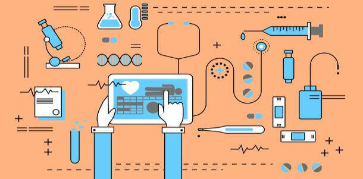
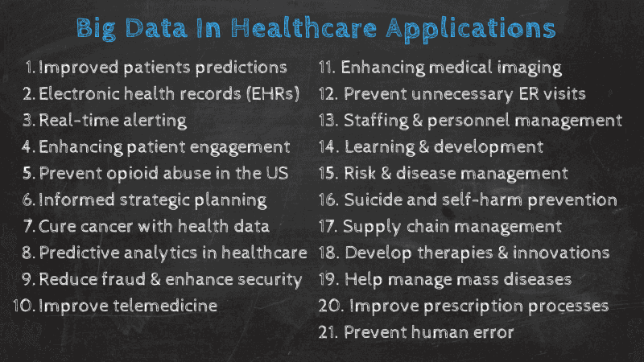
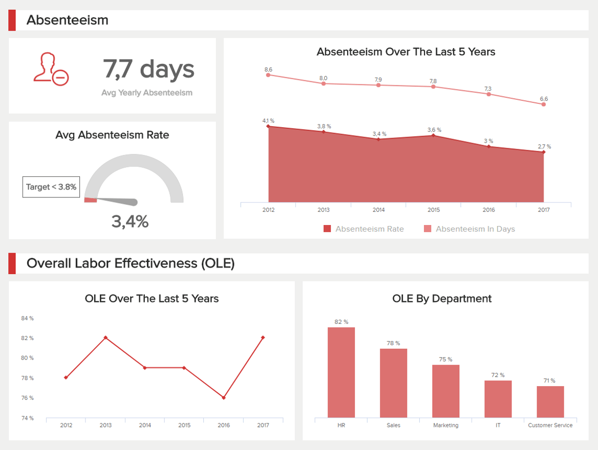
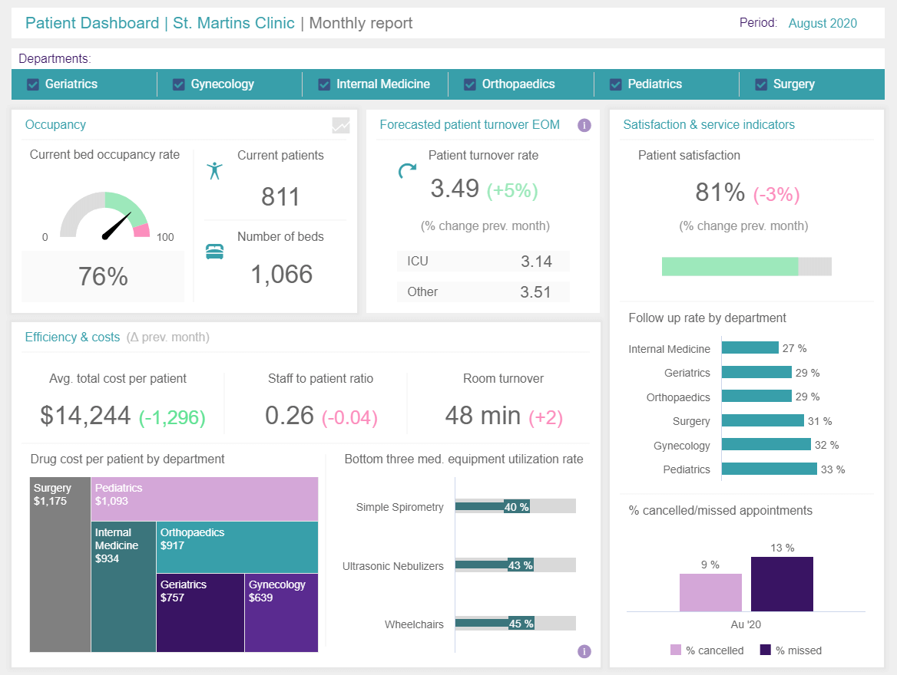

大数据改变了我们跨行业管理、分析和利用数据的方式。数据分析正在发生重大变化的一个最引人注目的领域是医疗保健。

事实上，[医疗保健分析](https://www.datafocus.ai/infos/healthcare-analytics)有可能降低治疗成本、预测流行病的爆发、避免可预防的疾病，并总体上提高生活质量。世界人口的平均寿命正在增加，这对当今的治疗方法提出了新的挑战。卫生专业人士，就像商业企业家一样，能够收集大量数据并寻找使用这些数字的最佳策略。

在本文中，我们将讨论医疗保健和医院大数据中对大数据的需求：它为什么有帮助以及如何提供帮助？采用它的障碍是什么？然后，我们将研究医疗保健领域已经存在的21个大数据例子，这些大数据可以让医疗机构受益。

但首先，让我们来看看大数据医疗保健分析的核心概念。

## 医疗保健领域的大数据是什么?

医疗保健中的大数据是一个术语，用于描述通过采用数字技术收集患者记录并帮助管理医院绩效而产生的大量信息。对于传统技术来说，这些信息太大、太复杂。

大数据分析在医疗保健中的应用有很多积极的结果，也可以挽救生命。本质上，大数据是指万物数字化所产生的海量信息，通过特定技术进行整合和分析。应用于医疗保健，它将使用人群（或特定个人）的特定健康数据，并可能有助于预防流行病、治愈疾病、降低成本等。

现在我们的寿命更长了，治疗模式也发生了变化，其中许多变化都是由数据驱动的。医生希望尽可能早地了解一个人，以便在严重疾病出现时发现它们的警告信号——早期治疗任何疾病要简单得多，而且成本更低。通过利用[医疗保健和医疗保健数据分析中的关键绩效指标](https://www.datafocus.ai/infos/kpi-examples-and-templates/healthcare)，预防胜于治疗，并且设法全面描绘某人将使保险提供量身定制的套餐。这是该行业试图解决患者数据孤岛问题的尝试：到处都是收集到的点点滴滴，并存档在医院、诊所、手术室等，无法正常通信。

也就是说，卫生专业人员可以从患者那里获得见解的来源数量不断增长。这些数据通常以不同的格式和大小出现，这给用户带来了挑战。然而，当前关注的不再是数据有多大，而是管理得有多智能。借助正确的技术，可以从以下医疗保健行业的大数据源中以智能、快速的方式提取数据：

- 患者门户
- 研究性研究
- 电子病历
- 可穿戴设备
- 搜索引擎
- 通用数据库
- 政府机构
- 付款人记录
- 人员配备时间表
- 病人候诊室

事实上，多年来，为医疗用途收集大量数据一直是昂贵且耗时的。随着当今不断改进的技术，不仅可以更轻松地收集此类数据，还可以更容易地创建全面的[医疗保健报告](https://www.datafocus.ai/infos/healthcare-report-benefits-and-examples)并将其转换为相关的重要见解，然后可用于提供更好的护理。医疗保健数据分析的目的，是使用数据驱动的发现来预测和解决问题，同时更快地评估方法和治疗，更好地跟踪库存，让患者更多地关注自己的健康中，并为他们提供工具。

## 21 大数据在医疗保健中的应用

既然您了解了大数据在医疗保健中的重要性，让我们探索 21 个真实世界的应用程序，这些应用程序展示了分析方法如何改进流程、增强患者护理并最终挽救生命。

### 1) 改善人员配备的患者预测

对于我们在医疗保健领域的第一个大数据示例，我们将看看任何轮班经理都面临的一个经典问题：在任何特定时期，我安排了多少人？如果你增加了太多的工人，你就会冒着增加不必要的劳动力成本的风险。如果工人太少，您的客户服务结果可能会很差——这对该行业的患者来说可能是致命的。

大数据正在帮助解决这个问题，至少在巴黎的几家医院是这样。英特尔的一份白皮书详细介绍了巴黎公共医院援助中心的四家医院如何使用来自各种来源的数据来预测每个设施预计有多少患者的每日和每小时预测。

其中一个关键数据集是 10 年的住院记录，数据科学家使用“时间序列分析”技术对其进行处理。这些分析使研究人员能够看到录取率的相关模式。然后，他们可以使用机器学习来找到预测未来招生趋势的最准确算法。

总结所有这些工作的成果，数据科学团队开发了一个基于 Web 的用户界面，该界面可以预测患者负荷，并通过利用[在线数据可视化](https://www.datafocus.ai/infos/data-visualization-tools)帮助规划资源分配，从而达到改善整体患者护理的目标。

### 2) 电子健康记录 (EHR)

它是大数据在医学领域中最广泛的应用。每个人都有自己的数字记录，包括人口统计、病史、过敏、实验室测试结果等。记录通过安全信息系统共享，并可供公共和私营部门的提供者使用。每条记录都由一个可修改的文件组成，这意味着医生可以随着时间的推移实施更改，而无需文书工作，也没有数据复制的危险。

当患者应该进行新的实验室检测或跟踪处方，以查看他或她是否一直遵循医生的命令时，EHR 还可以触发警告和提醒。

尽管 EHR 是一个很好的想法，但许多国家仍在努力全面实施它们。根据 HITECH 的调查显示，美国 有94% 的医院采用 EHR，取得了巨大的飞跃，但欧盟仍然落后。然而，欧盟委员会起草的一项雄心勃勃的指令应该会改变它。

凯萨医疗机构（Kaiser Permanente ）在美国处于领先地位，可以为欧盟提供一个效仿的模式。他们已经完全实施了一个名为 HealthConnect 的系统，该系统可以在其所有设施之间共享数据，并使 EHR 的使用变得更容易。麦肯锡在一份关于大数据医疗保健的报告中指出，“综合系统改善了心血管疾病的治疗效果，并通过减少就诊和实验室检测节省了大约 10 亿美元。”

### 3) 实时警报

医疗保健中数据分析的其他示例，共享一个关键功能——实时警报。在医院，临床决策支持 (CDS) 软件会在现场分析医疗数据，在医疗从业人员做出规范性决策时为他们提供建议。

然而，医生希望患者远离医院，以避免昂贵的内部治疗。这已经成为2021 年[商业智能流行语](https://www.datafocus.ai/infos/business-intelligence-buzzwords-2019)之一的趋势，并有可能成为新战略的一部分。可穿戴设备将持续收集患者的健康数据并将这些数据发送到云端。

此外，这些信息将被访问关于公众健康状况的数据库，这将使医生能够在社会经济背景下比较这些数据并相应地修改交付策略。机构和护理管理人员将使用复杂的工具来监控这一庞大的数据流，并在每次结果令人不安时做出反应。

例如，如果患者的血压升高得惊人，系统将向医生发送实时警报，医生将采取行动联系患者并采取措施降低血压。

另一个例子是 Asthmapolis，它已经开始使用带有 GPS 追踪器的吸入器，以便在个人层面和更大的人群中识别哮喘趋势。这些数据正在与来自 CDC 的数据结合使用，以便为哮喘患者制定更好的治疗计划。

### 4) 提高患者参与度

许多消费者——以及潜在的患者——已经对可以永久记录他们所走的每一步、心率、睡眠习惯等的智能设备产生了兴趣。所有这些重要信息都可以与其他可跟踪数据相结合，以识别潜在的健康风险。例如，慢性失眠和心率升高可能预示着未来患心脏病的风险。患者直接参与对其自身健康的监测，健康保险的激励措施可以促使他们过上健康的生活方式（例如：将钱还给使用智能手表的人）。

另一种方法是开发新的可穿戴设备，跟踪特定的健康趋势，并将它们传送到医生可以监控的云端。患有哮喘或血压的患者可以从中受益，变得更加独立，并减少不必要的就医次数。

### 5) 在美国防止阿片类药物滥用

我们的大数据医疗保健的第五个例子是解决美国的一个严重问题。这是一个发人深思的事实：截至今年，滥用阿片类药物在美国造成的意外死亡人数超过了道路事故，而此前，道路事故是意外死亡的最常见原因。

分析专家 Bernard Marr 在福布斯的一篇文章中写到了这个问题。情况变得如此严峻，以至于加拿大宣布阿片类药物滥用是一场“国家健康危机”，奥巴马总统在任期间拨出 11 亿美元用于制定解决该问题的方案。

大数据分析在医疗保健中的应用可能是每个人都在寻找的答案：Blue Cross Blue Shield 的数据科学家已经开始与 Fuzzy Logix 的分析专家合作来解决这个问题。通过多年的保险和药房数据，Fuzzy Logix 分析师已经能够识别出 742 个风险因素，这些因素可以高度准确地预测一人是否有滥用阿片类药物的风险。

公平地说，接触被确定为“高风险”的人并防止他们出现毒品问题是一项微妙的工作。然而，这个项目仍然为缓解一个正在摧毁许多人的生活并花费大量资金的问题带来了很大的希望。

### 6) 使用健康数据进行明智的战略规划

在医疗保健中使用大数据可以更好地了解人们的动机，从而实现战略规划。护理管理人员可以分析不同人口群体中的人的检查结果，并确定哪些因素阻碍人们接受治疗。

佛罗里达大学利用谷歌地图和免费公共卫生数据制作了针对人口增长和慢性病等多个问题的热图。随后，学者们将这些数据与最热门地区的医疗服务可用性进行了比较。从中获得的见解使他们能够审查他们的交付策略，并在问题最严重的地区增加更多的护理单位。

### 7) 大数据可能只是治愈癌症

在医疗保健中使用大数据的另一个有趣的例子是癌症登月计划。在第二个任期结束之前，奥巴马总统提出了这个计划，目标是在一半的时间内完成 10 年治愈癌症的进展。

医学研究人员可以使用大量关于癌症患者治疗计划和康复率的数据，以找到现实世界中成功率最高的趋势和治疗方法。例如，研究人员可以在与患者治疗记录相关联的生物库中检查肿瘤样本。利用这些数据，研究人员可以看到某些突变和癌蛋白如何与不同的治疗相互作用，并找到将导致更好结果的趋势。

这些数据还可以带来意想不到的好处，例如发现抗抑郁药地西帕明有能力帮助治愈某些类型的肺癌。

然而，为了使这类洞察更为可用，需要将医院、大学和非营利组织等不同机构的患者数据库连接起来。然后，例如，研究人员可以访问其他机构的患者活检报告。医疗保健中潜在的大数据使用案例之一是对临床试验患者的癌症组织样本进行基因测序，并将这些数据提供给更广泛的癌症数据库。

但是，在此过程中存在很多障碍，包括：

- 不兼容的数据系统。这可能是最大的技术挑战，因为使这些数据集能够相互连接是一项壮举。
- 患者保密问题。各机构有不同的规定，规定哪些患者信息可以在同意或不同意的情况下发布，所有这些都必须进行导航。
- 简而言之，投入大量资源和资金开发自己的癌症数据集的机构可能并不急于与他人分享，即使它可以更快地治愈。

然而，正如Fast Company 的一篇文章所述，有先例表明，在利用数据分析的力量加速癌症治疗的同时，可以解决这些类型的问题和障碍。

### 8) 医疗保健中的预测分析

我们已经连续两年将预测分析视为最大的[商业智能趋势](https://www.datafocus.ai/infos/business-intelligence-trends)之一，但潜在的应用范围远远超出了商业领域，而且在未来更为广阔。美国研究合作机构 Optum Labs 收集了超过 3000 万患者的 EHR，为预测分析工具创建了一个数据库，以改善医疗服务的提供。

医疗[在线商业智能](https://www.datafocus.ai/infos/online-bi-tools)的目标是帮助医生在几秒钟内做出数据驱动的决策，并改善患者的治疗。这对于具有复杂病史、患有多种疾病的患者特别有用。新的[BI 解决方案](https://www.datafocus.ai/infos/business-intelligence-bi-solutions)和工具也将能够进行预测，例如，预测谁有患糖尿病的风险，从而建议使用额外的筛查或体重管理。

### 9) 减少欺诈并增强安全性

一些研究表明，[93%](https://www.healthcarefinancenews.com/news/healthcare-data-breaches-will-cost-industry-4-billion-years-end-and-2020-poised-be-worse)的医疗保健组织都经历过数据泄露。原因很简单：个人数据在黑市上非常有价值且有利可图。任何违规行为都会产生严重后果。考虑到这一点，许多组织开始使用分析来识别网络流量的变化或任何其他反映网络攻击的行为，从而预防安全威胁。当然，大数据存在固有的安全问题，许多人认为使用大数据会让组织比现在更容易受到攻击。但加密技术、防火墙、杀毒软件等安全方面的进步，满足了对更高安全性的需求，带来的好处大大超过了风险。

同样，它可以以系统的、可重复的方式帮助防止欺诈和不准确的索赔。分析工具有助于简化保险索赔的处理，使患者能够在索赔中获得更好的回报，并使护理人员更快地获得报酬。例如，医疗保险和医疗补助服务中心表示，他们在短短一年内就节省了超过 2.107 亿美元的欺诈费用。

### 10) 远程医疗

远程医疗已经在市场上出现了 40 多年，但直到今天，随着在线视频会议、智能手机、无线设备和可穿戴设备的到来，它才得以全面开花。该术语是指使用技术提供远程临床服务。

它用于初级会诊和初步诊断、远程患者监测和卫生专业人员的医学教育。一些更具体的用途包括远程手术——医生可以使用机器人和高速实时数据传输进行手术，而无需与患者在同一地点。

临床医生使用远程医疗来提供个性化的治疗计划并防止住院或再次入院。如前所述，医疗保健数据分析的这种使用可以与预测分析的使用联系起来。它使临床医生能够提前预测急性医疗事件并防止患者病情恶化。

通过使患者远离医院，远程医疗有助于降低成本并提高服务质量。患者可以避免排队等候，医生也不会在不必要的咨询和文书工作上浪费时间。远程医疗还提高了护理的可用性，因为可以随时随地监控和咨询患者的状态。

### 11) 将大数据与医学影像相结合

医学成像至关重要，每年在美国进行大约 6 亿次成像程序。手动分析和存储这些图像在时间和金钱方面都很昂贵，因为放射科医生需要单独检查每张图像，而医院需要将它们存储数年。

医学成像提供商 Carestream解释了医疗保健大数据分析如何改变图像读取方式：分析数十万张图像开发的算法可以识别像素中的特定模式并将其转换为数字以帮助医生进行诊断。他们甚至更进一步，说放射科医生可能不再需要查看图像，而是分析算法的结果，这些算法将不可避免地学习和记住比他们一生中更多的图像。这无疑会影响放射科医生的角色、他们的教育和所需的技能。

### 12) 防止不必要的急诊室就诊的方法

使用大数据分析为医疗保健节省时间、金钱和能源是必要的。如果我们告诉您，在 3 年的时间里，一位女性曾 900 多次访问急诊室会怎样？这种情况在加利福尼亚州的奥克兰成为现实，一名患有精神疾病和滥用药物的妇女几乎每天都去当地的多家医院就诊。

当地急诊室之间缺乏共享医疗记录，增加了纳税人和医院的成本，并使这名妇女更难得到良好的护理，这加剧了这名妇女的问题。正如在奥克兰的 Alta Bates Summit 医疗中心协调护理管理计划的 Tracy Schrider 在Kaiser Health News 的一篇文章中所说：

_“每个人的本意都是好的。但她被转介到三家不同的药物滥用诊所和两家不同的心理健康诊所，她有两名病例i管理人员都在从事住房工作。这不仅对患者不利，而且浪费了两家医院的宝贵资源。”_

为了防止将来发生此类情况，阿拉米达县医院联合创建了一个名为 PreManage ED 的程序，该程序在急诊科之间共享患者记录。

该系统让急诊室工作人员了解以下内容：

- 如果他们正在治疗的患者已经在其他医院进行了某些检查，那么这些检查的结果是什么。
- 如果有问题的患者在另一家医院已经有一名病例管理员，请避免不必要的任务。
- 已经向患者提供了哪些建议，以便提供者可以向患者传达连贯的信息？

这是另一个很好的例子，表明医疗分析的应用是有用，也是需要的。在过去，没有 PreManage ED 的医院会一遍又一遍地重复检查，即使他们可以看到已经在另一家医院进行了检查，他们也不得不走老路，请求或发送一份长传真，以获取他们所需要的信息。

### 13) 智能人员配备和人事管理

如果没有凝聚力、敬业度高的员工队伍，患者护理将会减少，服务率将会下降，并且会发生错误。但是，借助医疗保健领域的大数据工具，可以简化您在许多关键领域的员工管理活动。通过使用正确的[人力资源分析](https://www.datafocus.ai/infos/workforce-people-hr-analytics)，时间紧迫的医疗机构可​​以在预测手术室需求的同时优化人员配备，从而简化患者护理。

很多时候，医疗机构严重缺乏流动性，员工在错误的时间分布在错误的区域。这种人事管理的不平衡可能意味着某个部门要么人满为患，要么在最重要的时候人手不足，这可能会产生工作积极性降低和缺勤率增加的风险。在这种情况下，[人力资源仪表板可能会有所帮助：](https://www.datafocus.ai/infos/dashboard-examples-and-templates/human-resources)

_\*\*点击放大\*\*_

通过数据驱动分析，可以预测在高峰时段某个部门何时需要员工，而在较安静的时段将技术人员分配到机构的其他部门。

此外，医疗数据分析将增强高级工作人员或操作人员能够在需要时提供适当水平的支持，改进战略规划，并使重要的员工和人事管理流程尽可能高效。

### 14) 学习与发展

继续我们之前的观点，在医院或医疗机构中，员工的技能、信心和能力可能意味着生与死的区别。当然，医生和外科医生在他们的专业领域都非常熟练。但大多数医疗机构都有一系列人员在一个屋檐下工作，从搬运工和行政文员到心脏专家和脑外科医生。

在医疗保健领域，软技能几乎与认证一样重要。为了保持机构以最佳能力运行，您必须鼓励持续学习和发展。通过在记录培训数据的同时全面跟踪员工绩效，您可以使用医疗保健数据分析来深入了解谁需要支持或培训以及何时需要。如果每个人都能够随着周围的变化而成长，那么您将挽救更多生命。医疗数据分析将帮助您做到这一点。

### 15) 高级风险和疾病控制

大数据和医疗保健对于解决特定慢性病患者的住院风险至关重要。它还可以帮助防止恶化。

通过深入了解药物类型、症状和就诊频率等信息，医疗机构可​​以提供准确的预防性护理，并最终减少住院人数。这种风险计算水平不仅会减少内部患者护理的支出，而且还将确保为最需要的人提供空间和资源。这是医疗保健分析如何改善和挽救人们生命的一个清晰的例子。

因此，医疗保健大数据可以提高患者护理质量，同时使组织在每个关键领域更加经济高效。

### 16) 自杀和自残预防

在全球范围内，每年有近80 万人死于自杀。此外，世界上 17% 的人口在其一生中会有自残行为。这些数字令人震惊。但是，虽然这是一个非常难以解决的领域，但医疗领域的大数据应用正在帮助人们在自杀和自残方面做出积极的改变。作为每天看到大量患者的组织，医疗机构可​​以使用数据分析来识别可能伤害自己的人。

在KP 和心理健康研究网络2018 年的一项研究中，结合 EHR 数据和标准抑郁问卷调查，准确地确定了自杀未遂风险增加的个体。利用预测算法，研究小组发现，在根据特定数据集标记的前 1% 的患者中，自杀企图和成功的可能性要高出 200 倍。凯撒永久华盛顿健康研究所（Kaiser Permanente Washington Health Research Institute ）的高级研究员、 医学博士、公共卫生硕士格雷戈里·E·西蒙（Gregory E.Simon）在谈到这个问题时解释说：

_“我们证明，我们可以将电子健康记录数据与其他工具结合使用，以准确识别自杀未遂或自杀死亡的高风险人群。”_

医疗保健行业大数据的这一重要用例确实证明了医学分析可以挽救生命这一事实。

_“如果有人对数据进行了足够的篡改（无论是否公开），它都会承认任何事情。” – Paolo Magrassi，Gartner 前副总裁兼研究总监。_

### 17) 改善供应链管理

如果医疗机构的供应链被削弱或分散，从患者护理、治疗到长期财务等一切都可能受到影响。也就是说，我们的医疗保健大数据示例的下一个重点是分析的价值，以保持供应链端到端的流畅和高效。

利用分析工具跟踪[供应链绩效指标](https://www.datafocus.ai/infos/supply-chain-metrics-and-kpis)，并就运营和支出做出准确的数据驱动决策，每年可为医院节省高达1000 万美元。

描述性和预测性分析模型都可以增强价格谈判决策、减少供应变化以及优化整个订购流程。通过这样做，医疗机构可​​以长期繁荣发展，同时为患者提供重要的治疗，而不会出现潜在的灾难性延误、障碍或瓶颈。

### 18) 开发新疗法和创新

我们的医疗保健分析示例中的下一个重点是为医疗行业更光明、更大胆的未来而努力。医疗保健领域的大数据分析有助于新疗法和创新药物的发现。通过利用历史、实时和预测指标的组合以及[数据可视化技术](https://www.datafocus.ai/infos/data-visualization-techniques-concepts-and-methods)的凝聚力组合，医疗保健专家可以识别试验或过程中的潜在优势和劣势。

此外，通过数据驱动的遗传信息分析以及患者的反应预测，医疗保健领域的大数据分析可以在开创性新药和前瞻性思维疗法的开发中发挥关键作用。医疗保健中的数据分析可以简化、创新、提供安全性并挽救生命。它给人医疗信心和清晰度，这是医疗前进的道路。

### 19) 帮助管理和追踪大规模疾病

自 2020 年初开始以来，新冠肺炎大流行已经影响了全世界数百万人。这种疾病的普遍性给卫生产业带来了挑战，他们发现自己正在努力从中吸取教训，同时控制它。在这种情况下，大数据在应对这种使世界停滞多年的、日益严重的疾病方面发挥了重要作用。

在先进的数据管理技术的支持下，卫生专家能够实时跟踪 新冠病毒的传播方式、不同条件下的变异速度以及它对世界不同经济体的影响。这是通过分析来自不同来源的海量数据集来完成的，例如医疗记录以及个人行为。例如，看看他们中有多少人待在家里、坐火车或上学，因为这会极大地影响病毒的传播速度。

与此相结合，人工智能等技术允许各种医学成像方式，如 X 射线、断层扫描、超声波等，为患者提供早期诊断，防止疾病传播。事实上，欧盟在 2020 年支持了一款名为 InferRead 的软件来促进这一过程。从本质上讲，这个由人工智能驱动的软件“分析 CT 扫描仪拍摄的肺部图像，识别冠状病毒的迹象，并评估病变。这个过程通常需要有经验丰富的医生仔细研究，但机器只需要几秒钟”。这一技术水平使欧洲各地的医院能够防止病毒传播，从而使曲线变得平坦。

### 20) 改进药物处方流程

从我们的示例中可以看出，护理专业人员随手可得的大量数据帮助彻底改变患者护理、疾病控制和许多其他方面。所以说，这一趋势也蔓延到制药行业也就不足为奇了，它有望最大限度地提高药品的价值并提高处方质量。这将我们引向医疗保健领域的下一个大数据应用。

应用这项技术的公司之一是 Express Scripts，这是一家为提供健康保险计划的客户管理药品保险的第三方机构。根据《Pharmaceutical Journal》的一份出版物，这家总部位于美国的公司收集了 8300 万患者的数据，包括患者的临床和行为特征（例如拿处方的人）以及针对该公司的推文。有了这些数据，Express Scripts 可以预测重要的情况，例如谁可能对某种药物上瘾或谁不坚持治疗。如果最近发生，公司会立即发送个性化的干预和支持，以确保人们坚持他们的处方治疗。因此，Express Scripts 表示他们将丙型肝炎患者的不依从率从 8.3% 降低到 4.8%。

### 21) 防止人为错误

医疗行业的欺诈可以被认为是各种各样的，从错误的账单到导致浪费检查的低效，甚至在一个人的医疗记录中添加不正确的信息。事实上，根据美国国家医疗保健反欺诈协会估计，仅在美国，医疗欺诈造成的经济损失就可能达到3000 亿美元。这意味着大约 10% 的总卫生支出，由于欺诈或人为错误而被浪费。然而，当涉及到人为失误和欺诈时，金钱甚至不是最大的问题，而是病人的生命受到威胁。给病人开错药或治疗可能会导致长期后果甚至死亡。

为了避免这种情况，公司利用大数据和预测来快速识别和防止欺诈或人为失误。例如，通过分析大量的处方模式，专家能够在处方错误发生之前检测到它们。剂量范围、化验和其他程序也是如此。随着时间的推移，这不仅使医生和护理人员能够信任技术来进行决策，而且还可以在提供最佳护理的同时为设施节省大量资金。

## 如何在医疗保健中使用大数据？

总而言之，我们通过这 21 个医疗保健分析示例注意到了三个关键趋势：患者体验将显着改善，包括治疗质量和满意度水平；人口的整体健康也可以在可持续的基础上得到加强，运营成本也可以显著降低。

现在让我们看一下如何在医疗保健中使用数据分析的具体示例：

### a) 应用在医院仪表板上的医疗保健大数据

下面的这个[医疗保健仪表板](https://www.datafocus.ai/infos/dashboard-examples-and-templates/healthcare)为您提供了作为医院主任或设施经理所需的概述。将医院每个部门的所有数据、出勤率、性质、产生的成本等数据集中在一个中心点，您可以全面了解您的设施，这将有助于医院的顺利运行。

_\*\*点击放大\*\*_

您可以在此处查看有关各个方面的最重要指标：在您的设施中受到欢迎的患者数量、他们停留的时间和地点、治疗费用以及急诊室的平均等待时间。这种整体视图有助于高级管理员识别潜在的瓶颈、发现趋势和随时间推移的模式，并总体评估情况。这是做出更明智决策的关键，这将提高整体运营绩效，以更好地治疗患者并拥有合适的人力资源。

### b) 患者护理大数据医疗应用

[我们的动态患者KPI 仪表板](https://www.datafocus.ai/infos/best-kpi-dashboard-examples)是医疗保健大数据分析的另一个实际应用，是一种视觉平衡工具，旨在提高跨部门的服务水平和治疗准确性。

_\*\*点击放大\*\*_

通过在一个中心位置提供完美的风暴或以患者为中心的信息，医疗机构可​​以创造各部门之间的和谐，同时简化大量重要领域的护理流程。例如，床位占用率指标提供了一个了解可能需要资源的窗口，跟踪取消或错过的预约将为高级管理人员提供他们需要的数据，以减少昂贵的病人缺席。

在这里，您将找到实时和长期提高患者护理水平所需的一切。这是一种视觉创新，可以改善各种类型的医疗机构，无论机构大小。

## 为什么我们需要医疗保健中的大数据分析

通过查看我们最有洞察力的医疗大数据应用程序列表，你应该了解到分析的使用对这个行业有多积极。如果仍然不清楚，这里我们将通过列出大数据在医疗保健中的一些好处来总结主要的要点。

如前所述，医疗保健领域对大数据的需求巨大，尤其是在美国等国家，成本不断上升的情况下。正如麦肯锡的一份报告所述：_“经过 20 多年的稳步增长，医疗保健费用现在占 GDP 的 17.6%——比美国这样规模和财富的国家的预期基准高出近 6000 亿美元。”_ 这句话表明了我们的第一个好处。

**降低成本**

如上所述，成本远高于应有的水平，并且在过去 20 年中一直在上升。显然，我们在这一领域需要一些聪明的、数据驱动的思维。当前的激励措施也在发生变化：许多保险公司正在从按服务收费计划（奖励使用昂贵且有时不必要的治疗并快速治疗大量患者）转向优先考虑患者结果的计划

正如《Freakonomics》的作者所说，经济激励很重要——优先考虑患者健康而不是治疗大量患者的激励措施是一件好事。为什么这很重要？

在之前的计划中，医疗服务提供者没有直接的动机来相互分享患者信息，这使得利用分析的力量变得更加困难。现在，他们中的更多人根据患者结果获得报酬，他们有经济动机分享可用于改善患者生活的数据，同时降低保险公司的成本。

**减少医疗差错**

医生的决定越来越以证据为基础，这意味着他们依赖大量的研究和临床数据，而不仅仅是他们的学校教育和专业意见。也就是说，人为失误的风险始终是潜在的威胁。尽管医生是训练有素的专业人员，但他们仍然是人，选择错误药物或治疗的风险可能会危及一个人的生命。通过使用大数据以及我们在这篇文章中提到的工具，当提供了错误的药物、检测、治疗或其他方法时，可以很容易地提醒专业人员并立即进行补救。随着时间的推移，这可以显着降低医疗错误率并提高医疗机构的声誉。

与许多其他行业一样，数据收集和管理规模越来越大，专业人士在这方面需要帮助。这种新的治疗态度意味着医疗机构对大数据分析的需求比以往任何时候都大，而[SaaS BI 工具](https://www.datafocus.ai/infos/saas-bi)的兴起也满足了这一需求。

**优化组织和人事管理**

虽然使用数据确保您为患者提供最佳护理至关重要，但它还可以在其他运营领域为医疗行业提供帮助。提供优质护理的一部分是确保设施以最佳状态运行，这也可以在大数据的帮助下实现。

通过使用正确的[BI 软件](https://www.datafocus.ai/infos/best-bi-tools-software-review-list)，专业人员可以收集和分析有关其组织在运营、财务以及人事管理等领域的绩效的实时数据。例如，预测分析技术可以提供有关录取率的相关信息。这些见解有助于确定人员配备计划，以满足医疗用品的需求和库存。通过这种方式，护理机构可以领先一步，确保患者获得最佳体验。

以如此直观的方式获得这种水平的洞察力，使管理人员能够将资源重定向到最需要的地方，并优化表现不佳的领域，以确保获得最佳的投资回报。

## 大数据医疗保健普及的障碍

上述几点只是大数据在医疗保健中的无数好处中的一小部分。也就是说，有好处的同时，也有局限性。为了全面了解该主题，我们现在将列出组织在其流程中实施分析时可能面临的一些障碍和医疗数据挑战。

**数据集成和存储：**在医学中使用大数据的最大障碍之一是医学数据如何在由不同地区、医院和行政部门管理的多个来源之间传播。这些数据源的集成将需要开发一个新的基础设施，所有数据提供者在该基础设施中相互协作。

**数据共享：**同样重要的是实施新的[在线报告软件](https://www.datafocus.ai/infos/online-reporting)和商业智能战略，使所有相关用户都可以连接到数据。医疗保健需要赶上其他行业，这些行业已经从基于标准回归的方法转向更面向未来的方法，如预测分析、机器学习和图形分析。这是在现代报告工具的帮助下完成的，例如[仪表板创建](https://www.datafocus.ai/infos/dashboard-creator)器，任何人只需单击几下即可轻松执行高级分析。

**安全和隐私：**安全和隐私是任何行业都关注的问题，但对健康领域来说更是如此。每天，医院和护理中心都会处理需要仔细保护的敏感患者数据。考虑到数据来自许多不同来源的事实，安全性可能会给这些类型的组织带来挑战。为避免这种情况，遵守法律法规、进行定期审计以确保一切顺利，并对员工进行数据保护最佳实践培训至关重要。

**数据素养：**在医疗保健中使用大数据涉及许多流程和工具来收集、清理、处理、管理和分析大量可用数据。这需要一定程度的知识和技能，这可能会对不熟悉这些流程的普通用户造成限制。然而，虽然数据素养可能是大数据在医疗保健领域的一大缺点，但情况已不再如此。在过去的几年中，已经开发了 各种[自助式 BI工具，目的是为任何类型的使用打开分析之门，而无需任何技术知识。](https://www.datafocus.ai/infos/self-service-bi-tools)

因此，即使这些分析服务不是你喜欢的，你也是潜在的患者，因此你应该关心新的医疗保健分析应用程序。此外，偶尔看看周围，看看其他行业是如何应对的，他们可以激励你去适应和采纳一些好的想法。

## 医疗保健中的 21 个大数据示例 - 总结

这个行业正在发生变化，与其他行业一样，大数据正在开始对其进行改造——但仍有许多工作要做。该行业慢慢采用将其推向未来的新技术，帮助其做出更明智的决策，改善运营等。简而言之，这里是我们在本文中介绍的示例的候选清单。通过医疗保健数据分析，您可以：

- 预测患者的每日收入以相应地调整人员配置
- 使用电子健康记录 (EHR)
- 使用实时警报进行即时护理
- 帮助预防美国的阿片类药物滥用
- 提高患者对自身健康的参与度
- 使用健康数据进行更明智的战略规划
- 更广泛地研究以治愈癌症
- 使用预测分析
- 减少欺诈并增强数据安全性
- 远程医疗实践
- 整合医学影像以进行更广泛的诊断
- 防止不必要的急诊就诊
- 智能人员配备和人事管理
- 学习与发展
- 高级风险和疾病管理
- 自杀和自残预防
- 改善供应链管理
- 开发新疗法和创新
- 跟踪和控制大规模疾病
- 改进处方流程
- 减少人为错误

_“世界上大多数人都会通过猜测或直觉做出决定。他们要么幸运，要么错误。” – Suhail Doshi，Mixpanel 首席执行官。_

这 21 个真实世界的医疗保健数据分析示例证明，医疗应用可以挽救生命，应该成为该领域专家的首要任务。即使是现在，数据驱动的分析也有助于早期识别和干预疾病，同时简化机构以实现更快捷、更安全和更准确的患者护理。随着技术的发展，这些宝贵的功能只会变得更强大——医疗保健的未来就在这里，它在于数据。

想让您的医疗机构更上一层楼吗？开始构建您自己的分析和报告，并通过 DataFocus 的[30天免费试用](https://www.datafocus.ai/console/)改善您的医疗数据管理！
