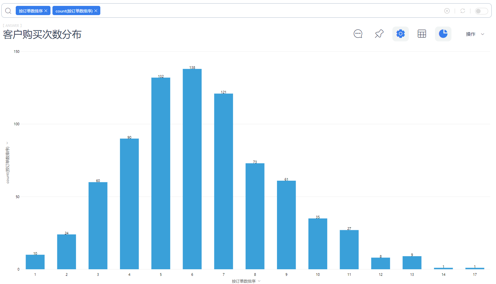

分布分析用于展现同一维度下不同个体的分布情况。例如，散点图、直方图就是分布分析的普遍应用。本章内容涵盖次数分布分析、时间分布分析、合计百分比分布分析等案例。

**1\. 次数分布分析**

商业场景：本节案例为**分析客户购买次数分布**，主要目的在于找出一段时间范围内客户购买的规律。

图1所示为**依据客户ID统计客户购买次数的分布情况**。结果呈现正态分布，即大部分客户的购买次数为5~7次，分析师可进一步分析这组客户的用户特征，获取更有价值的洞察。

**图1：依据客户ID统计客户购买次数的分布情况**

**解题思路：**

1\. 依据【客户ID】字段，计算订单数，并保存为中间表。

2\. 依据步骤1中生成的中间表，按订单数进行不重复计数（每个客户ID只进行1次计数）。

**在DataFocus中的实现步骤：**

在**DataFocus**中选择数据表，在左侧选择【客户Id】列，输入【unique\_count(订单Id）】，对客户购买次数进行非重复计数。需要提醒的是，必须使用【unique\_count】进行非重复计数，避免统计重复的订单。

完成后，将结果保存为中间表，重新选择数据表将中间表导入。在**DataFocus中**提供了中间表用来将新生成的维度快速保存下来，进行下一步操作。

选择新增公式，命名为【按订单数排序】，公式=【to\_integer(to\_string(订单数))】。保存后在搜索框中输入count(客户Id），左侧选择公式输入，工作表中立马出现了柱状图，按购买次数升序显示对应的客户数量。结果如图1所示。

**可视化实现：**

柱形图。柱形图有利于呈现客户购买次数的分布情况。
