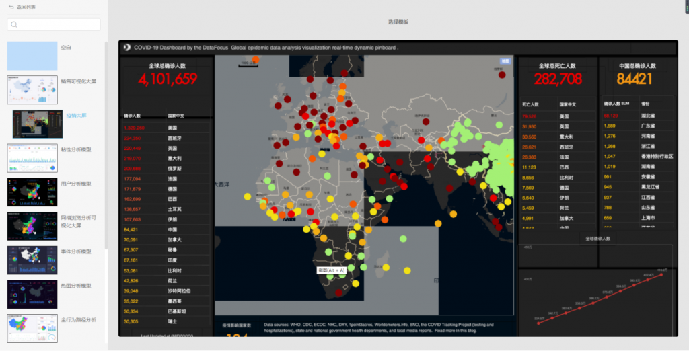

在新的一年里，我以通常的愿望和期望为一体，分享五个领域，组织应重点讨论这些领域，以培养技能，获得更大的了解，并赋予与之合作的人权力。

## **数据民主化是重中之重**

去年，我们目睹了科学界为应对COVID-19危机而开展的无数合作，这些合作建立在数据和知识以及经验和专门知识的基础上。这应该会激励组织将数据民主化放在2021年优先名单的首位。

与科学界一样，员工之间也有很多尚未开发的潜力。他们都是数据专家吗？可能不是。但是，通过允许他们访问数据和易于使用的工具来审问数据，组织可以发挥他们的集体智慧，发现见解，帮助他们做出更好的数据驱动决策。

这当然需要正确的基础设施和系统的支持，以及有效的数据治理。对于希望在这些具有挑战性的经济环境中取得成功的组织来说，数据孤岛、部门思维和政治内斗的时代必须结束。必须向所有员工开放数据访问权限。

除了有效的数据治理之外，这当然需要正确的基础设施和系统的支持。对于想要在这些具有挑战性的经济环境中取得成功的组织来说，围绕数据的数据竖井、部门思维和政治内斗的时代必须结束。对数据的访问必须对所有员工开放。

## **培养组织内部的数据素养**

为了确保数据民主化的成功，并从组织对数据和分析的投资中获取最大价值，不应再忽视数据素养。我们不会让人们在不通过考试的情况下开车。因此，让我们谨慎行事，确保员工在从数据中得出结论之前，对数据、分析和基础统计知识进行必要的培训和理解。

在组织内建立数据素养将需要资源和结构，以进行持续的培训和发展。如果企业希望保持竞争力，提高员工技能并确保他们的知识是当前的，就应该成为首要议题。

这一点至关重要，尤其是当您想将员工的分析和由此产生的见解作为做出业务决策的基础时。

从积极的方面来看，很高兴看到，根据我们的研究，85% 的组织报告已采取行动提高其业务中的数据素养水平，因为这将帮助他们在员工中培养技能，这在危机恢复和以后非常重要。

## **认真对待数据道德**

我们经常阅读和听到人工智能 （AI） 和机器学习将在自动化方面取得重大进展，并取代许多行业的工作岗位。虽然这当然是一种可能性，但算法背后仍有人类。人类带着偏见—我们都这样做——所以有可能将偏见引入我们每天接触到的算法中。

在数据道德方面，组织及其内部人员考虑自己的角色非常重要。数字是通过巧妙的分析、措辞还是可视化来看起来良好？为了避免审查，某些数据是否故意被排除在分析之外？数据道德始于看似无辜的小情况，但它关系到我们所有人。

组织必须启动并增加围绕数据道德的对话，以确保它们不会从道德角度出发，最终处于更加困难的位置。现在行动总比等待好。

## **构建有效的数据文化**

实施变革、推动新举措以及让您在业务的每一部分都能够更好地访问数据，当您拥有重视和理解数据的文化时，就容易多了。

建立有效的数据文化是组织在 2021 年设定的一个伟大的目标 - 从小而切实的步骤和活动开始，让人们参与并接受这一想法。

内部拥有数据支持机构的组织已经迈出了第一步。授权这些人围绕数据和分析这一主题制定将员工聚集在一起的想法。让他们创建每个人都可以参与的活动-使用它们来帮助组织建立一个数据素养的劳动力一路走来。

## **处理工具堆栈**

没有技术，关于数据的讨论是不完整的。许多组织能够利用2020年的挑战来评估其分析和数据工具，以努力在有限的资源下巩固和创新。找到更智能的数据处理方法并确定最有效的解决方案，将建立组织，以持续的成功和最大的分析投资回报。

当他们审查他们目前拥有的内部工具时，他们应该问问自己，他们在交付结果方面有多有效？它们是否用于正确的目的，或者是否有更合适的替代方案？

不要回避动摇旧的传统基础，看看他们是否仍然提供价值。与供应商密切合作，确保他们提供的内容是您想要和需要的，以及它是否与堆栈中的其他工具协调工作。

## **展望未来**

这五个数据决议绝不是微不足道的——它们是帮助许多行业组织制定2021年数据的极大考虑因素。如果我们能在2021年学到一件事来帮助我们，那就是我们现在既拥有了应对意外危机的技术和人类聪明才智，又利用数据来建设更美好的未来。
