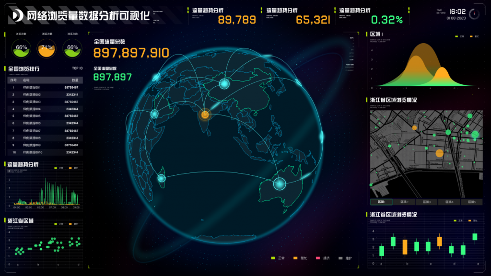

如今，公司收集的数据比以往任何时候都多。反过来，业务智能流程已经成为每个业务功能(包括供应链)的必需品。

BI工具可能会在短时间内变得复杂。考虑到供应链公司发现自己淹没在数据的海洋中，选择正确的解决方案可能变得棘手。关注一些与供应链分析的核心相关的BI功能是有意义的。

“值得注意的是，并非市场上的所有商业智能软件都将与特定的数据库集成，”数字商业图标尼尔·帕特尔在他最近的BI指南中写道。不同的平台有不同的专长，并不是所有的平台都能处理已知供应链监测网络发出的物联网信号。

假设您的软件和网络基础设施针对供应链用例进行了优化，这里有一些关键的方法，您可以使用BI来获得不同的见解。

**基于角色的建模**

供应链很难处理。许多这种复杂性来自于过程中所涉及的不同角色。

从运输的角度来看，可能会涉及物流或运输法规遵从性副总裁等角色。在交通运输之外，还存在运营规划主管、销售主管和健康与安全主管等角色。所有这些角色都有非常不同的目标，因此，智能数据建模对于为它们提供所需的信息至关重要。

VP角色可能关注于运输预算的遵守，需要流程的高级视图。交通管理人员需要基于各种因素的路线选择和场景建模的细粒度信息。传输之外的角色需要来自整个组织的数据集组合的指示板。

精明的BI部署为公司提供了跨所有这些角色和项目数据建模场景的能力。基于角色的场景建模可以帮助公司降低整个供应链的风险，并更有效地规划流程。

**数据源集成**

供应链涉及许多不同的流程，结果是不同的数据源。例如，运营分析师可能更关心机器传感器数据，而不是他们发货的状态监测数据。

今天的企业级BI平台可以将所有这些数据集成到单个环境中，并使它们可以在报告中使用。集成在供应链分析中是一件大事，因为供应链数据影响组织级计划的很多方面。这是供应链解决方案提供商一直关注的问题。

“在我看来，将我们的服务整合到客户ERP(企业资源规划)系统的基本使用已经相当令人兴奋了，”状态监测初创公司Logmore的联合创始人兼首席执行官Janne Juhala在最近的一次采访中说。“对于那些在自己的系统中建立了强大流程的公司来说，它的简便性使得报告和分析效率大大提高。”

通过集成不同的数据源，来自组织所有部分的流程就会聚集在一起。通过组合不同的数据点，管理人员可以获得对相互依赖的过程的洞察，并在他们的组织中构建效率。

**根本原因分析**

供应链经理每天要处理一系列令人震惊的问题，这些问题根据经理的职权范围有不同的含义。

例如，运输部门经理可能正在处理大量被承运人拒绝的装载标书。销售和市场经理可能正在分析数据，以弄清楚为什么生产不能跟上最近宣布的促销活动。

深入挖掘这些问题的根源对于业务成功至关重要。BI软件允许管理人员创建视觉上丰富的指示板，以暴露失败的根本原因。运输经理可以创建一个费率曲线分析，以找出为什么投标被拒绝。销售和市场主管可以使用生产分析来更好地计划销售活动。

钻入根源也暴露了与每种运输方式相关的成本。这有助于公司降低成本，增加利润。

**嵌入式分析**

供应链公司经常面临着采用新行为的挑战。员工可能仍然固守过时的任务执行方式，并且发现很难转向独立的分析包。

实现更好地采用分析的关键步骤是将它们嵌入现有的应用程序中。由于嵌入分析，员工不需要改变他们的工作流程，并且可以在他们现有的应用程序中访问见解。即使是让你的团队最大限度地减少应用界面之间不必要的切换所带来的摩擦，这也会带来很大的不同。

给她最后一英里物流账户代表接收警报有关数据的能力异常疲软,Deliveroo马里昂De Najar高管说,“团队可以将注意力集中在真正重要的,而不是被淹没的数据点,不知道去哪里看。”这就是嵌入式BI服务的强大之处。她补充说:“他们已经获得了很多效率，因为他们知道应该把精力集中在哪里。”

供应链专业人士的申请几乎是无限的。例如，发货经理可以在向给定供应商下订单之前查询承运人性能的摘要。对于经理来说，总结是他们系统的一部分。BI包在后台处理数据，并以易于理解的评级格式提供了见解。

**落地成本及采购分析**

公司需要洞察客户和产品的盈利能力。物流组成部分是计算成本时要考虑的一个重要因素。问题是，这些成本通常包括计划外的附属成本。

没有使用BI系统的公司通过在投标中使用成本来克服这个问题。然而，这些数字远非准确。一个好的BI系统可以从最终的货运审计数据中提取数字，从而合并附属成本。

供应商关系是降低成本的重要组成部分，采购分析在这方面帮助公司。可以准确地衡量供应商的性能，公司可能会发现某些供应商在负责采购或分派特定产品时表现得更好。

**强大的bi更好的洞察力**

由于公司产生的大量数据，他们可以深入了解供应链的各个方面，降低成本，提高效率，并对运营进行战略调整。智能供应链需要智能的、数据驱动的解决方案。
