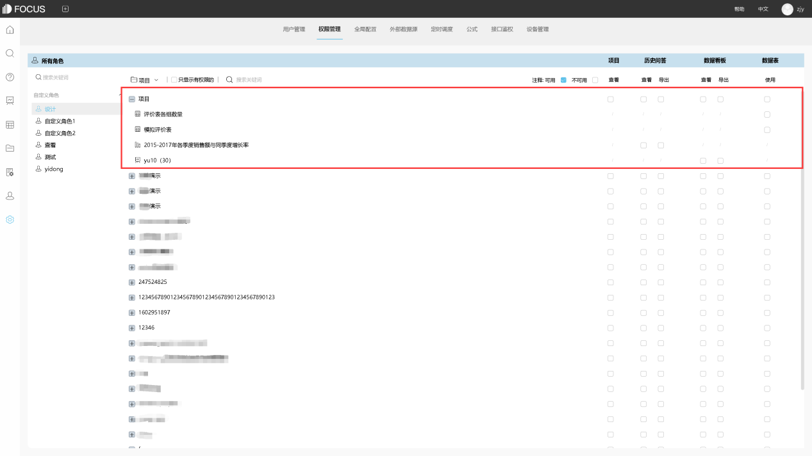

**目的：**通过对全球动物所患疫病进行分析，找出最容易发生的疫病，并研究该疫病可能会造成的危害。

**摘要：**禽流感就是指发生在动物之间的病毒性流行性感冒，容易发生在春冬季，一般不会在人与人之间传染。通过此次数据分析，可以发现在四大洲中，疫病发生次数最多的是欧洲，其次是亚洲、非洲，最少的是美洲，而在所有种类的疫病中，发生次数最多的是禽流感。主要对禽流感造成的危害进行分析，可以发现禽流感从发现到确认所需的时间基本分布在20天内；家养动物的感染次数最高的是家养的鸡；家养的鸭类虽然有极高的禽流感感染率，但是鸭类的死亡率却低于家养的鸟类；在爆发出禽流感之后，大家多会选择利用火鸡来代替家养鸡进行屠杀。

**关键词：**疫病,禽流感,危害

一、案例背景

动物疫病是指动物机体受到内在或外界致病因素和不利影响的作用而产生的一系列损伤与抗损伤的复杂过程，表现为局部、器官、系统或全身的形态变化或功能障碍。在健康情况下，动物与其环境之间保持一种动态平衡，机体的结构和功能处于正常状态；疾病则使这种平衡受到破坏。在这一过程中，若损伤大于机体的防御能力，则疾病恶化，甚至导致死亡；反之则疾病痊愈，机体康复，间或遗留某些不良后果。

禽流感则就是禽类的病毒性流行性感冒，是由A型流感病毒引起禽类的一种从呼吸系统到严重全身败血症等多种症状的传染病。禽流感容易在鸟类间流行，过去在民间称为“鸡瘟”。

此次案例分析的主要数据是全球的动物疫病数据，包括该疫病的名称，发生的地区，观察时间，疑似染疫动物种类，死亡数量，屠杀数量等。

二、案例问题

全球动物疫情报告数据的及时处理能帮助相关部门第一时间采取应对措施，能及时控制疫情。因此，本文将着重介绍最容易发生的疫病可能或造成的危害及其特点。但由于疫病数据的数据量较大，数据更新快，用EXCEL来进行操作会略显麻烦，使用Datafocus产品就可以快速处理大量数据，分析的准确性也高。

三、案例分析

（一）综合分析

1.疫情分布

首先统计四大洲曾发生的疫情数，通过饼图观察并找出发生过疫情最多的大洲。

图1 各地区疫病分布情况

从图中可以观察到，在四大洲中，疫病发生次数最多的是欧洲，其次是亚洲，非洲，最少的是美洲。

2.疫病发生次数

接下来统计各类疫病发生的次数，找出发生次数最多的疫病。利用柱状图并进行排序可以直接观察到发生次数最多的一种疫病。

图2 各类疫病的发生次数

从上图可以明显的看出，所有种类的疫病中，发生次数最多的是禽流感，其次是蓝舌病、非洲猪瘟。

（二）禽流感的危害研究

1.时间间隔

从图2可以观察到所有的动物疫病中发生次数最多的是禽流感。因此，接下来主要对禽流感所引起的一系列问题进行研究。

首先观察禽流感从观察到确认所需耗费的时间。

图3 禽流感确认所需时间

通过散点图可以直接观察到，禽流感从发现到确认所需的时间基本分布在20天内，也就是说，经过20天基本可以确定动物是否患有禽流感。

2.禽流感的血清型

其次观察何种血清型的禽流感最容易爆发，也就是说何种禽流感会对家养动物类造成较大的影响。

图4 最容易爆发禽流感的血清型

从图中可以观察到有四种血清型最容易爆发禽流感，从高到低依次是H5N8高致病性禽流感、H5N1高致病性禽流感、H7N9低致病性禽流感以及H5N6高致病性禽流感。其中，我们已知H5N1和H7N9病毒已获得感染人的能力，发现了人患禽流感的病例。

3.易感染的家养动物类型

观察何种家禽的患病概率较大，容易对人和其他家禽产生危害。

图5 家养动物中最容易感染禽流感的类型

从图中可以观察到，有三类家养动物的感染次数远高于其他物种，其中最高的是家养的鸡，其次是鸭，最后是未指明的鸟类。鸡鸭属于农村人家中基本都会饲养的家禽，经过此次研究发现，鸡鸭同样也是最容易感染禽流感的家禽，因此，饲养鸡鸭一定要注意防疫。

4.死亡家养动物数

合计所有种类的家养动物的死亡数。

图6 家养动物中感染禽流感的死亡数

结合图5，可以观察到，所有家养动物中最容易感染禽流感的也是死亡率最高的，但是家养的鸭类虽然有极高的禽流感感染率，但是鸭类的死亡率却低于家养的鸟类。

5\. 屠杀家养动物数

最后对所有种类的家养动物的屠杀数进行合计。

图7家养动物中感染禽流感的屠杀数

从图中可以看出，在发生禽流感后，屠杀家养动物数目最大的是家养的火鸡，其次是家养的鸡类。由此可以推断出，在爆发出禽流感之后，大家多会选择利用火鸡来代替家养鸡进行屠杀，但也仍有不少的家养鸡被屠杀。

（三）数据看板

最后将这7个结果图导入“全球动物疫病”数据看板中，为了使数据看板更为美观，在全局样式中选择第三个预设样本，选择“自由布局”。操作结果如下：

图8 数据看板

四、结论

综上所述，在四大洲中，疫病发生次数最多的是欧洲，其次是亚洲，非洲，最少的是美洲。而在所有种类的疫病中，发生次数最多的是禽流感。

接下来主要对禽流感造成的危害进行分析，禽流感从发现到确认所需的时间基本分布在20天内；家养动物的感染次数最高的是家养的鸡，其次是鸭，最后是未指明的鸟类；家养的鸭类虽然有极高的禽流感感染率，但是鸭类的死亡率却低于家养的鸟类；在发生禽流感后，屠杀家养动物数目最大的是家养的火鸡，其次是家养的鸡类，由此可以推断出，在爆发出禽流感之后，大家多会选择利用火鸡来代替家养鸡进行屠杀。

五、对策建议

1、结合禽流感病毒的特点和现有研究发现，目前认为，携带病毒的禽类是人感染禽流感的主要传染源。减少和控制禽类，尤其是家禽间的禽流感病毒的传播尤为重要。因此，可以将从散养方式向集中规模化养殖、宰杀处理和科学运输的转变，提高家禽和家畜的养殖、流通生物安全水平。

2、要做好动物和人的流感的监测。及时发现动物感染或发病疫情，以及环境中病毒循环的状态，尽早的采取动物免疫、扑杀、休市等消灭传染源、阻断病毒禽间传播的措施。早发现、早诊断禽流感病人，及时、有效、合理地实施病例隔离和诊治。

3、其实认真看来禽流感只是一种相对致病性比较强一点的流感病毒，一般造成严重并发症都是针对那些幼儿、体弱、年老的人，绝大部分正常健康人就算感染了也比较少造成太严重的并发症。认真做好防病意识就不用太担心，在流感季节少去人群聚集的地方去，多加强身体锻炼。
