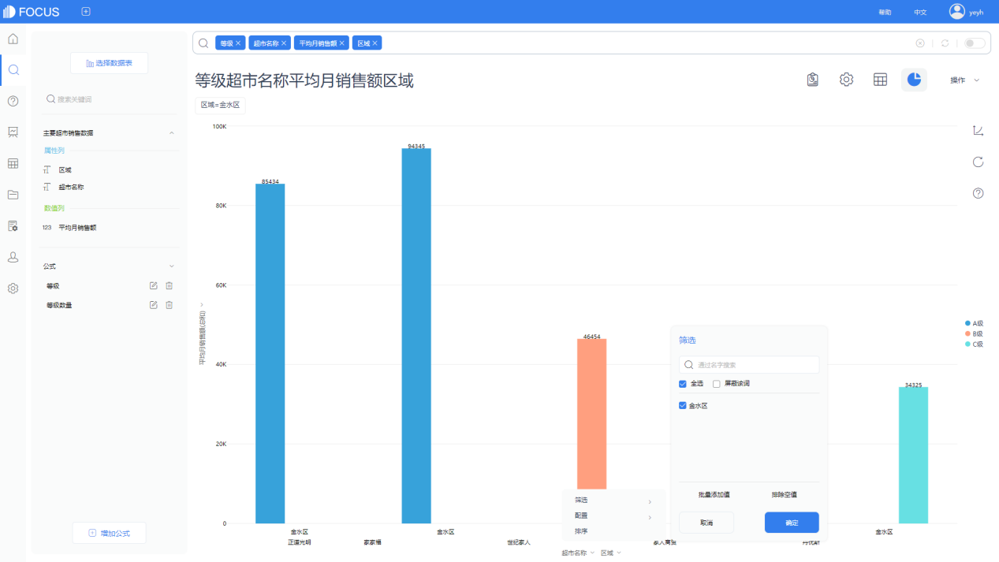

**目的：**通过对不同省市的高考录取率进行观察，找出影响录取率的因素，以及如何影响，并提出相关建议。

**摘要：**每年的这段时间都是所有高三学子最开心同样也是最担心的时间，一场高考可以改变一个人的命运，它可以轻松毁去12年的努力，也可以瞬间功成名就。通过此次数据分析，可以发现一个省的高考难度主要取决于两个方面，一是所在省份的考生人数多少，二是录取比例；其次高考难度还体现在录取分数线上；全国卷的使用存在一定的规律，而全国1卷一般适用于人口基数较大的省市，而全国2卷一般适用于人口基数较少的省市。

**关键词：**高考,录取率,影响因素

## 一、案例背景

我们生活在同样一片土地，却享受着天差地别的高考待遇。据了解，2018年的高考考生共计975万，而在这些考生中，河南、河北、山东等高考大省的一本录取率却不超10%，而北京、天津、上海的一本录取率却高达21%以上。高考大省的一本录取率本省就不高，但是其高考题的难度却是最高的，在各省学校之间一直流传着这样一句话，“你的考试成绩若是在北京一定能上一本，但是在咱们学校却只能上二本”，这也是为什么那么多家长想要在北京落户的主要原因。

此次案例分析的主要数据是2017年全国31个省市的高考情况，包括高考难度，使用的试卷，高考报名人数，一本录取率等高考录取数据，通过对各省高考录取率进行分析，发现可能影响录取率的因素，并提出相关建议。

## 二、案例问题

高考录取的数据是每年所有的考生及其家长非常关注的数据，而高考录取率容易受到各种因素的影响。本文将着重讨论影响不同省市的高考录取率的因素。但由于销售类的高考数据用EXCEL来进行操作会略显麻烦，使用Datafocus产品就可以快速处理大量数据，分析的准确性也高。

## 三、案例分析

### （一）综合分析

#### 1.高考录取率

首先计算从2000年至2017年每年的高考录取率，即为计划录取人数除以参加高考人数，大体观察这18年来的录取率的波动情况。

图1 各年全国高考录取率

从图中可以观察到，前5年的全国高考录取率基本稳定在60%左右，2005-2008年录取率有所下降，2009-2013年高考录取率迅速上升至最高值，并稳定在74%左右波动。

#### 2.各省报名人数

通过观察各年的录取率，无法实际看出不同省市之间的差距。因此，通过画出全国31个省市的四年实际高考报名人数的折线图，观察不同省份之间存在报名人数的差异。

图2 四年各省市高考报名人数变动

从上图可以明显的看出，2017年各省的高考报名人数之间有明显的差距，报名人数最多的是河南，其次是广东，山东，四川等省份。高考大省河南的高考报名人数从2015年开始一直稳步上升，但2017年山东的高考报名人数却出现了明显的下降，同样有下降的还有江苏，甘肃等省份。

### （二）2017年的高考情况分析

#### 1.报名人数影响

高考录取率的高低取决于本省的高考报名人数、高考录取人数、高考试题的难以程度等多方因素。因此，首先对2017年各省的高考报名人数与一本录取率进行整体观察。

图3 2017年全国各省市的高考报名人数和录取率

从上图可以观察到，一本录取率最高的三个省市分别是北京、天津、上海。从图中也可以明显看到北京、上海、天津的高考报名人数也是较少的；而人口大省河南，虽然河南学子的成绩都相当优异，但由于人口数量庞大，一本录取率仍处于相对较低的情况。

#### 2.试卷使用情况

通过对不同省市使用的试卷情况进行研究，发现试卷难度对高考录取率的影响。

图4 各省市高考试卷使用情况

从图中可以观察到，各省市的高考试卷可以分为五种类型，分别是全国1卷，2卷，3卷，自主命题，半自主命题，其中使用最多的试卷是全国2卷，其次是全国1卷，最少的是半自主命题。

图5 下钻自主命题省市

对自主命题的省市进行下钻，可以发现自主命题的省市分别是上海、北京、天津、江苏和浙江。通过对网上资料的阅读，可以发现自主命题的五大省市之中，江苏和浙江的教育水平在全国是名列前茅的，同样高考的试题也可以说是非常难，这也是导致江苏、浙江的录取率偏低的原因之一。

#### 3.常住人口的影响

对使用全国卷的省市进行观察，通过气泡图发现该省常住人口对高考报名人数的影响。

图6 全国卷使用情况

图中气泡的大小代表该省的常住人口数多少。从图中可以观察到，全国卷的使用也具有一定的规律，常住人口较多的省市高考报名人数也越多，而全国1卷一般适用于人口基数较大的省市；常住人口较少的省市高考报名人数也越少，而全国2卷一般适用于人口基数较少的省市。

#### 4.全国1卷录取率

对使用全国1卷的省市的一本录取率进行分析。

图7 使用全国1卷的一本录取率

从图中可以看出，录取率最高的是福建省，其次是湖北省，最低的是河南省。结合图6，可以发现，在试卷难度一样的情况下，报名人数对录取率存在巨大的影响。

#### 5.本科计划率

除了试卷难度、高考报名人数，录取比例也是影响一本录取率的重要因素之一。通过计算不同省市的本科计划率，对比不同省市的差距。

图8 不同省市的计划本科率

从图中可以看出自主命题的省市有较高的录取比例，其次是使用全国2卷的省市，录取比例最低的是使用全国3卷的省市。

#### 6.全国2卷录取率

通过图8的录取比例的计算，观察到使用全国2卷的省市的录取比例仅次于自主命题，因此筛选使用“全国2卷”的省市，观察其录取率情况。

图9 使用全国2卷的一本录取率

从图中可以看出，录取率最高的是宁夏，其次是辽宁，最低的是重庆。结合图6，可以发现，使用全国2卷的省市基本都是高考人数较少的西北部地区，最高的录取率也仅有11.5%。

### （三）数据看板

最后将这8个结果图导入“全国各省市高考录取情况”数据看板中，为了使数据看板更为美观，在全局样式中选择第三个预设样本，选择“自由布局”。操作结果如下：

图10 数据看板

## 四、结论

综上所述，一个省的高考难度主要取决于两个方面，一是所在省份的考生人数多少，如果考生多，竞争就非常激烈，要想进入名校，必须拼了老命；二是录取比例，这才是更要命的，如果大学在某个省份招生人数多，录取比例相对就高，考大学就容易些，考生的机会也更多。

其次高考难度还体现在录取分数线上。同样的试卷，有的省份分数线高，而有的省却创下新低，这种现象是存在的。

全国卷的使用也具有一定的规律，常住人口较多的省市高考报名人数也越多，而全国1卷一般适用于人口基数较大的省市；常住人口较少的省市高考报名人数也越少，而全国2卷一般适用于人口基数较少的省市。

通过此次分析可以将所有高考考生分成五类：一类是高考自主命题，且高考试卷难度较低；第二类是教育相对落后，考生人数偏少，录取比例高；第三类是高考分数线稳定，录取率居中游；第四类是考试经验丰富，经验能力全面，但竞争压力稍大；第五类是教育水平强大，但因试卷难度或报名人数原因，录取率偏低。

在江浙、两湖、两河高考基本上是噩梦，会导致很多优秀人才被埋没。

## 五、对策建议

1、全国的教育模式需进行一定的变动，应更加看重学生的综合素质能力培养，而不是培养其应试教育。

2、除了继续对西北教育贫乏地区进行适当的录取政策优待，也可适当调整河南的录取比例，争取对全国的考生能更加公平。

3、可以适当增设大学的数目或者增加985、211大学的数目，能是更多的学子有学习的机会。
