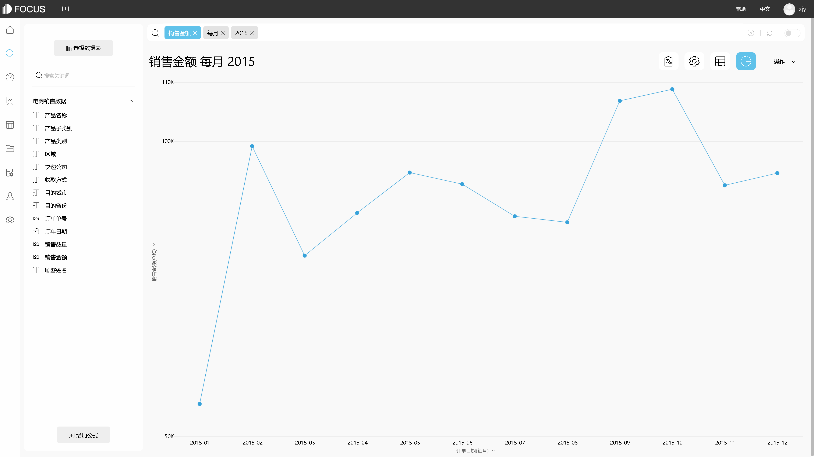
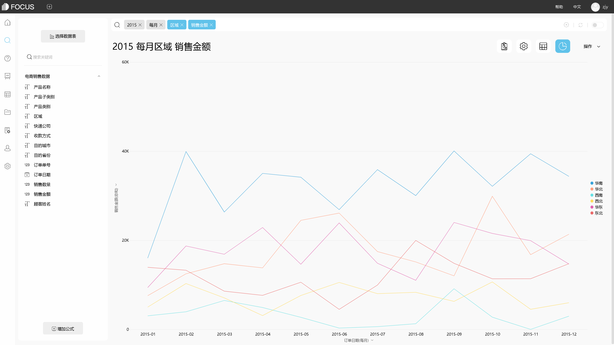
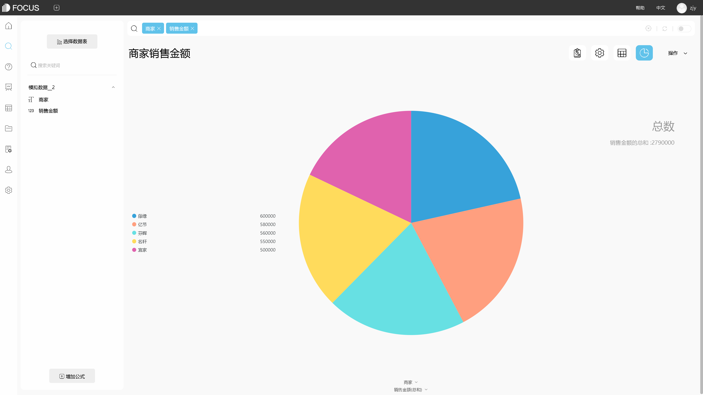

**目的：**辅助媒体产出奥运会相关文案。

**摘要 ：** 本报告使用DataFocus系统，数据记录了120年的奥运会参赛国家、人员以及成绩等相关信息，案例主要从时间、参与国家、运动员以及比赛项目、成绩的角度进行分析，总览奥运会发展的历史过程。分析结果可帮助媒体行业向用户更直观展示奥运会的发展过程，拉动用户兴趣，增加活跃度。最终分析可得，随着时间推移，奥运会赛事数量整体呈现上升的趋势，且夏季奥运会赛事数量明显远超与冬季奥运会赛事数量；1896年开始到1980年夏运会参赛运动员数量呈现曲折上升的趋势，这是因为此时处于世界格局动荡期，战争、国家间冷战摩擦等事件很大程度影响了奥运会举办的客观条件，同理冬运会也类似; 男性夏运会参赛运动员人数是和历年运动员数量变化同调的，女性夏运会参赛运动员人数明显的持续增长，并在1980年到2000年间持续大幅上涨。120年来的奖牌数量排名如下，USA为最多，CHN（中国）为第17名。中国队1984年开始有奖牌记录，奖牌总数逐年上升，在2008年主场举办的奥运会上奖牌数达到最高，此后一直稳定在奖牌榜和金牌榜前列。常夺金牌的项目有女子排球、男子体操、男子单双人乒乓球等。

**关键词：**DataFocus,媒体行业,奥运会,用户活跃

一、案例背景

参赛人员信息：ID、姓名、体重身高、性别、国籍、成绩、参赛项目与成绩。

二、案例问题

数字媒体需要根据时事热点产出内容吸引用户关注，有明确数据的直观的文案更容易引起用户的关注产生用户粘度，奥运会作为四年一次的盛会是大多数人的关注点，数据记录了120年的奥运会参赛国家、人员以及成绩等相关信息，以供媒体行业找出有价值的文案亮点，更好的产出内容，增加平台知名度和用户关注度。

三、案例分析

## 进入DataFocus系统，从数据管理页面中导入csv数据源文件“athlete\_events”和“noc\_regions”并关联数据表，在数据看板页面创建新的数据看板，命名为“120年奥运会历史”。

## 1.历年赛事数量变化

添加“GameSeason”“Gameyear”“Event”数据列，限定“Event去重后的数量”“按Gamyear升序排列”。图形转换为柱状图。

由图可得，随着时间推移，奥运会赛事数量整体呈现上升的趋势，且夏季奥运会赛事数量明显远超与冬季奥运会赛事数量；且1924年，才开始举办冬季奥运会。

2.历年运动员数量变化

添加“Gameyear”“GameSeason”“ID”数据列，限定“ID去重后的数量”。图形转换为折线图。

由图可得，1896年开始到1980年夏运会参赛运动员数量呈现曲折上升的趋势，这是因为此时处于世界格局动荡期，战争、国家间冷战摩擦等事件很大程度影响了奥运会举办的客观条件，同理冬运会也类似，但由于参赛项目少和知名度低等原因参赛人员本身就大大低于夏奥会，所以趋势不是很明显；图表显示到了1980年，世界64个国家联名抵制苏联奥运会使参赛人数出现最大一次下降幅度，此后世界形势渐渐明朗，经济贸易和外交逐渐恢复，奥运会也进入了同步的快速增长和稳定阶段。

3.夏运会运动员性别分布变化

添加“Gameyear” “Sex”“ID”数据列，限定“ID去重后的数量” “GameSeason不包含‘Winter’”。图形转换为面积图。

可以看出男性夏运会参赛运动员人数是和历年运动员数量变化同调的，女性夏运会参赛运动员人数明显的持续增长，并在1980年到2000年间持续大幅上涨。

4\. 冬运会运动员性别分布变化

添加“Gameyear” “Sex”“ID”数据列，限定“ID去重后的数量” “GameSeason不包含‘Summer’”。图形转换为面积图。

可以看出冬运会参赛运动员人数是稳定上涨的趋势的，男性参赛运动员人数略有波动，女性参赛运动员人数稳定增长。

5.历年参赛国家数量变化

添加“Gameyear”“GameSeason”数据列，限定“region去重后的数量”。图形转换为折线图。

我们看到1972年和1980年的数据为图表中明显差异点，1980年是苏联运动会，变化原因上述文中已经提及；1972年慕尼黑运动会是截止到1972年规模最大的一届，奥运会期间出现了巴勒斯坦恐怖分子导致奥运会一度叫停。

6.各国历年奖牌数变化

添加计算公式“num\_medal”，添加“NOC”“Medal”数据列，限定“按num\_medal降序排列的”“Medal不包含‘NA’”。图形转换为堆积柱状图。

如图所见120年来的奖牌数量排名如下，USA为最多，CHN（中国）为第17名。接下来分析中国的奥运会相关信息。

7.中国历年来奖牌数

添加“num\_medal”“Medal”“Gameyear”数据列，限定“按Gameyear升序排列的”“Medal不包含‘NA’”“CHN”。图形转换为柱状图。

中国队1984年开始有奖牌记录，奖牌总数逐年上升，在2008年主场举办的奥运会上奖牌数达到最高，此后一直稳定在奖牌榜和金牌榜前列。

8.中国夺牌热门项目

添加“num\_medal”“Medal”“Event”数据列，限定“按Medal的数量降序排列的”“Medal不包含‘NA’”“CHN”。图形转换为树状图。

可以看到常夺金牌的项目有女子排球、男子体操、男子单双人乒乓球等。

将8个结果图导入“**120年奥运会历史**”的数据看板。排版如下：

四、结论

最终分析可得，随着时间推移，奥运会赛事数量整体呈现上升的趋势，且夏季奥运会赛事数量明显远超与冬季奥运会赛事数量；1896年开始到1980年夏运会参赛运动员数量呈现曲折上升的趋势，这是因为此时处于世界格局动荡期，战争、国家间冷战摩擦等事件很大程度影响了奥运会举办的客观条件，同理冬运会也类似; 男性夏运会参赛运动员人数是和历年运动员数量变化同调的，女性夏运会参赛运动员人数明显的持续增长，并在1980年到2000年间持续大幅上涨。120年来的奖牌数量排名如下，USA为最多，CHN（中国）为第17名。中国队1984年开始有奖牌记录，奖牌总数逐年上升，在2008年主场举办的奥运会上奖牌数达到最高，此后一直稳定在奖牌榜和金牌榜前列。常夺金牌的项目有女子排球、男子体操、男子单双人乒乓球等。

五、对策建议

可以针对性的分析中国队在奥运会中的历史表现，也可以深挖各个数据奇点中隐藏的历史故事等角度来生成文案，吸引用户的关注度。
