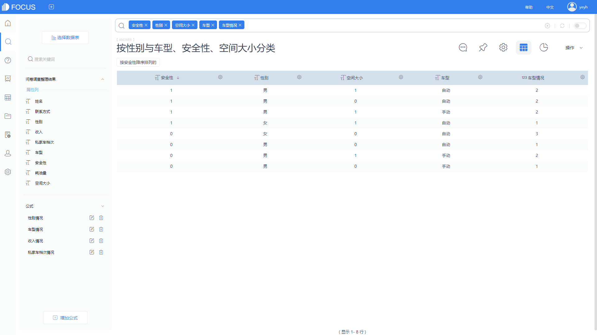

DataFocus是一款功能强大的数据分析以及数据可视化工具。其现拥有30多种图表样式，且仍在不断地开发新样式，其中包括有柱状图、折线图、饼图等基础图形，也有弦图、时序图、热力图等高级图形，那今天，主要是为大家讲解如何在DataFocus中创建弦图。

弦图是什么？弦图主要用于展示多个对象之间的关系，两点之间的连线，就代表着这两者之间具有联系。比如现在有全球180个国家的贸易往来数据，你想用一张图来展示每一个国家之间往来的频率是高还是低，这些国家之间的关系是紧密还是疏离，那么弦图就是最好的选择了。

如何制作弦图呢？下面就一起来创建一个弦图吧。

首先，需要准备一份如下的数据（虚拟数据，如有雷达，纯属巧合）：

其次，将数据导入DataFocus系统中，在数据管理页面，选择“操作——导入数据”，按提示进行导入；

然后，在搜索页面，选择导入的这个数据源，双击数据源中的列加入搜索框，系统默认显示环图：

最后，需要在图表转换处更改图表类型，点击右上角“图表转换”，选择高级图形中的“弦图”，若弦图字体颜色为黑色，则代表该数据结果符合弦图的出图要求，若为灰色，则代表该数据不适合使用弦图展示：

至此，弦图已制作完成。但是也可以对弦图的图表属性进一步配置，点击右上角“图表属性”，可看到页面左侧弹出配置选项，有通用配置，悬浮文本配置，刻度盘配置等，如下图为配置了主题颜色，以及连线的粗细大小：

DataFocus中的可视化过程非常简单，不管是弦图还是其他图形，都不需要任何复杂的额外操作，所以，现在大家学会了吗？
