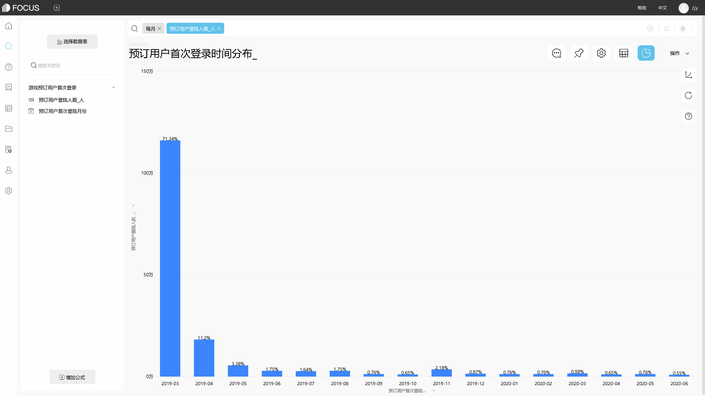

1.谁是你的阅读者？

无论您是在做传统报告还是新信息图，首先要问自己哪些阅读者可以看到报告？他们对将要讨论的内容了解多少？他们需要什么？他们将如何使用您想要显示的信息和数据？以明确和明确的方式分析目标和方法非常重要，因为只有对目标的明确分析才能有一个良好的驱动过程。无论是目标驱动器还是分析过程驱动程序，后续数据分析工作和分析报告中显示的所有内容项都与此目标主题密切相关。

2.规划数据可视化程序

数据可视化解决方案必须能够解决用户特定的问题。因为它解决了用户特定的问题，所以它高度基于对数据的现象和性质的深度和理解。简而言之，它是您的可视化解决方案，不仅可以理解和解释数据分析的结论，信息和知识。经理可以快速找到并发现您计划可视化的决策。

3.用清晰的标题可视化数据。

当您的报告像报纸或杂志新闻时。从这个标题，你可以给你的阅读者一个强大的影响力。清晰的标题是对报告和故事的一个很好的解释，以及整个报告和故事的摘要。当然，商业分析师不鼓励成为“头条新闻”。好的头条新闻既不模糊也不多余，只是对图表的清晰解释。这有助于观众直接进入主题。这允许阅读者浏览文件并快速掌握核心。尽量让你的头衔脱颖而出。

4.将数据可视化与您的战略和计划联系起来

如果数据可视化的目的是提供解决特定，可测量，可执行，相关和时间敏感问题的数据，那么将这些问题添加到start语句中。稍后联系您的策略以阐明这些数据的定位，以便阅读者可以立即了解可视数据的相关性和价值。最后，他们可以更好地参与，并能够更明智地使用这些信息。数据可视化最终为公司的良好业务服务，具有商业价值。如果不关注公司的战略和行动计划，很难创建具有关联价值的信息图表。例如，企业实施的行动计划通常是实现和实现公司的战略目标，并以此方式实现精益管理和精益运营。因此，视觉解决方案应该能够对战略目标，个人，团队部门指标和受影响的关键绩效指标实现行动驱动的影响。只有有价值的数据可视化才能用于查看连接的信息。

5.明智地选择您的演示文稿图表。

无论图表类型，条形图，折线图，雷达图等，每个图表都有自己的优点和局限。您找不到完美的可视化图表。但是，通过试验混合和显示，您可以使您的视觉表现更加人性化。因此，视觉效果应尽可能简单和准确。这意味着无论时尚，美学还是美学，这都不是设计数据可视化的初衷。事实上，我们以持续且永不满足的方式追求数据之美。但最佳平衡是通过正确的数据可视化显示适量的信息和知识。

仅使用与传达重要信息和受众需要的图形相关的图形。

无需填写页面的所有空白——太多凌乱的内容只会干扰重要信息的接收，使其难以记忆且容易被忽略。

适当使用颜色以增加信息的深度。另请注意，某些颜色会产生潜在影响。例如，红色被认为是代表警告或危险的颜色。适合早期预警。

不要使用太多不同类型的图表，表格和图形。如果您需要比较各种图表，请确保在显示数据时使用相同类型的图表，以便您可以将它们相互比较。

6.在适当的地方备注

文本描述有助于解释单词中的数据，并在图表为背景时增加内容的深度。数字和表格可能只提供快照，而字幕允许人们更多地了解关键点，评论关键点并强调其含义。引导观众思考图形的主题，而不是方法，图形设计，图形生成或其他任何东西。

最后需要注意：

1、避免扭曲数据的原始意图。

2、保持大数据集一致。

3、吸引阅读者比较和比较不同的数据段，突出关键点和优缺点。

4、主题应该非常明确：描述，挖掘，写作和自我解释的可视化。
