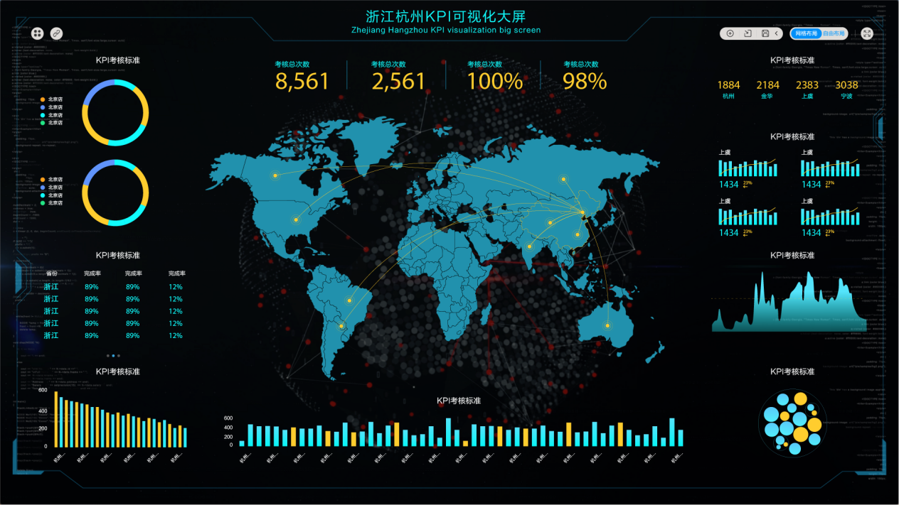
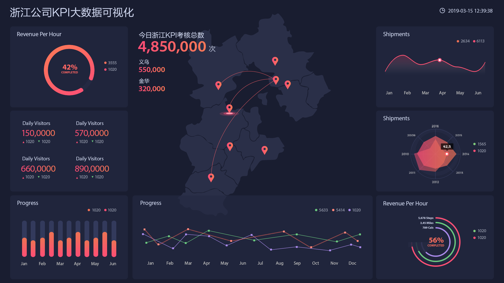
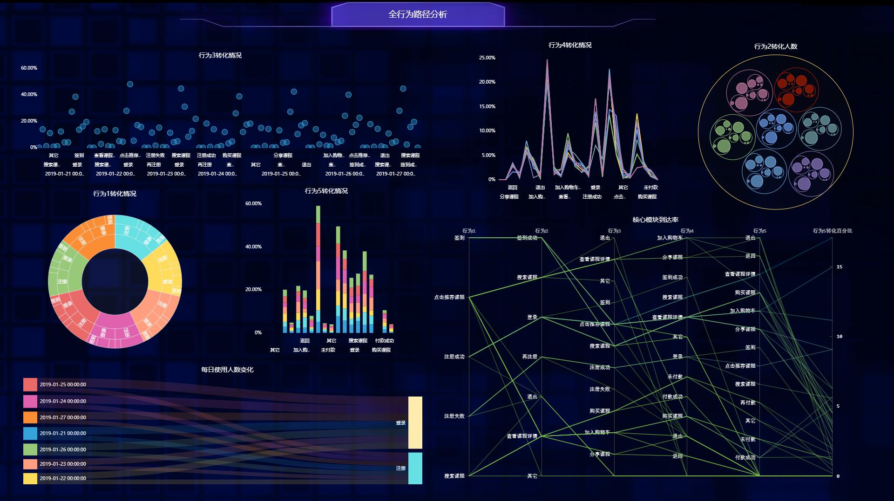

DataFocus产品发布半年之际，笔者有幸再次采访到其创始人Jet，就DataFocus的产品、市场以及对行业的发展，进行了交流。奉上原汁原味的采访笔记，以飨读者。

**问：DataFocus发布半年来有什么变化？市场反响怎么样？**

Jet: DataFocus自2018年8月正式对外发布以来，逐渐被很多人接受。有些用户从一开始的将信将疑，不太相信搜索就可以进行分析，到逐步认可搜索式分析，并开始体验到搜索分析的优越性。许多朋友用过DataFocus之后都有很积极的反馈，比如有人认为搜索方式上手非常快，业务人员也可以使用；有人用DataFocus做数据预处理，感觉比MatLab好用得多；还有些客户自己测算下来，使用DataFocus至少在项目实施和报表开发上为他们节约了70%以上的时间，相比于工具购买费用来说，大型企业在这方面获得的收益要远大于其软件投入成本。

很多客户都有这样的经历，购买一款软件的成本，相比于维护和使用来说，只占总成本的20%都不到。而DataFocus则彻底将数据分析的实施成本和使用成本降低，这些收益企业管理者都能切身感受到。**这个就是DataFocus最核心的竞争力。**

DataFocus发布半年以来，已经进化到V2.13的版本，增加了许多新功能，性能上也得到极大的提高。比如新版本的DataFocus已经具备了数据填报、数据库直连，算法模型训练和部署等各种新功能，还包括各种细节的优化，如增加了分析中行转列的功能。新版本的DataFocus的大屏可视化功能已经可以与市面上某些单独做大屏开发的产品如DataV相媲美。

感谢大量信任我们的客户，DataFocus将继续沿着既定道路，进化成行业中最为全面和强大的数据分析平台。做业界最好的数据分析产品，这个目标我们会长期坚持。

**问：记得上次采访时聊过toB业务的一些特点，你当时讲到有做项目和做产品两种思路，DataFocus是认真坚持做产品的思路，现在还是这么认为吗？**

Jet: 当然。为什么中国的ToC产品能达到世界级的高度，而中国的ToB业务反而与我们的市场体量如此不相称呢？根本原因，还是与当前这个时期，整个社会的浮躁心态相关的。受追捧的都是快速成功、迅速致富的各种捷径，大家不仅愿意听那些一夜成名的故事，更期待自己也能成为故事的主角。ToC产品可以快，是因为他都是按照产品经理的思路一路快跑，频繁迭代，然后再由海量的用户筛选和淘汰，剩下的自然都是有世界级影响力的产品。ToB产品没法快，他周期长，验证、迭代都相对慢很多，最终用户和采购决策人的不一致，还决定了就算是垃圾产品，也不太可能被快速淘汰出局。

toB业务到底应该怎么做？没有标准答案。我能说的是，就我目前的观察，国内太多公司热衷于做项目，热衷于搞各种解决方案，鲜有公司愿意沉下心来做产品。这就是我们软件行业与美国软件行业最大的差距。基本上，你能听到的知名软件产品，都是Made in USA。有一种提法是说，产品是做减法，解决方案是做加法。**这种说法还不够精确，我有一个说法“做产品是求最大公约数，做项目则是求最小公倍数”。**我们都知道，只有解决问题的工具，不可能有通用的解决方案。做产品是要将行业通用的痛点提炼出来，用最高效的方式去解决，必须要有通用性；做项目则是要最大限度的满足好当前的客户需求，可以说很多时候客户的各种特定需求都得照单全收，项目做完后形成的解决方案通用性就比较差。

DataFocus产品已经过上百次迭代，我们始终会坚持两点：第一，我们不会超出数据分析的边界。我们期望用户能在DataFocus平台中，完成数据储存、清洗、分析、可视化、训练算法模型、部署算法模型等一条龙的工作，但是我们始终不会跨入业务流程的开发；第二，继续坚持做好通用型数据分析工具的初心，我们愿意与更多公司协作，做他们解决方案中的功能模块。

**问：去年DataFocus产品发布时，确实很轰动，国内第一家纯搜索式分析BI产品。今年我们看到，作为行业老牌企业tableau，在3月份也发布了Ask Data 功能模块，你觉得他们的新功能怎么样？比DataFocus如何？**

Jet: DataFocus从设计之初就决心要变革现有的商业智能BI产品的交互方式，它的分析入口只有一个，就是一个搜索框。这一点儿和Google当年决心要变革信息检索方式是一样的，它的首页永远都是只有一个搜索框。而当时的巨头Yahoo则是逐渐意识到分类检索方式的弊端，开始逐步转型，你能看到那个时候的Yahoo也有一个搜索框，但这个搜索框是嵌入在一堆分类检索列表中的。

你能预见到的DataFocus和Tableau的差异就和Google与Yahoo的差异如出一辙。不仅仅是tableau，可以预见的将来，许多老牌厂商终究都会意识到拖拽式分析已是昨日黄花，迟早会被搜索方式替代，但是他们的转型都带着沉重的包袱。他们不能抛弃大量赖以生存的老客户。你能想象他们在产品宣传中既吹嘘自己的拖拽分析式最友好，又夸自己的搜索分析是最完美的吗？

Tableau的Ask Data模块是他2017年收购的ClearGraph团队整合而来。我认为，他们与其将ClearGraph团队作为一个功能模块潜入到tableau中，还不如单独推出一款自然语言产品，这样他们的产品线不至于互相混淆，又能保持其传统的拖拽分析领域的霸主地位。

当然Ask Data我也没用过，从它的官网来看，目前应该是只提供英文版的使用，有没有中文搜索还不得而知。所以他的使用体验究竟如何，以及和DataFocus的比较来看，我没有发言权。

**问： 大数据、云计算和人工智能是国家重点扶持的行业。有人说现在的中国已经正式进入云时代，各级政府也在大力推进企业上云。对此，你怎么看？**

Jet: 大数据、云计算和人工智能，技术基础已经成熟，越来越多的落地应用在产生很好的效果，这也是行业加速发展的根本原因。国家扶持这些行业是顺势而为，也许可以有效的加速行业的发展。但对于各级政府，尤其是一些市县级政府的经信部门力推的“企业上云”，我不敢苟同。企业上云出发点没错，是希望各级企业拥抱最新的技术，进而提升生产效率，提高产品质量，助推国家工业升级转型。但是一哄而上的搞补贴，通过各种名目的补贴诱导企业上云，我们已经看到一些适得其反的效果，说得严重一点儿，有些拔苗助长的后果。

比如，我们看到有些地区政府部门也很着急，前几年移动互联网快速发展，要拥抱互联网+，于是各级政府花钱开发了很多app；这阵子又遇到物联网的爆发，于是又要搞很多智慧XX；大数据兴起的那几年，在贵阳大数据博览会的潮流下，各级政府又开发了很多大屏幕；现在BAT这些大佬又一直讲云计算，于是又要搞企业上云。

我接触到一些企业，他们对企业上云的理解就是搞个网站，租个云空间。简单说，他们对企业上云的理解就等于企业上网。政府部门力推企业上云初衷是好的，但是这个酒瓶子都被各地运营商灌了很多水。我曾经看到过某运营商为当地经信委编制的企业上云方案，就是购买空间+带宽，仅此而已。

**问：你觉企业上云该怎么做？**

Jet: 我们知道，大部分优秀的市县级企业是当地制造业支柱，他们受IT人才的限制，不能接触到一些前沿的技术，有作为的政府帮助他们提升信息化、数字化的能力，是很好的，但是经却被一些云服务商和运营商念歪了，他们想的只是借着政府补贴的势，去推销他们的空间和带宽。政府和企业应该更多的找到DataFocus这样为企业提供服务、提供工具的厂商，帮他们落地，不仅要授之以鱼，还得教会他们如何打鱼，这样才能真正的做到通过信息化、数字化提升企业生产效率，改进社会生产力，促进工业转型。至于企业上不上云，那都是个伪命题，无非是上云了，某些云服务厂商、某些运营商可以赚点儿快钱。长期来看，公有云也好、私有云也好，混合云也好，都会随着边缘计算、雾计算技术融为一体。

**问：DataFocus会采用云端部署的SaaS模式吗？你对商业智能BI产品的未来发展趋势如何预测？**

Jet: 我们会顺应潮流，客户需要什么类型的服务，我们就会提供什么类型的服务。从目前的情况来看，确实有一部分客户提出希望使用DataFocus的SaaS版服务，我们已经在着手进行部署。未来云端的DataFocus也可以很快和用户见面了。

商业智能BI产品如何发展？这个命题有点儿大。在我还没有出生的时候，商业智能这个概念就被IBM发明出来了，但是直到今天，其产品形态还在不断的变迁。从最早的各种表格程序，Lotus等等，也称得上是商业智能产品，再到后来的改进过的，结合WEB技术的表格产品，如tableau等，也是商业智能产品。Tableau还首创了拖拽式分析的GraphSQL，使得整个分析行业的交互方式向前跨出一大步。如今，随着DataFocus这类搜索式数据分析产品的崛起，商业智能BI的交互方式面临着又一次大的变革。这整个发展的线索就是，随着技术不断的演进，交互方式越来越智能，也许在未来我们可以看到真正能和人类无障碍对话的商业智能。

如果我们回顾商业智能BI的最初定义，我们会发现其实当时的人们对商业智能的期待是很高的。在他诞生之初，第一波人工智能的浪潮正在兴起，在各行各业，人们都期望能由计算机来代替人类的工作。如今的人工智能第二次浪潮，很多东西已经慢慢变成了现实，比如生产线上的工人，已经逐渐被机器人取代；扫地机器人取代了清洁工；酒店机器人取代了客房服务员。在商业智能领域，人们理所当然的希望机器人能取代人类做各种商业决策。或者进一步的说，人类希望机器人取代人类管理者。

从这个角度来说，商业智能BI离其最终形态，还差得远，还是个小婴儿。DataFocus目前能做到的是，从描述性统计、到预测分析和规范分析。但是远远不能替代管理者，它还只是一个建议者，可以为决策人员提供信息和建议，但是最终的决策，还需要管理者综合各种因素来做决定。

工业生产线上的机器人，可以有非常完整的反馈系统做决策，这些都是建立在精确的物理定律基础上的；管理问题更多的是个社会问题，无法用精确的物理定律去描述，从数学意义上讲，我们甚至都搞不清有哪些变量。考虑到这种差异，也许商业智能BI永远也不可能取代人类管理者。
