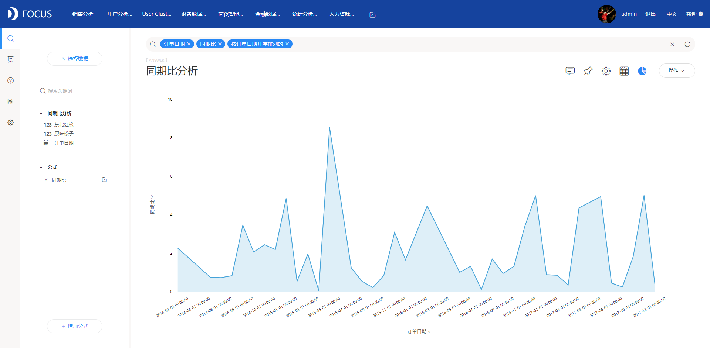

折线图适合二维的大数据集，尤其是表示趋势的分析。百度百科对折线图的定义为：折线图是排列在工作表的列或行中的数据可以绘制到折线图中。折线图可以显示随时间（根据常用比例设置）而变化的连续数据，因此非常适用于显示在相等时间间隔下数据的趋势。在折线图中，类别数据沿水平轴均匀分布，所有值数据沿垂直轴均匀分布。

从官方的解释中，我们提取出两个重要信息点;

**1.折线图通常用于查看随着时间推移某个事物的值的变化趋势；**

**2.折线图适用于连续数据**

**适用情况如下：**

****适用于单个二维数据集比较****

**适用于多个二维数据集的比较**

**折线图通常会与其他图形结合使用（与柱状图、面积图等）**

下面是折线图与柱状图相结合的一个简单例子，柱状图表示利润的总和，折线图表示销售额的总和。

综上，我们看到，折线图适用于处理随时间变化的连续数据，特点是经常与其他图形结合使用。（以上截图均来自数据可视化工具DataFocus）
