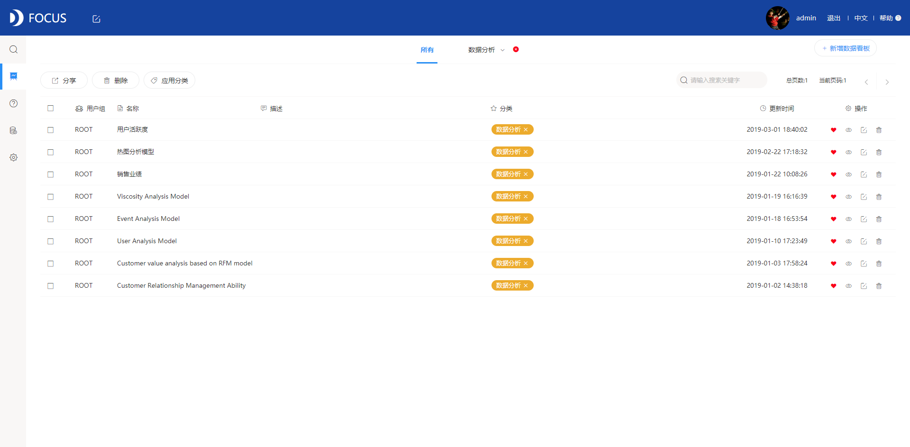

交互式可视化是计算机科学和编程领域的专有名词，它专注于图形可视化，并改进我们访问信息，或与信息交互的方式。商业智能BI工具所使用的图形显示也称图形可视化。大多数情况下，这些可视化构成了交互式仪表板的一部分，因为它们可用于提供一种快速简便地洞察方法，用于理解基于不断变化的数据。

交互式的可视化，它们必须具有与人类交互的方式，如单击按钮，移动滑块，以及足够快的响应时间以显示输入和输出之间的真实关系。我们来看看DataFocus的交互可视化实际效果：

大屏配图

交互式可视化的使用在商业智能中变得越来越流行，并且由于其易用性和附加价值而成为大多数分析套件的常用功能配置。

可视化使用户能够通过使用动态图表，根据查询或交互更改颜色和形状来探索，操作和交互数据。重要的是，交互式可视化还可以更好地访问实时数据，这使得它们在各种组织的仪表板中都很有价值。在数据发生和变化时查看数据的能力对于做出最佳和最准确的决策至关重要。

## **我如何使用交互式可视化？**

交互式可视化是各种设置中的绝佳工具，因为它们能够优化信息的显示方式。交互式可视化的最常见应用之一是数字化仪表板或数字看板，大家都知道，直接与枯燥的数据表格交互的信息获取体验，是极其糟糕的。

相反，使用这些可视化使仪表板，可以成为高层理解组织、部门或项目的理想工具。将它们包含在仪表板中，允许组织划分数据并创建层次结构，将粒度信息移动到可视化内部或简单地移动到不同的选项卡。

我们来看看DataFocus仪表板的实际效果：

大屏配图

此外，在BI报告中实现交互式可视化时非常出色，这可以使它们更具吸引力，更有趣，更易于阅读。

这些数据可视化工具使组织能够显示数据的方式多样化。这允许更深入的理解和更可定制的分析，这可以产生不同的见解和意外结果。即使在为客户显示信息时，交互式可视化也会提供更引人注目的报告。
