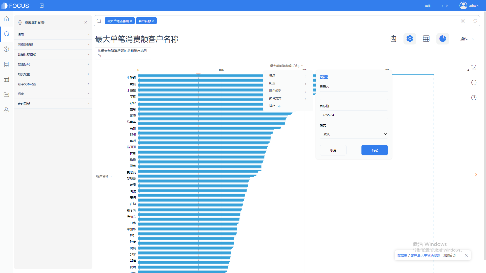

上一节主要讲述了此次文章所希望达成的一些目标，接下来就是具体的内容介绍了。首先是比较型图表，比较类的图表主要是将基于分类/时间类型的数据进行对比，这就要求图表必须能接受多个变量，并能将其明显对比出来。

1、柱状图

当变量数目较少时，可以选用柱状图。柱状图就是使用柱体的高度来代表各变量的数据大小，在变量有多个时，可以将每一类别由一根柱变成多根柱。柱状图一般排序后使用，效果更佳，同时适合基于分类/时间类型的数据。

2、条形图

当变量数目较多时，更加适合使用条形图。条形图简单来说，其实就是将柱状图顺时针旋转90度得到的。但条形图的类目一般不超过30条，否则会造成视觉负担，影响对比结果，且基于时间的数据不适合使用条形图。

3、折线图

折线图适用于基于时间的数据，也就是我们常说的时序数据，最好是连续型的数据类型，这时候可以非常明显的看出变量随时间的走势变化，举个简单的例子，比如股票数据，基本都是用折线图表示。

4、面积图

面积图的表示和折线图十分类似，就是将折线图下方部分用颜色填充，面积图最终是用数据颜色部分的面积大小来代表各变量的数据大小，可以用来表示时序数据或分类数据。

5、组合图

当你想要在一个图中既表达对比又表达趋势，就可以使用组合图表示，能够充分满足你的需求，同样可以用来表示时序数据或分类数据。

6、雷达图

雷达图最常见的就是用于分析人物的各项能力水平，主要是用来比较每个数据相对与中心的数值变化情况，多用于倾向分析和重点把握。每个数据离中心越近，则说明属于较差的状态，需要改进；数据远离中心，则说明表现优异。

7、玫瑰图

在雷达图的基础上，进一步可以绘制玫瑰图。

此处的玫瑰图可以选择利用半径或者面积来代表数值之间的差异，因此数值差异不能过大，否则将难以观察对比。

以上就是DataFocus系统中较适合比较类的常用图表类型。
