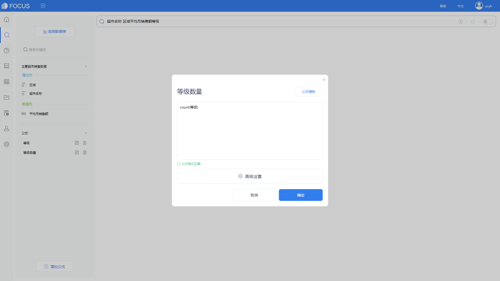

在介绍完构成类的图表后，这一节讲述的主要是分布类和联系类的图表。在DataFocus中，分布类的图表主要与经纬度数据相关，联系类的图表则主要是要求数据内有多个变量。通过分布类或联系类的图表，能够看到数据的分布情况，进而从中找到一些相关性、异常的信息或离群点。

一、分布类

1、散点图

散点图一般是针对离散型的数据，可以直观反映数据集中情况，对离散数据线性回归等曲线预测性有拟合辅助作用。

单看下面这张图，可能觉得就是几个点而已，但是如果给销售数据和销售金额加上两条垂直的线条，将这个answer区分为四个象限，就可以知道那部分区域的散点最多，最密集，从而进行改进。

2、地图

当原始数据中存在地理省份信息的数据时，就可以利用地图来更加形象地表示，毕竟只是将“北京”这两个字放在图表上和用地图将北京标注出来还是很不一样的。若数据中还存在省份下各城市数据的话，可以利用DataFocus系统的下钻功能，观察某省份下的各城市具体情况。

3、经纬图

根据原始数据中的经纬度数据，可以绘制某区域或全国的地图，类似的还有统计图。

4、热力图

热力图可以视为气泡图和地图的结合演变而成，主要是表示数据的密集程度，一般颜色越深的地方则数据密度大，数据集中。

5、树形图

树形图本质就是决策树的可视化，只不过排列成矩形，同时将各个变量进行细分。在矩形树图中，各个小矩形的面积表示每个子节点的大小，矩形面积越大，表示子节点在父节点中的占比越大，整个矩形的面积之和表示整个父节点。

二、联系类

1、散点图

散点图也经常被称为“相关图”，因为散点图主要是可以用来表示X、Y轴上的两个变量之间的相关关系。散点图一般是两个数值变量在x、y轴上的交叉点绘制而成的图表，利用直线或者曲线将这些点进行大致连接，则代表了XY轴上的变量之间的变化趋势。

2、气泡图

气泡图就是在散点图的基础上多加一个变量，不仅仅用一个点表示，而是使用散点面积的大小表示第三个变量的大小情况。

以上就是DataFocus系统中较适合分布类和联系类的常用图表类型。
