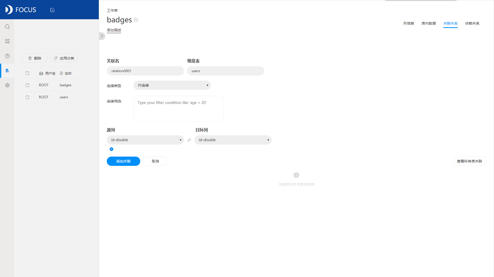

增长率是指一定时期内某一数据指标的增长量与基期数据的比值。在商业数据分析中，常常用到同比和环比。同比即本期与同期做对比，同比一般用在相邻两年，相同时间段内，查看涨幅程度，一般用在两年相同月份，很少用在两月相同日期。；环比即本期与上期做对比，一般是用在月、日很少用在年上，主要是对比很短时间内涨幅程度，不过由于行业差异，比如旅游，会受到淡旺季影响。

今天小编来讲讲在DataFocus中，如何使用自然语言搜索进行增长率分析。

关于环比，我们可以直接在搜索栏中输入“按xx计算的yy的X增长率”，主要是计算在两个条件限定下的增长率。增长率包括年增长率、周增长率、月增长率等（计算的是本月比上月的增长）。例：按订单日期计算的销售金额的总和的月增长率。

关于同比，也可以直接在搜索栏中输入“与往年同期相比按xx计算的yy的X增长率”，主要是计算在两个条件限定下的增长率。增长率包括年增长率、周增长率、月增长率等（计算的是今年当前月比去年同一月份的增长）。例：与往年同期相比按订单日期计算的销售金额的总和的月增长率。

可以看到，在DataFocus中进行增长率分析计算时，无需公式计算，直接在搜索栏输入自然语言就可以得到结果，简单方便，容易理解。
