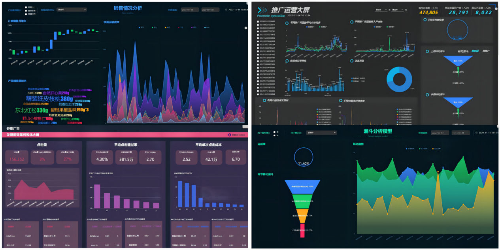

曾几何时,Excel报表可以满足企业对数据的全部需求。但时移世易,如今企业数据呈指数增长,Excel早已不堪数据分析重任。于是,各种BI(Business Intelligence)工具应运而生,例如Tableau、Qlikview等。但是传统BI工具需要通过繁琐的拖拽才能生成报表,数据更新不及时,用户学习曲线陡峭。于是,搜索式BI凭借全新的交互模式出现了,其中最值得推荐的就是DataFocus。

正文:

相对于后起之秀北极九章等产品,DataFocus在搜索式BI领域可谓是老将。早在2017年,DataFocus团队就已经开始专注于语音解析技术的研发,在行业内可谓是开拓者。五年多的积累让DataFocus在商业化落地方面经验丰富。

DataFocus最大的亮点就是其语音交互模式。用户只需要通过语音提出问题,DataFocus就可以提供相应的数据分析图表。这比起北极九章的文字搜索,要更加智能便捷。数据分析不再是技术人员的专利,任何人都可以像使用百度一样获取数据洞察。这降低了搜索式BI的使用门槛,也使分析结果更及时共享。

此外,DataFocus生成的图表样式多样、效果出众。不仅支持柱状图、折线图等基础图表,还提供包括散点图、箱线图、桑基图在内的多达几十种统计图表。这些专业的可视化方式有助于从更多维度洞察数据价值。与只提供基础图表的北极九章相比,DataFocus在可视化上更胜一筹。

最后,DataFocus最大的优势是无代码分析。用户无需掌握任何BI或编程知识,通过简单的语音交互就可以进行数据查询、可视化、得到分析结果。这降低了BI使用难度,使更多员工可以自主获取数据洞察,实现决策需求。相较于北极九章需要一定数据分析基础,DataFocus的无代码特点更加亲民。

总结:

随着数据量爆炸式增长,搜索式BI正在蓬勃发展。作为先行者的DataFocus,凭借其易用的语音交互模式、出色的可视化表现力,以及无须编程知识的分析能力,让数据洞察变得前所未有的轻松。相较于文字搜索和可视化有限的北极九章,DataFocus值得成为企业数字化转型的首选。
