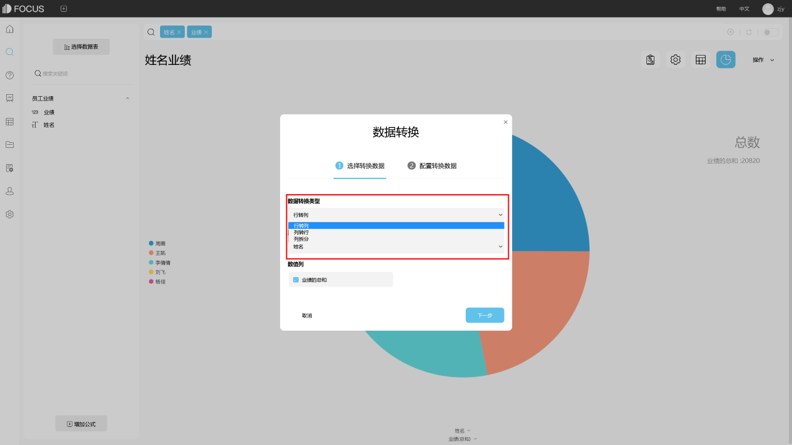
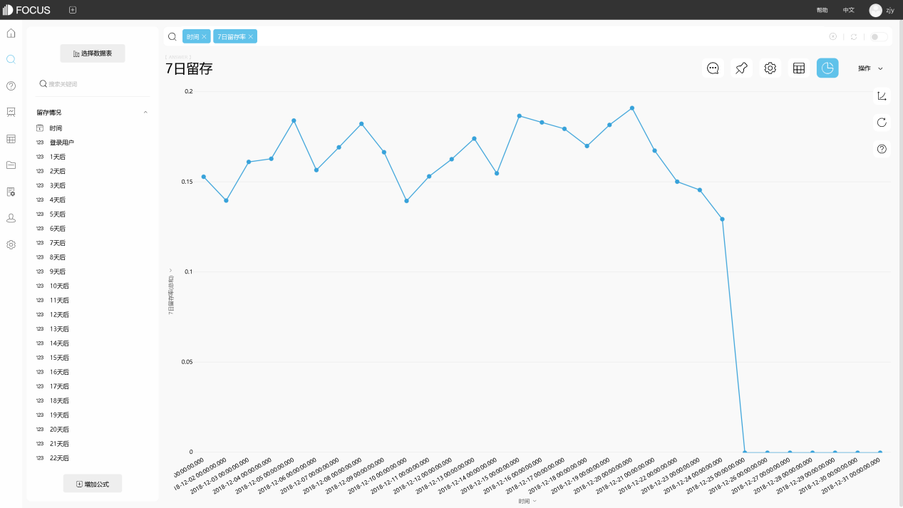

我们以前讲到过如何做店铺数据分析，依据流程能力诊断、销售诊断、商品诊断等6个维度全面诊断店铺存在的问题，并进行优化。有不少读者来信表示想要更加深刻的了解流程能力诊断的过程。本篇就为大家用某合作商家真实数据详细描述流程能力诊断的思路。由于保密性原因，仅对数据本身进行文字性简单描述。

**首先我们可以搜索付款周期**。时间维度可以选择想要分析的年份并按月搜索，在数据维度上可以每10分钟作为一个维度，比如1-10分钟、11-20分钟这样。那么我们统计下来整年的付款周期，1-10分钟的占88%-95%，11-20分钟的占2-6%，21-30分钟的占2-8%，31分钟及以上的占2-8%，并且除有大促外的每月低区间付款人数占比在加大。那么我们可以得出，总体店铺的流程能力是健康的，而且店铺的客户付款周期有在缩短的趋势，店铺的页面描述、评价、活动等是否起到了作用，能让客户果断的下单付款，而随着付款总体时间的缩短，时间外未付款的订单关闭可能会加大，所以根据店铺的现状，可以优化催付时间。而对于迟迟未付款的客户，也可电话调研原因，提升付款率。

**接下来是发货周期的分析**。其他不变，数据维度可以以天为单位，0天发货的到4天以上发货的。那么我们统计下来除大促外0天发货的占比50-70%，1天20%-50%，2天2-10%，3天1%，4天1%，并且0-1天发货的除大促外基本每月稳定在90%以上，大促月2天以上发货高达35%。所以我们可以看到本年的发货周期比较稳定，大促期间满了许多，所以是否需要加强仓储或物流能力，并且对于2天以上发货的订单，一定会严重影响客户体验，所以可以做好物流提前安抚，或赠送小礼品对冲客户不良体验。

其他如签收分析、评价分析甚至售前的下单分析等环节，同理都可以进行搜索，或用DataFocus的VS关键词进行对比，但最重要的还是对于店铺转化率比较重要的付款周期，和对于客户体验比较重要的发货周期，是影响流程能力的决定性因素。
