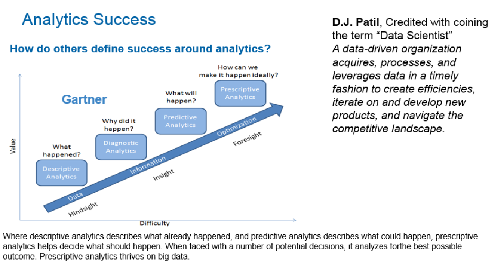

为了更好的玩好数据分析，D.J.Patil 把数据分析分成了四个阶段。大体如上图所示。

最低的阶段是：descriptive analytics, 这个阶段数据分析只是为了描叙问题，what was happened? 一般的来说就是 说what, where, when and how much。普通的SPC monitoring system , trend chart 都是这一类型的数据分析。

第二阶段是：Diagnostic Analytics,是Descriptive analytics的自然延续，回答 “为什么”问题发生了。这一阶段只要应用的DRILL DOWN，相关参数（低层参数）的分析。一般只要求能解释问题的发生就行了。

第三阶段是：Predictive Analytics, 这是一个类智的分析。有点人工智能的意思了。一般是通过多次，全方位的分析，充分了解可能产生问题的原因。然后建立系统，当观察至所有INPUTS都满足出问题的条件时，自动示警。提前行动，把可以发生的问题处理掉。从难度来说，与第二阶段是一样的。只是Predictive Analytics更全面，是多次Diagnostic Analytics 的成果转换。

最高阶段，也就是第四阶段是Prescriptive Analytics, 这一阶段的主要特征是控制结果。这一阶段，对所有INPUTS的实时监控是第一步。还要设计一个关键可控INPUT，与不可控合在一起建一个模，通过实时观察INPUTS,调整可控INPUT，以达到对OUTPUT控制.航空公司的机票定价就是一个典型例子。

通过这四个阶段分解，可以使我们更清醒的认识自己的数据分析。为提高数据分析的能力建立清晰的路径。
