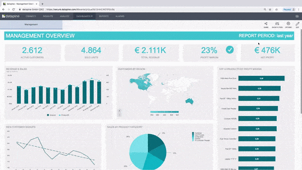

在数据分析中，不一定每个你想要的数据，都能在原始数据表中找到，例如，在销售数据中，想要知道每个商品的利润，但是原始数据中只有销售价格，成本价格，销售数量等间接数据，并没有直接的利润值，故此时，就需要用到公式计算，那在DataFocus中，如何进行公式计算呢？下面，就让我们一起来了解。

要创建“利润”，首先要知道利润的计算公式，在这个例子中，利润=（销售价格-进货价格）\*销售数量-运输成本，其次需要在DataFocus中添加公式，若是有用过excel的公式，那么在DataFocus中创建公式应该很简单。

1、在搜索页面，选择间接字段所在的数据源，如下图，选中后点击确定；

2、点击“添加公式”，在“公式辅助”中可看到所有的公式（公式分为聚合公式、转换公式、日期公式、混合函数、数字函数、逻辑操作符、文本操作函数），以及公式说明，公式使用示例，在公式输入框中输入计算公式，重新命名公式为“利润”，如下图；

3、在公式创建中，还可以修改公式计算结果的聚合方式以及列类型，列类型分为MEASURE和ATTRIBUTE，MEASURE列对应的聚合方式有：SUM\\MIN\\MAX\\AVERAGE\\STD\_DEVIATION\\VARIANCE\\NONE\\COUNT\\COUNT\_DISTINCT，ATTRIBUTE列对应的聚合方式有：NONE\\COUNT\\COUNT\_DISTINCT，如下图；

4、全部完成之后，点击“确定”，公式即创建成功，在搜索页面左侧最下方可看到自己命名为“利润”的公式，双击“利润”、“产品名称”，即可将其加入搜索框，系统即时返回搜索结果，如下图，从图中可知各产品的利润情况；

 5、也可以不添加额外的公式列，直接在搜索框内输入公式，如下图，直接在搜索框内输入：(sum(销售价格)-sum(进货价格) )\*sum ( 销售数量 )-sum (运输成本 )，系统即可进行搜索，实时返回结果；

公式列可以创建多个，也可以直接在搜索框内输入，无需很复杂的操作，也不需要任何SQL语句等，只要你知道计算规则，DataFocus就能给你计算出结果。
