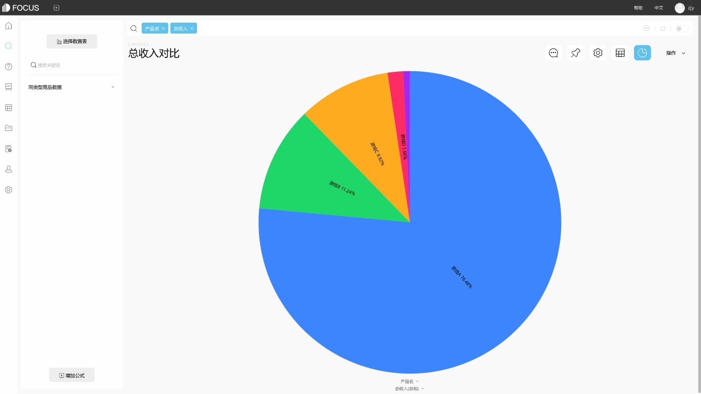

如今，企业越来越多地支持日常运营中的数据，商业智能产品也受到了越来越多的关注。随着日益复杂的IT环境和不断变化的业务，传统的BI产品已无法满足企业对数据分析的需求。与此同时，以业务部门为主导的自助式BI工具逐渐成为企业的首选。

所谓的工人想要尽力而为，他们必须先磨砺自己的工具。在国外，Tableau和Qlik等自助式BI工具已得到许多公司的认可，在国内也有像DataFocus这样的轻量级自助式BI服务提供商。那么，在数据分析层面，与传统BI相比，DataFocus所代表的BI产品有哪些优势？

数据建模

通常，使用传统BI进行数据分析，IT人员需要首先根据分析需求对数据建模，这需要涉及许多复杂的流程，包括确认客户需求，汇总数据，对数据执行ETL处理以及定义数据之间的关联模型。之后，业务人员将根据输出数据报告查看它。

这种方法的直接问题是，一旦客户的分析需求发生变化，业务或分析师就无法修改数据报告并依赖IT部门。此时，IT人员需要重新构建或修改现有分析模型，然后输出报告。毫无疑问，这种方法效率低下，需要很长时间。

此外，静态数据报告还使业务人员无法执行有效的数据分析。由于所有维度和指标都已预先设置，因此输出可视化是固定且不可编辑的。例如，如果要平均已设置的值，则需要重新建模。

使用自助BI产品的数据分析消除了对复杂数据建模的需求。使用DataFocus开发的轻量级BI产品，数据建模过程相当简单。业务人员只需拖放长时间运行的数据表即可完成建模过程。此外，DataFocus支持实时调整数据表中维度和度量的计算，大大增强了数据分析的灵活性。此外，DataFocus还支持一系列操作和编辑上传数据，包括自由更改表文件名，表分组，字段类型等。

实时互动分析

由于传统BI主要基于提供报表服务，虽然它更全面，但它受产品技术架构和复杂而固定的分析过程的限制。一方面，传统的BI无法实现采集的实时数据处理和分析。业务人员也无法随时调整数据报告，更多的是固定时间间隔的输出监控或固定格式报告。

在研发之初，DataFocus考虑到了大数据时代对实时分析的强烈需求。基于自行开发的DH数据连接器框架，DataFocus使用户能够实时对接企业中的各种业务系统数据，并通过内存分析引擎进行实时处理和分析。

探索性分析

传统的BI产品基本上采用验证分析模式，这是一种自上而下的模式。也就是说，企业决策者设置业务指标并提出分析要求，然后分析师根据相关要求定制报告。在通过业务数据验证之前，此模型必须有一个想法。因此，验证分析需要高数据质量。如果数据本身存在问题，即使通过科学数据建模进行分析，结果肯定是错误的。

与验证分析相比，探索性分析需要相对较低的数据质量，并且不需要复杂的数据建模。这是DataFocus的核心概念。探索性分析的重要性在于，它允许分析人员或决策者查看和分析数据本身呈现的可视图，而无需了解数据规律或了解如何对数据建模。

目前，基于探索性分析的数据可视化产品很少见。国外产品包括Tableau，Qlik，Power BI等，而在中国最具代表性的是DataFocus自主开发的自助BI产品。基于探索性分析，DataFocus支持智能推荐图形，图表协同过滤和全面数据钻取，以帮助用户快速定位和识别问题。

操作简单

传统的BI设计理念是帮助企业构建一个庞大而全面的报表平台，但功能众多但非常复杂。一方面，传统的BI需要手工建模，操作复杂，学习极其困难；另一方面，在整个数据处理中，还需要大量的代码指令，这是业务人员无法完成的。

与传统BI相比，自助BI产品更轻巧。由于产品本身主要由商务人士使用，因此即使没有具有任何操作经验的白人用户，自助BI也更容易使用且门槛非常低。可以轻松上手。

以DataFocus产品为例。无论是数据处理还是分析，都可以通过简单的搜索点击完成整个过程。同时，从教学视频到帮助文档，DataFocus为用户提供全面的学习资料。通过学习，用户可以完成数据集成，数据关联，可视化分析和业务看板等所有流程。

结论：从这个角度来看，在大数据时代，面对海量业务数据，企业应该尽快放弃传统BI所代表的数据分析方法，转而采用轻量级自助服务BI产品代表通过DataFocus。只有完全解放IT部门并将数据分析功能返回给业务人员，我们才能真正释放数据的价值，并深入了解业务的未来。
