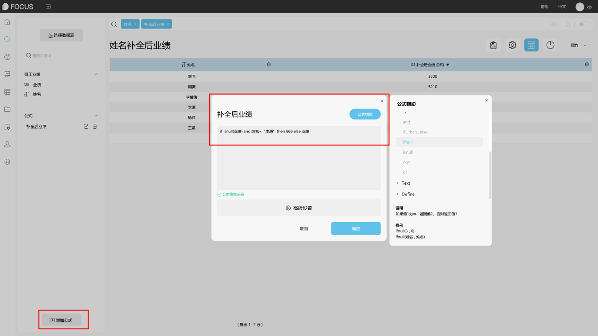

今天，随着商业形式的快速变化，许多传统公司认为他们的肥胖极不稳定并且充满了隐患。许多企业经历了轻微的资产转型，并试图利用互联网引发业绩增长的第二个曲线。转型的基础是数据。数据管理可以为公司绩效目标，就业战略，战略方向等提供科学参考。这种数据管理思维在销售上有着快速而出色的效果。下面DataFocus就带大家看一看什么是销售数据管理，以及如何创建销售数据跟踪。

销售跟踪是一项非常艰巨但非常重要的工作，绝对不可能单独依赖人员。这是一个系统项目，最好精细的规划好它。

对销售跟踪的常见误解是仅跟踪销售或销售权利不佳的组织或个人。事实上，销售跟踪的目的是让落后的组织或个人更好地改变，让销售普遍改善，并使销售变化。更好！销售跟踪和目标管理是一对兄弟，目标是通过跟踪更好地完成，跟踪必须基于目标。销售目标包括销售（数量）目标，销售费用目标，利润率（费率）目标，新客户目标等，以及电子商务的流量和转换率。销售跟踪必须合理，并且必须与数据对话。为了获得标准的数据，标准可以是人为确定的或客观的。数据之间的比较是销售跟踪的标准，追逐比较分析，发现差异，并找到跟踪的基础。比较分析有四个标准：时间标准，空间标准，特定标准和计划标准。

销售跟踪需要注意以下几点：

1. 跟踪制表和系统化。确保对一组表使用相同的逻辑集，否则它将落入不必要的参数中。同时，“双重规则”非常重要，在指定时间内以指定格式上传跟踪数据;
2. 利用技术跟踪销售情况。一些业务逻辑嵌入在公司系统软件中。当数据异常时，被跟踪的相关人员可以收到电子邮件，短信或微信;
3. 更有利于跟踪处理结果。例如，销售不是直接跟踪销售，而是分解为进入商店的人数，交易率，客户的单价以及相关的费率，这些更有效;
4. 追踪必须有结果。 没有结果的追踪毫无意义。

销售跟踪不仅仅是一个电话，它就像发送电子邮件一样简单，它也是一项技术工作，销售跟踪基于大量的数据分析。那么如何进行数据跟踪销售呢？

1. 数据比较
    
    对比产生间隙，对比产生压力，对比产生问题。比较分析的形式是绝对值比较和相对价值比较。我们常用的城市销售排名是绝对值比较，而销售贡献排名是相对价值比较。
2. 有效使用极值来跟踪销售
    
    销售（包括最大值和最小值）有很多极端可用于跟踪销售，例如商店的最高每日/每月销售记录，黄金周销售高峰，最大商店销售额，历史最低销售额等等。
3. 使用单位重量曲线跟踪销售额
    
    单位重量的概念是零售业中相对精细的管理概念。它是每日销售额与日常重量指数的比率。它有效地解决了时间标准有时无法比较的原则。权重曲线就像一台监控器，可随时监控销售，流量，网站点击等的变化。

1. 跟踪预测值的销售额
    
    我们经常习惯于以销售完成率跟踪销售，但完成率是不同地区的同一时间节点的完成率可能不一致（因为销售节奏可能不同）。完成率是历史数据的比较，预测是对未来的估计。每月销售预测，您可以使用每周权重指数法预测月度销售额;年度销售预测：零售行业通常使用月销售比率法，使用年度总利用率数据的百分比来进行预测。此百分比是销售规则。历史数据通常用于预测的准确性3年。

如果希望了解自助数据分析系统或者BI解决方案，请移步DataFocus官网，我们诚挚的欢迎您的咨询来访。

 
