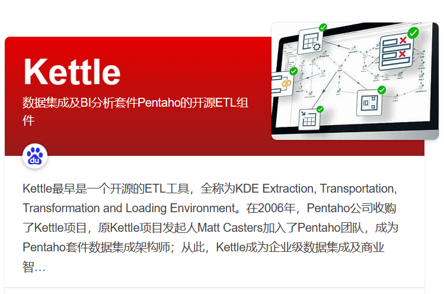

导语：伴随着数据时代的来临，ETL（数据抽取、转换和加载）工具成为企业进行数据处理和分析的重要工具。本文将介绍几款知名的ETL产品，包括Kettle、Tapdata、DataSpring和datapipeline的功能，并对它们的优缺点进行简单分析。接着，我们将设想几种不同的用户使用场景，并根据需求特点，分别推荐以上几种产品，尤其是重点推荐DataSpring。

## 一、Kettle

Kettle是由Pentaho开源社区维护和开发的一款老牌ETL工具。Kettle具有强大的数据整合和转换能力，支持多种数据源的集成和处理。其功能包括数据抽取、清洗、转换和加载，并提供了可视化的拖拽式界面，方便用户进行ETL任务的设计和管理。

Kettle的优点在于功能强大，支持多种数据源的无缝集成；用户友好的可视化操作界面，适合入门用户；丰富的插件和组件库，可以满足个性化需求。然而，Kettle的架构相对过于老化，不支持分布式部署，操作繁琐，并且缺乏实时数据同步和监控功能等现代化特性。

## 二、Tapdata

Tapdata是一款基于云原生架构的数据智能平台，旨在帮助用户快速构建数据仓库、数据湖和数据分析平台。Tapdata基于Spark开发，具备分布式ETL功能，可以进行高效的数据抽取、清洗、转换和加载。

Tapdata的优点在于部署简单，上手容易；Tapdata支持全流程的数据操作，包括数据接入、数据预处理、数据分析和数据可视化；还可以与智能BI产品DataFocus实现无缝集成，为用户提供全面的数据分析和决策支持。相对而言，Tapdata作为一个相对新的产品，其生态系统和插件库相对较少，可能无法满足高度定制化的需求。

## 三、DataSpring

DataSpring是一款基于Flink框架构建的新型分布式ETL工具，具备高并发、低延迟、无限水平扩展等特点。DataSpring相较于传统的ETL工具，在数据处理速度和扩展性上具备明显的优势。

DataSpring的优点在于极高的性能，能够实现实时数据同步和处理；结合Flink框架的功能，支持复杂数据转换和计算；部署和操作相对简单，可通过可视化界面进行可视化操作。但需要注意的是，目前DataSpring的生态系统尚不完善，插件和组件库可能会有一定限制。

## 四、datapipeline

datapipeline是一款功能强大的大规模分布式ETL产品，以高速处理、高可靠性和高容错性为特点。datapipeline基于Hadoop和Spark开发，适用于处理海量数据。

datapipeline的优点在于强大的处理能力和处理效率；能够支持大规模分布式部署，实现高可用性和高容错性；同时，其灵活的数据抽取和转换功能也是其亮点。然而，datapipeline配置和部署相对复杂，需要一定的技术经验。

根据不同的用户使用场景，我们可以推荐以下几种产品：

1. 需要实时同步大数据量的数据：推荐DataSpring。作为一款基于Flink框架的新型分布式ETL工具，DataSpring具备高并发和低延迟的实时数据同步和处理能力，具备高性能和良好的扩展性。同时，与DataFocus的无缝集成也为用户提供了全面的数据分析和决策支持。
2. 需要检测业务数据的变动：推荐Tapdata。Tapdata作为一款基于云原生架构的数据智能平台，提供全流程的数据操作功能，可以满足业务数据变动的监测和分析需求。
3. 需要大规模分布式部署：推荐datapipeline。datapipeline作为一款功能强大的大规模分布式ETL产品，支持Hadoop和Spark的整合，具备高可用性、容错性和处理效率，适用于处理海量数据。

综上所述，根据不同的使用场景，可以选择适合的产品。对于大多数情况，DataSpring作为一款性能优异、易用性高的ETL工具，是值得重点推荐的选择。
