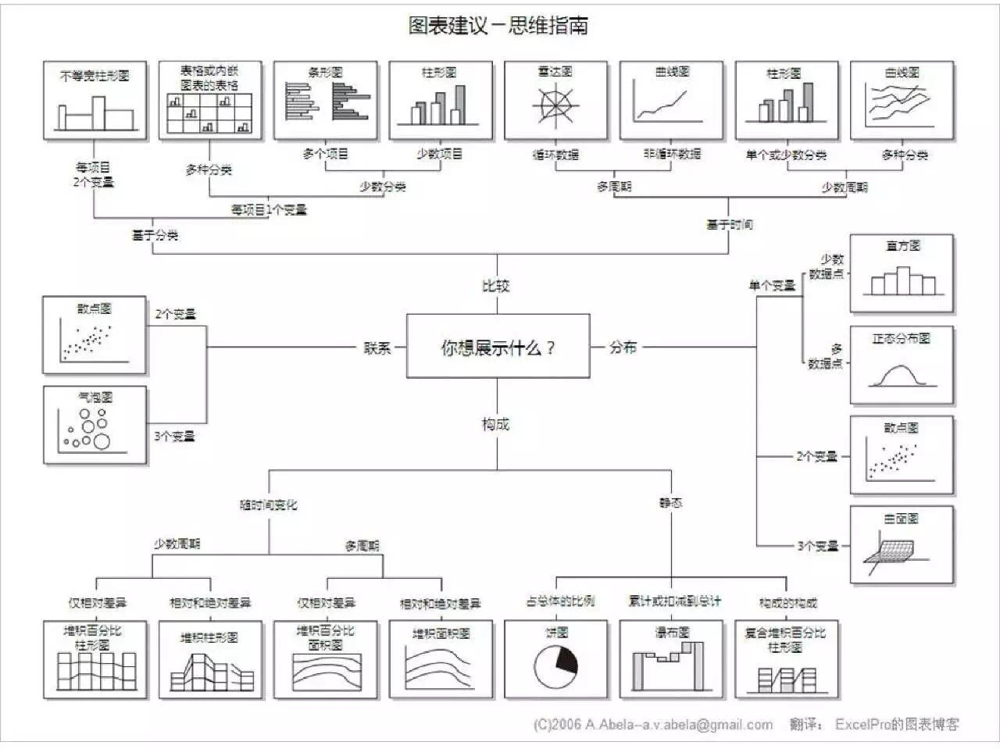

以“大数据分析”为关键词去进行搜索，你可以在大多数条目中看到“数据分析平台”和“可视化”的概念。

在发展受到局限时，人类喜欢并擅长于去使用工具和制造工具。

人类对图形信息的摄取效率远大于单纯的文字数字。

所以在信息流数量与流动速度爆炸都爆炸式增长的现状下，自然地催生了可视化大数据分析平台这类产品。

数据可视化旨在借助于图形化手段，清晰有效地去传达与沟通信息。丰富的图表可以通过位置、长度、角度、方向、形状、面基、体积、饱和度、色调来通过视觉暗示，达到聚焦视线表达图标含义的效果。

在企业运维决策的场景下，即是用适当的数据模型和统计分析方法对收集的企业数据进行可视化分析，转化成可视化结果清晰准确地形成结论报告，辅助企业了解运营状况、找到发展症结以及帮助决策等。

下面这张图展示了不同类型的分析需求对应的可视化类型。

根据Gartner最近的行业报告以及大会上，可以看到一些关于数据可视化未来发展的趋势。

1、 数据地图

“通过视觉探索和嵌入式的地理空间分析创建高度交互的仪表板和内容的能力。”

Gartner提到的“地理空间分析”，即为“数据地图”，专门用来展示和分析这些与地图有关的大数据，这确实是很好的功能，用来分析业务在地理层面上的数据具有相当的价值，尤其是对如今在地域上分布越发广泛的行业来说，可以精确地定位问题所在的国家城市甚至某一营业点。不仅会比单纯的表格要直观形象得多，也更具有信息沟通的有效性和专业的形象。从类型上讲，数据地图可以分为区域地图、组合地图、标记点地图、单层地图 、自定义图片地图、流向地图、热力地图等。

2、 互动式探索

“通过一系列可视化选项来进行数据探索，这些可视化选项不仅仅是基本饼图,条形图和折线图这些基本的数据图形，还包括热图和树图、数据地图、散点图和其他特殊用途的图表，更贴合各行各业的需求。这些工具使用户能够通过与数据直接地视觉交互来分析数据和操作数据。”

数据可视化的交互体验的能力主要通过易学性、易用性、UI友好性、使用效率来评价。它的表现形式主要体现在通过可视化图表直接对数据进行图形化的上卷下卷、切片旋转等操作，以及很重要的数据联动功能，给予用户全面的统筹数据问题与深入的挖掘数据问题的方法和角度。

3、 数据故事

“数据可视化要具有故事性，将数据通过可视化的方式迎合报告者的需求，帮助他们讲述一个完整的数据故事，让观看者更好的认识主题。”

数据可视化的结果之间可以互相联系形成具有故事性的看板，以更完整更多样的角度去阐述数据，展现更多的细节，将观看者拉入到这个故事中来。

4、 基于搜索的智能探索方式

“基于搜索和可视化的数据探索分析功能将作为新型BI和分析平台的组件融合到下一代的数据分析产品中。”

“到2021年，具有智能数据探索分析功能的新型BI和可视化分析平台的用户数量将是不具有这一功能的产品和平台的两倍，并且将创造两倍的商业价值”

现市面上的大部分可视化数据分析产品都采用拖拽式的探索方式，这种探索方式简单而快捷，但同时具有相当的局限性。在分析维度较多较复杂的时候，拖拽式操作反而会给用户带来多种不便，且要求用户对数据结构有深刻的理解才能形成理想的可视化结果。而类似于搜索引擎探索结果方式的搜索式探索方式不仅包含了拖拽式简单快捷的优点，更进一步的将分析人员从必须理解数据结构的前提下解脱出来，直接将业务问题输入分析平台，形成可视化结果。

5、 自然语言

“到2020年，50%的分析查询将使用搜索，自然语言处理或语音生成，或将自动生成。”

自然语言生成功能和搜索式探索方式的结合，完美契合了业务人员对数据进行可视化分析的需求，成为数据可视化的未来愿景，使平台能够理解用户使用自然语言描述的业务逻辑上的查询需求，准确转化为程序能够理解的查询语句，再生成可视化结果反馈给用户。
