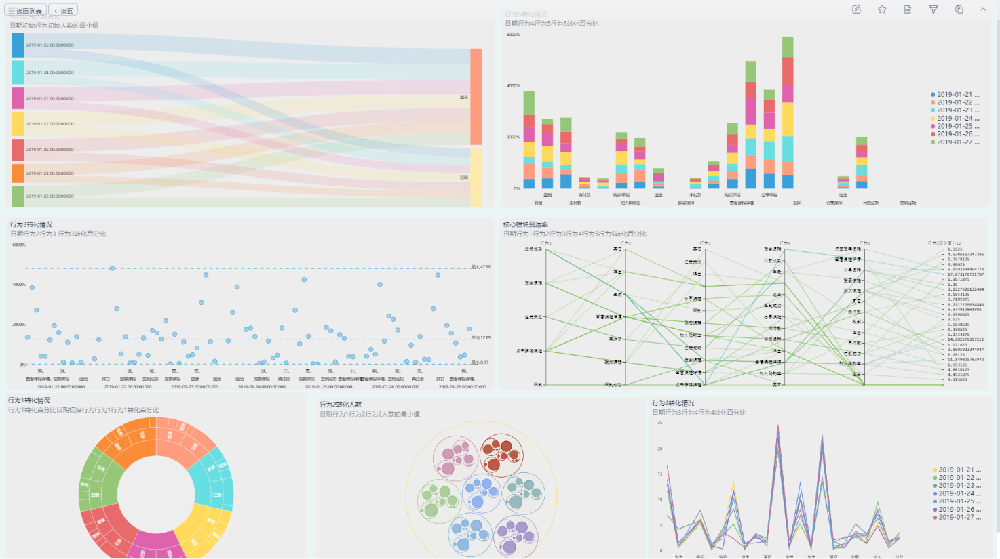
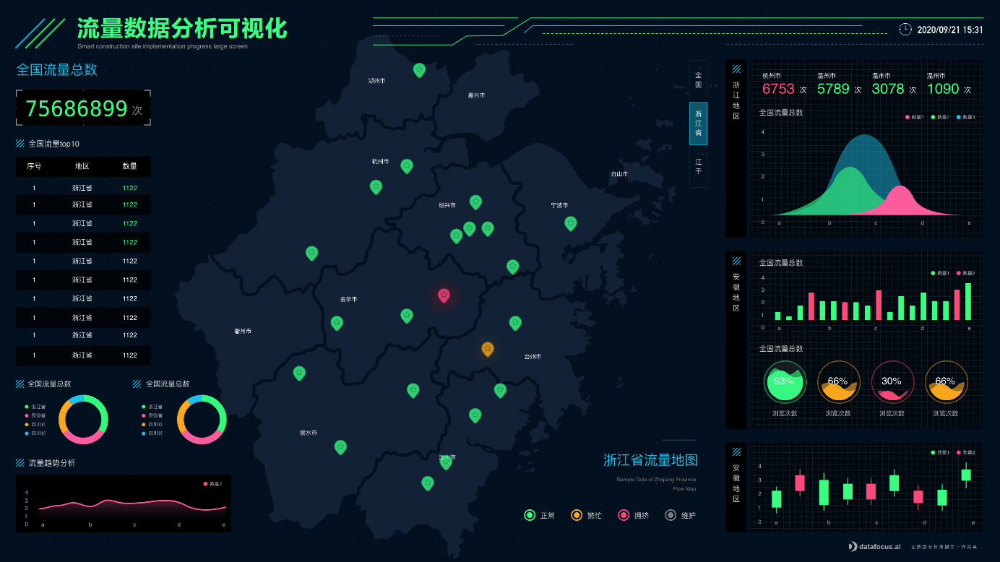

**目的：**为毕业生们从学科类型、学校所在地区，月薪及就业需求方面来选择学校及学科门类提供一定数据支持。

**摘要 ：**本报告使用datafocus系统，根据中国薪酬网公布的2017年中国大学毕业生薪酬排行榜TOP200和近三年各招聘机构公布的专业相关职业的平均薪酬统计进行可视化分析，得到相比2017届毕业生，2015届和2013届毕业生薪酬水平有较大幅度提高；大多数高薪酬毕业生均来自985、211院校；一线城市的高校在毕业生薪酬上明显占据优势；专业类的院校越来越有竞争力等结论。因此认为选择东部发达地区院校薪酬较高，选择专业类的院校比较有前景；选择理工类、文学类、财经类专业比较受市场青睐，且薪酬也较高。

**关键词：**datafocus,薪酬,学科门类,学校名称

一、案例背景

今年全国普通高校的毕业生达到820万人，相比2017年大幅增加近25万人，高校毕业生面临较大的就业压力。另外高考结束后，考生们都会面临着选大学和选专业的大难题，很多人在选学校和专业的时候会考虑到以后的就业前景和薪资水平等因素。

二、案例问题

数据可视化，是关于数据视觉表现形式的科学技术研究。excel处理数据比较方便，但是BI的图表表现方式更丰富些。本文使用datafocus产品对高校毕业生就业薪酬进行可视化，将数据转化为图形，更直观，更清晰。

三、案例分析

进入datafocus 产品系统，从数据管理页面中导入数据源“2018大学专业薪酬”、“2017年中国大学毕业生薪酬水平”，并在数据看板页面创建新的数据看板，命名为“高校毕业生就业薪酬可视化分析”。

A.院校选择

1.各高校2017届薪资排名

对各高校根据月薪高低降序排列，可以简单清晰的查看各高校的月薪排名，方便进行对比。

表 1各高校2017届薪资排名

从表1中可以看到，前200名高校的2017届毕业生平均月薪均在10000元以下，其中月薪超过9000元的共有4所，超过8000元的共有42所，超过5000元的共有134所。

2.2015届和2013届毕业生薪酬水平涨幅

通过添加公式对“增长率”进行计算，然后使用柱状图和折线图的组合图对各高校2013届毕业生和2015届毕业生薪酬涨幅进行可视化。

图 1 2015届和2013届毕业生薪酬水平涨幅

从图1可以看到，相比2017届毕业生，2015届和2013届毕业生薪酬水平有较大幅度提高，特别是2013届毕业生薪酬普遍上涨近40%。其中华北电力大学、北京联合大学、上海海洋大学、复旦大学、南京医科等高校的薪酬水平提升较快。

3.各地区毕业生的月薪差异

通过位置图可以根据颜色的深浅比较各地区毕业生的月薪差异。

图 2各地区毕业生的月薪差异

由图2可知，从高校所在城市来看，一线城市的高校在毕业生薪酬上明显占据优势。上海和北京的毕业生薪酬相对较高，其余依次为广东、黑龙江、辽宁、福建、浙江和江苏。相比之下，位于中西部城市的高校毕业生待遇普遍要比东部发达地区高校低不少。

4.2017届各类院校学生月薪差异

选择仪表盘来展示985、211院校和普通院校的学生月薪差异。

图 3 2017届各类院校学生月薪差异

如图3所示可知，大多数高薪酬毕业生均来自985、211院校，985、211毕业生薪酬大幅领先，与普通高校毕业生薪酬水平差距较大。

5.各类高校平均薪酬

此次统计图选择使用雷达图。

 图 4各类高校平均薪酬

在众多高校类别中，理工类、语言、财经院校一直深受企业青睐，从上图4来看也是如此，除上述三类以外，薪酬高于6K的高校类别还有政法类、艺术类和综合类。说明专业类的院校越来越有竞争力。

6.高薪酬专业类高校探索

选择散点图对高薪酬专业类高校薪酬进行探索。

图 5高薪酬专业类高校探索

从图5中可以看到，政法类高校中国际关系学院、华东政法大学排名靠前；理工类高校中，清华大学、同济大学、北京航天航空大学、华南理工大学排名靠前；艺术类高校中，北京电影学院、中央美术学院排名靠前；语言类高校中，北京外国语大学、外交学院上海外国语大学排名靠前；财经类高校中，对外经济贸易大学、中央财经大学上海财经大学的排名靠前。其中北京外国语大学、外交学院、 上海外国语大学、广东外语外贸大学等高校薪酬排名均位居前30位，超过不少985和211高校。另外，对外经济贸易大学 、中央财经大学、上海财经大学、上海对外经贸大学等财经类高校排名也非常靠前。

B.专业选择

1\. 各学科门类的薪酬

通过条形图可以看到各学科门类的薪酬的对比。

图 6各学科门类的薪酬

如上图6所示，拥有经济学、管理学双学位的学科门类平均薪酬最高，其次为哲学、文学、工学、理学、经济学、轻化工类和金融类。

2.各专业平均薪酬

选择面积图对高薪酬学科进行专业探索。

图 7各专业平均薪酬

因为专业种类过多，通过放大查看薪酬较高的专业。

图 8各专业平均薪酬局部放大图

从图8中可见文学类和理工类的薪酬是最可观的。工学中环境科学专业是唯一一个薪酬超过3万的专业，薪酬超过2万的专业也只有文学中的芬兰语专业一个。其次为工学中的水文与水资源工程专业、文学中的荷兰语专业、经济学管理学双学位中金融工程专业，文学中的挪威语专业，工学中的水务工程专业。

将这8个结果图表导入“高校毕业生就业薪酬可视化分析”数据看板中，为了使看板具有美观性，对看板进行了布局操作，操作结果如下：

图 9 数据看板

四、结论

1\. 前200名高校的2017届毕业生平均月薪均在10000元以下，其中月薪超过9000元的共有4所，超过8000元的共有42所

2\. 相比2017届毕业生，2015届和2013届毕业生薪酬水平有较大幅度提高，特别是2013届毕业生薪酬普遍上涨近40%。

3\. 大多数高薪酬毕业生均来自985、211院校；一线城市的高校在毕业生薪酬上明显占据优势。

4\. 专业类的院校越来越有竞争力；经济学、管理学双学位、哲学、文学、工学、理学、经济学、轻化工类和金融类学科门类薪酬较为可观。

五、对策与建议

1.选择北京、上海、广东、黑龙江、辽宁、福建、浙江和江苏的高校，其毕业生待遇要高一些。

2.如果成绩达到一定分数线，建议选择985、211类院校。

3.选择专业类的院校：政法类高校中国际关系学院、华东政法大学排名靠前；理工类高校中，清华大学、同济大学、北京航天航空大学、华南理工大学排名靠前；艺术类高校中，北京电影学院、中央美术学院排名靠前；语言类高校中，北京外国语大学、外交学院上海外国语大学排名靠前；财经类高校中，对外经济贸易大学、中央财经大学上海财经大学的排名靠前。

4.选择理工类、文学类、财经类专业比较受市场青睐，且薪酬也较高。
