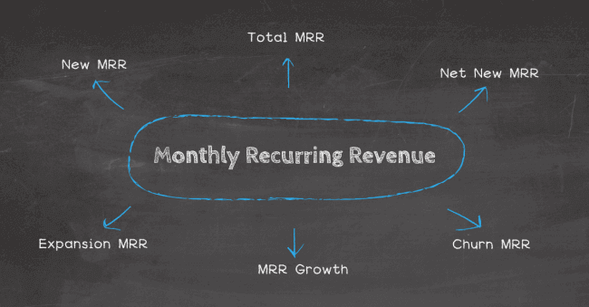

每月经常性收入 (MRR) 是任何 SaaS 业务的动力源。这是推动其增长并使其在其他商业模式中脱颖而出的原因。在基于订阅的 SaaS 业务中，您不必担心一次性销售可能会回来，也可能不会回来。如果您保持竞争优势，则收入将每月自动返回。SaaS 模式的这一优势和其他优势使得越来越多的公司转向建立在共享在线基础设施的服务。一项研究和报告研究表明，到 2023 年，基于 SaaS 的企业应用软件市场预计将以 +17% 的 CAGR（复合年增长率，它告诉您每年的投资收益率）增长。

我们已经发布了一篇关于 每个成功的 SaaS 公司需要跟踪以监控其进度的[5 大 SaaS KPI的博客文章。](https://www.datafocus.ai/infos/top-5-saas-kpis-every-company-needs-track)今天，我们将重点介绍其中最重要的部分。就是真实的可视化订阅现金从客户进入您业务的形式。在今天的帖子中，我们将解释每月的经常性收入究竟是什么，以及它的计算必须包括哪些方面。随后，我们将提醒您注意最常见的错误，并就如何改进您的数字给出一些提示。

## 每月经常性收入是多少？

每月经常性收入衡量的是公司在给定月份预期的总收入。这是一种将不同的定价计划和计费周期平均为一个一致的数字的方法，您可以随着时间的推移对其进行跟踪。在基于 SaaS 订阅的公司中，跟踪此指标至关重要，主要有两个原因：

- 这是一项重要的财务指标，可为您提供最准确的 SaaS 公司状态检查。它明确说明了订阅模型中的“重复”组件，并有助于根据用户订阅做出准确的财务预测。现在您可以预测您未来的业务状况，并相应地设计您的业务战略。
- 没有其他 KPI 可以为您提供有关您的业务是否正在发展和获得动力的更准确信息；每月的回报说明了一切。

## SaaS 模型有什么好处？

创建MRR流可以实现稳定的现金流，这将比波动的项目相关业务更好地保障公司的底线。拥有可预测的收入有助于预算预测和目标，并为增长铺平道路。事实上，当模型具有可扩展性时，一旦客户被锁定为订阅/每月付款，业务就可以更快地扩展。同样，风险也明显降低。拓展到国外市场也更容易，因为您的产品是基于互联网的应用程序，您不需要中间人来分发它。您唯一需要在全球范围内进行营销的就是互联网连接和良好的战略！

对于 SaaS 公司来说，受益的时间缩短了，因为原型制作速度非常快。该软件已经安装和配置好了，用户可以为云配置服务器并快速准备好使用它。由于大多数 SaaS 公司都提供免费试用，因此可以快速、轻松地向潜在客户证明概念，并直接进入发现阶段。这确实有助于让潜在客户更容易地了解公司，并展示公司的附加值、利益和独特的销售主张。事实上，该软件可以通过用户熟悉的浏览器访问，这使得学习曲线更加柔和，采用率更高。

具有经常性收入的企业也往往比没有经常性收入的企业拥有更高的客户留存率。怎么来的？通常情况下，最难的部分在于进行销售。订阅，就像每个月都有少量销售一样。您只需要让客户对您的产品和服务感到满意并参与其中，因为获得一个新客户的成本是留住一个新客户的五倍。这就是为什么您还需要熟悉[客户满意度指标](https://www.datafocus.ai/infos/customer-satisfaction-metrics-effort-score-nps-csat)，以保持稳固的客户群，使您稳步增长。

此外，随着已经存在的客户群带来固定收入，您以后可以通过向他们出售升级、附加组件、扩展和其他能产生更高利润的福利来增加销售额。再一次，使用特定的[客户 KPI](https://www.datafocus.ai/infos/top-7-customer-kpis-and-metrics)将有助于解决这个问题：生命周期价值、流失率、购置成本……它们都与每月经常性收入相辅相成，并将为您提供指导。

## 如何计算每月的经常性收入？

有两种方法可以做到这一点。第一个是简单地计算基础用户每月支付的费用。如果客户 A 每月支付 100 美元，客户 B 每月支付 200 美元，那么您的经常性收入总计为 300 美元。用 Excel 的话：

MRR = SUM（支付客户月费）

但是，这种逐个客户计算的方法相当繁琐且耗时。因为客户在使用您产品组合中的不同产品包时支付的金额不同，所以计算过程会拖沓。您可以通过计算每单位/账户的平均收入 (ARPU)来简化流程 。在这种情况下，您需要将付费客户总数乘以所有这些客户每月向您支付的平均金额 (ARPU)。例如，当您有 100 位客户平均每月支付 100 美元时，您的经常性收入将为 10,000 美元。

MRR = ARPU \* 客户总数

## 我如何利用我的成果？

要从经常性收入中获得有意义的见解并准确估计其增长，您必须在计算中加入更多指标：

**新MRR**

就是新客户带来的新收入。所以想象一下，在一个月内，您获得了 40 个每月支付 100 美元的新客户和 20 个每月支付 150 美元的新客户。您当月的新 MRR 为 7000 美元。

**扩展MRR**

在基于订阅的 SaaS 公司中，现有客户经常升级他们的产品包或购买额外的功能作为交叉销售的结果。扩展 MRR 是来自那些决定扩展套餐的现有客户的额外经常性收入。因此，当您有 10 个客户将他们的套餐从每月 100 美元升级到每月 200 美元时，这意味着您当月的扩展 MRR 将为 1000 美元。

**流失 MRR**

客户流失是指由于客户取消或降级他们的套餐而导致的经常性收入损失。因此，假设在给定的月份，有 2 个客户取消了每月 100 美元的计划，而另外 2 位客户将他们的计划降低了 100 美元。您的流失将达到 400 美元。因此，您下个月的经常性收入将减少 400 美元。

**MRR 增长**

最后，要计算您的 MRR 增长，您实际上应该在一个公式中考虑这三个方面：

净新 MRR = 新 MRR + 扩展 MRR – 流失 MRR

这个增长率是 SaaS 公司应该跟踪的最重要的指标之一，因为它回答了“我的业务增长速度有多快？”的问题。你的公司应该以达到一个可持续的增长率为目标，以建立一个健康的业务基础。下面，这就是您如何通过 [KPI 软件](https://www.datafocus.ai/infos/kpi-dashboard-software)可视化所有指标：

上面的仪表板显示了所有前面指标的模型开发。我们看到该公司通过获取新客户不断创造新的经常性收入。此外，MRR 的增长速度表明该公司在升级客户和说服他们在产品上投入更多方面做得很好。流失 MRR 结果保持在相同的低水平，这表明客户对他们的产品保持满意。

## 该计算的常见错误是什么？

尽管将整个过程分解为简单的步骤时似乎很清楚，但我们从经验中知道，某些错误会不断出现。让我们在这里列出它们。

**包括一个月内订阅的总收入**

即使有人在第一个月向您支付了总金额，这些计算中的订阅价值也应除以预期的订阅长度。否则，这些计算毫无意义，因为它们不能反映您业务的增长势头。而是在您的预订量计算中计算现金流。

**省去交易费用和逾期费用**

减去交易费用和拖欠费用会导致误导性的月度业绩。一些企业家可能希望这样做以使他们的计算更加准确。但是，在月末由于您没有从客户那里收取订阅费用，因此不会记录拖欠费用。相反，您应该做的是将拖欠费用分组到一个单独的类别中。通过这种方式，您可以准确地监控和衡量您每月因信用卡失败或过期而损失的收入金额。

**添加临时支付**

一次性付款（例如您不会定期收到的设置费）不属于定期收到的基础上，因为它们不会经常发生。将此类付款添加到您的计算中，会让你的增长预期不切实际。

**不包括折扣**

尽管这种解释听起来可能是多余且显而易见的，但为了清楚起见，让我们重复一遍。如果您给每月支付 100 美元的客户折扣，使他少支付 50 美元，那么您的经常性收入就不是每月 100 美元，而是每月 50 美元。不包括折扣会导致您的数字达到顶峰，并会扭曲您的增长预测。

**解读错误**

不要将经常性收入与现金流、销售额或收入混淆。你不能用它来计算你的利润，因为它不够准确和标准化以消除波动。只有当您的所有客户在每月的第一天到达时，您的经常性收入才会与您的实际收入相匹配，您不会给予任何退款或折扣，只会出售订阅。

## 我能做些什么来提高我的成绩？

既然您现在确切地知道每月经常性收入是多少并且可以正确计算它，那么让我们考虑可以采取哪些措施来改进它。下面的一些提示会以某种方式说明显而易见的事情，但那些才是真正有效的。

**不要只卖技术**

拥有具有清晰独特的销售主张 (USP) 的高质量产品。花点时间考虑一下您的产品的哪些特征构成了它的独特优势，使您的产品在竞争对手中脱颖而出。不要只推销具有技术规格的 IT 解决方案（通常面向非技术人员）——告诉他们这将如何对他们的业务产生积极影响。提高生产力、控制成本、降低风险……找出您可以解决客户需求的解决方案。然后将这些功能清楚地传达给您的潜在客户。既然你这么做了，为什么不以顾问的身份，给他们一些宝贵的建议，比如安全性、移动性、他们应该实施或集成哪个平台等方面。

**获取新客户**

这当然是显而易见的，但仍然需要提及。通过产生更多合格的潜在客户来永久增加客户获取的数量。确保您已经确定了您的目标群体，并专注于使用您相应的营销策略来解决它。入站营销策略可以提供非常高的投资回报率，但需要更多时间才能达到其功效的峰值；相反，外联策略更直接，但需要更多投资。

**升级/扩展策略**

有一个良好的升级策略，通过扩大 MRR 来提高经常性收入。发现现有客户的潜力并将他们升级为增强的产品包。从现有客户那里可以赚到很多钱，通常升级一个客户比获得一个新客户要容易得多。

**取消捆绑您的功能**

如果您在一个软件包中提供所有出色的功能，那么您肯定会错过一些赚钱的机会。将它们分成不同的附加服务将带来现金收入，就像品牌监测公司 Mention 所做的那样，他们的 ARPU（每单位平均收入）增加了 296% 。

**提供一年的预付款**

启动年度预付款计划可以显着提高您的客户留存率，因为他们将直接承诺 12 个月。当然，为了让它更具有吸引力，您需要为该年度预付款选项提供折扣。但是，客户流失率的减少仍可能在客户的整个生命周期内为您的每月经常性收入带来净收益。

**尽可能降低流失率**

确保您的客户与您的产品保持联系。通过引入新功能来吸引他们。定期添加新功能，尤其是添加到您更大的定价包中，不仅可以支持您的升级策略，还可以防止您的客户降级他们当前的包。

**优化客户支持**

照顾好您的客户并与他们保持联系。提供个人客户支持，并通过时事通讯和社交媒体渠道让客户了解新增功能的最新信息。快乐和满意的客户是您可以拥有的最好的广告，他们将成为忠诚的客户，从而增加终身价值。

## 定期跟踪每月经常性收入

“在增长阶段的业务中，我最看重的是增加月收入、减少月消耗的能力。” - Steve Schlenker，DN Capital 管理合伙人。

该指标是衡量您在 SaaS 业务中收入的最纯粹的衡量标准，表明您的势头是如何随着时间的推移而增强或减弱的。监控每月经常性收入的最简单方法是将其可视化在一个清晰且可操作的仪表板上，如上面的仪表板，以全面了解我们讨论过的各种经常性收入，并了解每项收入是如何发展的以及如何改进它们。要做到这一点，使用[仪表板设计](https://www.datafocus.ai/infos/dashboard-designer)器是非常有帮助的。

如果您想构建有意义的数据可视化，帮助您从数据中汲取洞察力并做出更好的业务决策 - 立即开始 [免费试用](https://www.datafocus.ai/console/)！
