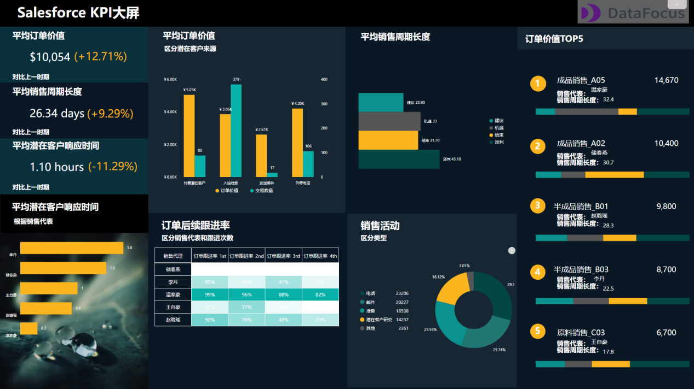
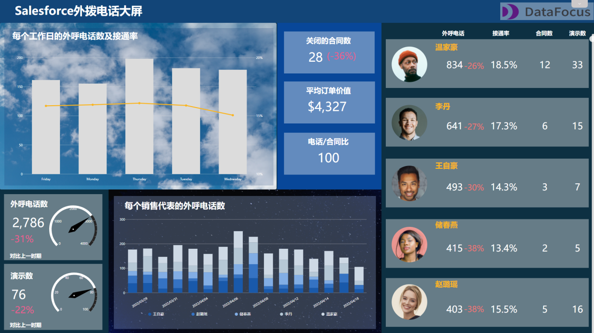
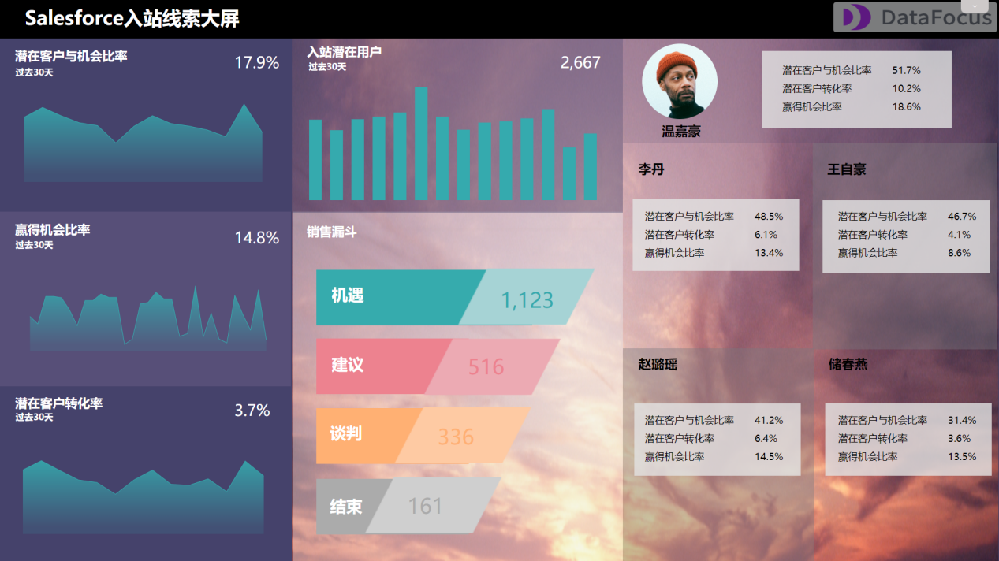

## 客户需求难以捉摸？CRM加上它，帮你轻松实现客户成功

CRM(Customer Relationship Management)即客户关系管理，简单讲CRM系统就是为了满足每个客户的特殊需求，同每个客户建立联系，企业运用软件技术，通过同客户的联系来了解客户的不同需求，在此基础上进行“一对一”个性化服务。

基于上述的定义，我们可以了解到实施客户关系管理将使企业能够深入了解客户需求，及时将客户意见反馈到产品和服务设计之中，为客户提供更加个性化和深入的服务。

因此无论企业或公司的规模有多大，都要提高的客户满意度和客户相关性。如果公司不能处理好与客户的关系，就很难取得成功。CRM系统可以帮助公司管理客户和公司之间的关系。对于企业来说，CRM系统的重要性不言而喻。

Salesforce是一种非常流行的基于云的客户关系管理(CRM)解决方案，它为销售流程的规划和优化提供了巨大的价值。借助**DataFocus**的一体化BI数据分析工具，旨在帮助销售部门监控、分析和优化客户关系管理的所有相关方面，从而使销售团队能够最有效地利用可用资源并实现商定的销售目标。同时可以将现有的Salesforce数据与其他数据源相结合，并充分利用您的业务信息的潜力。配备强大的动态交互式数据看板将使您能够，从视觉上更直接且吸引人的方式分享的分析结果，并积极推广数据驱动的销售或企业文化。

## **Salesforce KPI大屏**

第一个Salesforce KPI大屏，主要总结了用于评估销售业绩的核心关键绩效指标(KPI)。大屏总结的关键指标包括：潜在客户响应时间、订单后续跟进率、销售活动以及平均订单价值和销售周期长度，同时还对本季度数据和上一季度数据进行了增长率的对比。

首先分析不同在客户来源的平均订单价值和交易数量，尤其是入站线索和外呼电话之间，通常存在显著的差异。如上图所示的示例大屏中，大部分潜在用户是通过入站营销策略产生的，但最高的平均订单价值来自合作伙伴网站的付费潜在用户，但同时这一类的付费潜在用户一般会导致较高的获客成本（CAC）。

然后，通过将销售周期划分成4-5个主要的销售阶段，分析每个阶段的平均时长，以此确定产品周期中可能存在的薄弱点。

此外，Salesforce KPI大屏左侧提供了有关单个销售代表的平均潜在客户响应时间和后续联系率的详细信息。例如图上显示，销售代表温家豪的潜在客户响应时间最短，且其拥有最高的订单跟进率。通过研究这些信息，可以尝试关闭一些在第三次甚至第四次联系后跟进率极低的订单。

最后在大屏的右侧，展示的是上一季度订单价值最高的5份合约的概览。值得注意的是，5笔交易中有3笔的销售周期明显较长。

## **Salesforce外拨电话大屏**

下一个大屏是Salesforce外拨电话大屏，在这个大屏示例中，统计过去31天的一个5人销售团队，且该团队将大约三分之一的工作时间用于外呼电话。借助大屏，详细了解电话外呼的关键数据：外拨电话数量、外拨电话接通率、商定的会议或产品演示数量，以及签订的合同数量和他们的平均订单价值。

首先分析不同工作日的电话接通率，并将调查结果包括在未来的外呼计划中，尤其是在B2B领域。如上图的大屏所示，电话接通率在周二、周三较高，这也同时表明销售团队可以适当减少周一和周五的外呼电话数量。

然后通过仪表图和KPI指标，将外呼电话数和演示数进行可视化，这里也对比了上一时期的增长趋势，但都存在负增长。其次，还有三个KPI指标，分别是已关闭的合约数量、平均订单价值以及拨打电话与成功完成的合约之间的比率。

最后在大屏的右侧，还存在一个统计每个销售代表的关键指标的摘要：拨打的电话数量（增长率）、接通率、签订的合同数量和演示数。**这样的概览有助于您时刻关注各个销售员工的表现，并在出现偏离目标的异常情况时能及时做出反应并采取适当的措施。**

## **Salesforce入站线索大屏**

在商业实践中，如何获得最佳潜在客户资格对任何公司来说都是一项重大挑战。

通常会出现一下情况，要么入站潜在客户资格过高，可能会出现忽略潜在客户；要么入站潜在客户的资格不足，同时缺乏优先级，导致将较多的资源浪费在价值较低的潜在客户上。但如何寻得最优解，并没有一个普遍有效的“成功公式”，只能通过不断的测试和试错，寻找并开发属于自己的个性化、最优的潜在客户资格认证方法。

最后一个大屏示例侧重于Salesforce入站潜在客户管理，同时解释了优化销售渠道的指标：**潜在客户与机会比率、机会赢得比率和潜在客户转化率**。

在Salesforce入站线索大屏示例的左侧，可以找到关于上述三个指标的详细概述，用于监控和优化过去30天的销售漏斗。平均领先机会比率为17.9%，并且随着时间的推移略有下降。该指标通常用于评估潜在客户质量，因为它是通过将合格潜在客户（机遇）的比率除以收到的潜在客户总数来计算的。

第二个关键数字，机会赢得比率，计算了销售合格的潜在客户（SQL）到签订合同的频率。在大屏上，这个值约为14.8%。这也就意味着大约每7个SQL中大约只有一个可以成功签订合同。

第三个指标，潜在客户转化率，该指标展示了整个销售渠道的有效性，及可以成功转化为付费客户的占所有入站潜在客户的百分比。这个转化率自然是越高越好，同时借助前两个指标，可以一方面监控潜在客户质量，另一方面监控潜在客户资格的有效性。

最后，希望通过我们精选的几个大屏，能够向您展示专业KPI大屏软件在监控、可视化、分析和优化您的客户关系管理和销售业绩方面的优势。欢迎您在30天内完全免费测试我们的软件，只需通过简单搜索即可创建自己的仪表板，所思即所得！
