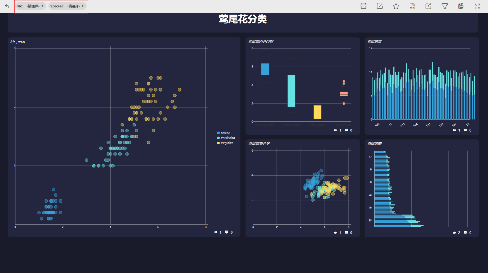

近年来，由于大数据等新兴技术和理念普及，电子商务等大量依托于数字化运营的行业迅猛发展。以此为依托，以数据分析为中心的各类应用和管理也层出不穷，以最大化的服务于企业的决策和运营。为此，很多企业聘请了专门的团队，或干脆购买了类似于DataFocus、Power BI等BI工具。

而对于TO C企业来说，比如电商行业，在这个人人都可以作为口碑基点的时代，客户体验是至关重要的一环，体验甚至很多时候超乎产品本身所带来的价值，是一个立体化的“产品”。因此，对于店铺来说，如何全方位多角度的甄别和分析客户体验是很多运营者和数据分析师都关心的问题。本篇就为大家分享某童装店铺对于客户体验的数据维度闭环打造策略。

首先还是会像大部分商家一样，定期有质检报告。通过分析每一位进入店铺消费的客户评价数据，加上主管分析其评价内容，且归档到相应类目。并且通过分析评价数据，反馈给相应部门做决策辅助，从而做到各渠道的服务提升，做到用户体验极致化。

第二是客户关怀数据维度。以店铺的六大数据（流程能力、销售、商品、客户、会员体系、服务）为基础，配合实时的数据分析，搭建适合其自身店铺的服务体系。相比于一味地无脑做营销，更加注重客户日常的服务反馈数据。

第三是标签数据的管理。通过对商品打标来数据化商品，从而对购买商品的人群打上标签，相当于进行了数据交集应用，以监控进入店铺消费的人群购买习惯，从而推测出人群画像。

第四是平台互动数据应用。比如手淘的“问大家”，部分替代了客服推荐尺寸、介绍材质等的工作，提升了店铺与客户、客户与客户之前的互动性，同时也帮助店铺更好的采集客户的真实数据。另外，手淘主页的“问大家”也是很多店铺分析优质流量数据的分析参考。
