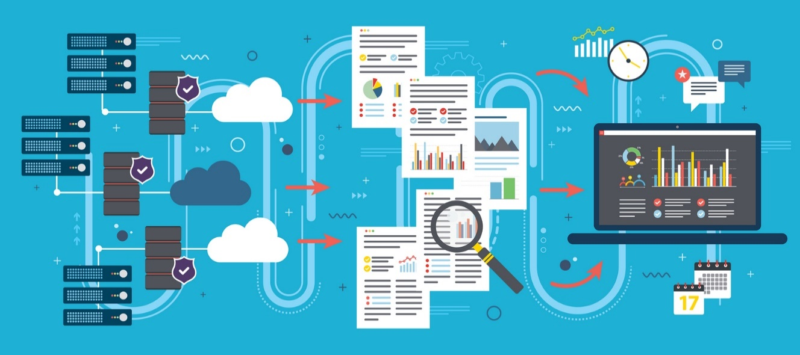

随着业务数据量的不断增长，公司必须集中精力管理数据，并在BI工具的帮助下进行数据分析，以便从过去的数据中获得洞察力，预测未来的发展。近年来，随着企业对数据的关注度增加，并且希望用数据指导日常业务，对BI工具的需求增长速度也加快了。

由于部署复杂、成本高和需要特定技能，过去只有大型企业才选用BI工具。不过这样的时代已经过去了。现在中小型企业正在积极选购BI工具。为了在残酷的商业竞争中脱颖而出，降低成本，增加利润，公司必须做出明智的决策。为此，这些决策必须基于可信和相关的数据之上，而这正是BI工具发挥价值的地方。而BI又往前发展了一步，自助式BI的概念开始普及，因为它对使用用户更友好，能让团队中的每个人都参与其中。

在本文中，我们将解释什么是自助BI分析平台，比较传统式和自助式BI，了解自助式BI的优势，并了解自助BI分析平台的一些应用示例。最后，我们将介绍你可以遵循的最佳实践思路。

**1)什么是自助BI分析平台？**

**自助BI分析平台**是指企业使用的流程、工具和软件，旨在使业务人员能够自行选择、过滤、比较、可视化和分析数据，而无需专业和高级的IT培训。

给定一个需要解决的问题或需求后，数据分析人员就可以连接数据、执行分析、创建可视化或报告以及共享他们的结果。执行此过程时，分析本身可能会因信息消费者的即时需求而异。在后台，系统会执行数据库查询，由强大的分析引擎支持完成数据分析，然后，你可以通过将数据转化为有意义的可视化图表来呈现结果。生成的图表可以通过数据看板轻松共享，这意味着你公司的任何人都可以查看、理解和参与数据提取过程，而不仅仅是受过培训的信息技术部门或数据分析师部门。最好的自助式BI平台还会在软件中提供预测分析模型，就像DataFocus的高级版本提供的那样。

传统上，整个过程由技术人员和专业数据分析人员完成，而业务人员只能提出需求和查看报告。让我们看看这一切是如何改变的。

**2)传统式与自助式BI**

近年来，BI领域发生了巨大的变化，让我们看一下传统式BI和自助式BI之间的区别：

1. 省去繁琐的需求实现流程

传统上，业务人员想要一份数据报告或制作一张数据看板，他们需要提出业务需求。而除此之外，他们就不再处理其余流程，反倒是IT部门接管了剩余的工作。IT或数据分析部门生成报告或数据看板，而业务人员对此流程没有任何控制权！而在自助式BI环境中，业务人员不需要精通技术就可以自己搞定ETL，分析、报告和数据看板的创建完全由用户自主控制。此外，自助式BI可以根据使用人员的知识水平提供各种可能性，因此业务人员和IT专家的需求都可以在同一个工具中实现。

1. 不需要代码实现ETL

ETL 指数据的抽取、转换和加载流程。在传统式BI中，IT部门通过编写SQL将数据从仓库中提取出来。而在自助式BI环境中，业务人员直接访问数据，不需要使用代码语言。虽然在数据准备的某些步骤中还需要IT部门的合作，但自助式BI已经能够帮助IT部门减少大量工作负担。

1. 以业务为中心的使用流程

在传统式BI中，报告和数据看板都是由IT专业人员完成的，这一过程可能需要几周的时间，而且如果业务人员需要修改，要经历更漫长的等待，这一流程早就需要改进。而在自助式BI环境中，流程以业务为中心，业务人员可以直接根据业务需求，生成即席报告、随时与数据看板进行交互。这个过程变得如此简单，还能随着业务变化随时调整与优化，充分发挥数据价值。

**3) 自助BI分析平台的优势**

a)在几秒内回答数据问题

必须等待数小时甚至数天才能拿到报告的日子已经一去不复返了。自助式BI分析平台可以让你随时访问数据，进行实时分析并获得即时可行的见解。而像DataFocus这样的工具，更是将拖拽式操作升级为搜索式操作，让速度再次提升数倍！

b)数据民主化

整个团队不再需要依赖数据分析师和IT部门。自助式BI分析平台以易于共享的形式为每个团队成员提供信息。所有人都可以轻松访问数据，决策过程更具包容性，每个人都有平等的机会发现问题，找到撬动业务的杠杆。

c)移动至关重要

商业智能可以理解为在正确的时间，拥有正确的数据，做出正确的决策。这意味着无论你在哪里都需要能访问你的数据。DataFocus Cloud就能做到！通过企业微信或分享链接，可以在手机端访问数据看板 ，保证即时性。

d)数据可视化是关键

数据看板的使用对于过滤和管理现代公司生成的大量数据已经变得不可或缺。将数百万个数据点和高级数学概念结合起来，制作一看就能理解的数据故事，这是自助式BI带来的变革。

e)限制你的风险

DataFocus Cloud采用了SaaS服务模式，与传统式BI相比，企业无需花费时间、费用和精力在内部开发商业智能基础设施。启动不需要前期投资，也不需要维护费用。还可以根据用户数量按月付费。企业不再需要建立自己的数据中心、雇佣大量的IT人员或购买昂贵的一次性许可证。DataFocus还提供免费试用，确保产品符合你的需求。

**4)实用的自助BI分析平台**

这一部分，我们将以DataFocus为例，介绍自助式BI平台的主要元素。

a)易于使用的数据仓库

你可以轻松地将你的数据库、电子表格、客户关系管理、财务系统等连接到统一的数据仓库中，既消灭了数据孤岛问题，还不影响数据的实时更新。

b)便捷的操作页面

一些用户可能听说过拖拽式操作的BI工具，相比之下，DataFocus的搜索式操作更直观、更便捷。你可以在搜索框中输入数据问题，就立即显示令人惊叹的可视化效果。

c)多种共享方式

DataFocus提供了多种共享方式。图表&数据看板通过电子邮件定时推送，数据监测告警并自动通知，移动端查看资源，复制并发送链接实现共享，数据沟通触手可及。

**5)自助BI分析平台的最佳实践**

现在我们将说明一下使用自助BI分析平台必须遵守的最佳实践，以便从中获取最大价值。

1. 让所有利益相关者和使用用户参与进来

这一点在选用企业级的软件解决方案时至关重要，让整个团队参与进来，充分了解情况，从一开始就表达他们的想法和意见，就团队的工作方式以及BI工具应该如何改进他们当前的工作流程提出问题。在充分了解问题的情况下，才能找到有效的解决方案。

1. 高效的沟通计划和时间表

制定高效的沟通计划不容易，但有效实施商业智能解决方案至关重要。敏捷沟通应该是另一个需要仔细解决的优先事项。确定对每个使用用户来说最重要的信息类型、数据管控的权限、培训和使用几计划，以使每个人都最快了解和掌握自助式BI工具。

1. 制定通用标准

为分析和报告设定标准也必须是自助商业智能的最佳实践之一。如果你希望充分体现公司的品牌特性、核心优势，就应该在内部实施标准。数据看板的颜色设计必须与你的品牌相一致，这一点至关重要，因为你不希望每个数据看板看起来都有很大不同，以至于看起来不像是你的公司创建的。图表类型的使用也是一个应该达成一致的地方，因为将一种类型用于特定的可视化是有意义的——例如，团队将有机会立即识别什么类型的数据将在折线图、条形图或堆积柱形图中呈现。

**总结**

我们已经了解了什么是自助式BI平台、传统式与自助式的区别及其优势。由于技术的进步，自助服务触手可及。如果你想让你的团队尝试一个真正的自助式BI解决方案，看看它如何让你的公司受益，DataFocus有答案。你可以尝试我们的软件，体验自助服务的力量。
