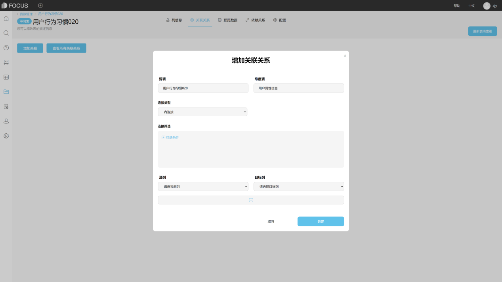
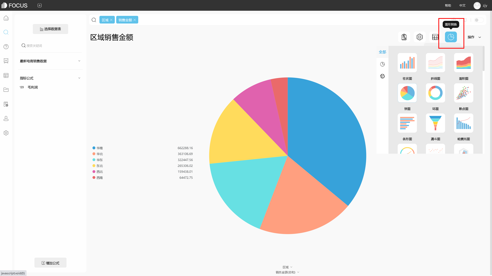

**不会代码，能否自助进行数据分析？**

数据分析师一般需要有扎实的SQL基础、有统计学基础、能熟练使用Excel且至少掌握一门数据挖掘语言等素质。那么，对于不懂代码、没有SQL语言基础的业务人员，能否进行数据分析呢？在当今科技发展的时代，商业智能BI应运而生，使业务人员从自身需求出发自助进行数据分析成为现实。

今天，我们借助DataFocus系统来了解下BI产品如何完成数据分析。

## 数据的查询与提取

将数据库中数据导入DataFocus系统后，可以在搜索模块通过搜索方式用关键词、公式、列名等进行数据的查看和提取。

支持连接的数据库包括mysql、postgresql、oracle、IBM DB2、sqlserver、Sybase、GaussDB 100、Pivotal Greenplum等。

图表 1. 1 数据源

我们来看几个常见的数据查询和提取，在DataFocus中是通过哪些关键词和公式来实现：

1. 查询表中列值，在搜索框中直接输入列名即可。
2. 对数据聚合，使用聚合公式如count()求行数、max()求最大值、sum()求和、sum\_if()按条件求和等。

图表 1. 2 公式

1. 分析公式：累积求值，如cumulative\_sum()、cumulative\_count()、cumulative\_max()等等；

分组求值，如group\_sum()、group\_average()、group\_min()等等

移动求值，如 moving\_count()、moving\_variance()、moving\_sum()等等

1. 对日期进行计算，使用日期公式如add\_days()增加天数、diff\_days()求相差天数、is\_weekend()判断日期是否为周末等等
2. 查询并将某个字段按正序和逆序排列时，在系统中使用功能键或在搜索时使用排序关键词，如“按销售额升序”
3. 根据特定条件进行查询提取，如使用公式if..then..else() 实现逻辑判断
4. 查询数据中前几项、后几项或中间项，可以使用筛选关键词，例如“排名第3到5的销售金额的总和”。
5. 将表中数据行合并起来，可以使用文本操作函数concat()

## 数据的处理、分析

在DataFocus系统中，数据的处理与分析是通过建立表间关联关系、创建中间表、数据转换等系统功能，以及系统支持的公式和关键词来实现。

1. 在数据表管理模块，给表之间建立关联关系。使这些数据表可以在搜索模块一起进行数据分析。

图表 2. 1 创建关联关系

1. 在系统的搜索模块，通过公式、关键词、中间表等功能，处理重复或缺失数据。

图表 2. 2 补全缺失值

1. 使用搜索模块的数据转换功能，进行行列转换

图表 2. 3 行列转换

1. 使用公式进行运算与分析

图表 2. 4 公式运算分析

## 数据可视化

在BI系统中，数据分析结果可以直接以图表形式展现，并进行可视化大屏的制作。

例如DataFocus系统会根据搜索分析结果自动选择图表展现，并支持图表更换、编辑与美化。

图表 3. 1 图形转换

将图表保存到系统中后，可以通过创建编辑看板，直接用该图表制作可视化大屏。

图表 3. 2 编辑可视化大屏

商业智能BI是数据仓库、联机分析处理和数据挖掘等技术的综合应用，能有效帮助业务人员甚至企业降低数据分析的成本。
