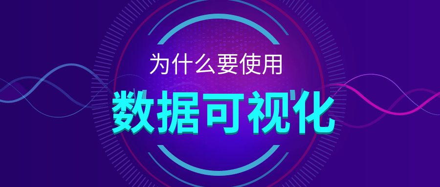

信息的质量很大程度上依赖于其表达方式，同样的，对数据集进行数据分析后，结果可视化可以帮助读者更好的理解数据信息，抓取其背后的价值。其实数据可视话的本质就是视觉对话，数据可视话将数据分析技术与图形技术结合，清晰有效地将分析结果信息进行解读和传达。可以说数据和数据可视化是相辅相成的，数据赋予可视化以依据，可视化增加数据的灵活性。企业利用数据可视化可以更好更高效的提取有价值的信息。那么数据可视化的优势在哪？

- 专递信息高效

人脑对于视觉信息的处理速度要比书面快，可视化后的数据结果更具有理解性，因此传递更高效。

- 信息更立体

可视化大屏代替繁杂的报告是再有用不过了。可视化大屏的交互性，可以显示数据的多维性，使图形不再“古板”，多角度查看数据本质，使数据信息更立体。

- 大脑记忆能力的限制。

很多研究已经表明，在进行理解和学习的任务的时候，图文一起能够帮助读者更好的了解所要学习的内容， 图像更容易理解，更有趣，也更容易让人们记住。

**常用的可视化工具：**

1、Excel

Excel应该是大家最早接触的分析工具了，它里面有日常用的图形，一般来说够用。但是里面可视化的图形是静态的，而且数据量大的时候，内存就不是很够，容易卡顿。

 2、DataFocus

DataFocus近年比较受欢迎，是基于AI系统的对话式自助分析工具。兼容多种数据源格式，支持数据自动更新，从而自动更新图表，无需二次分析。图表丰富多样美观，交互功能完善，允许多人创建、更新和修改表格并在线实时分享数据。首个使用中文自然语言搜索分析的系统，非常便捷。

3、Tableau

Tableau 是国外老牌可视化工具，可以做一些稍微复杂的数据分析，但是也要有一定的学习成本。好多人都有推荐这款软件，但是价格也是很“高贵”呢。

4、编程性语言工具

R语言、Java、HTML、Processing、Python等，专业数据分析师或数据科学家推荐，学习成本很高，一般来说没有特别的复杂要求，前三个比较实用一些。
