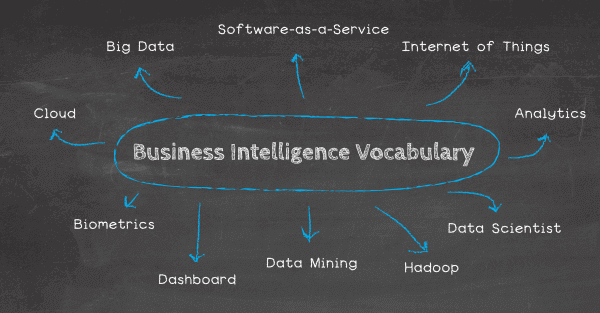

自过去几年以来，我们目睹了信息技术发展的重大飞跃，导致商业智能解决方案日益普及。公司不断寻找工具来帮助他们利用业务收集的大量数据的潜力。在商业世界中，转向商业智能不再是新鲜事物，而是必需品。换句话说，现在每个人都应该掌握商业智能，即使它只是能够选择最好的[自助式商业智能工具](https://www.datafocus.ai/infos/self-service-business-intelligence)，而无需向 IT 专家寻求帮助。我们准备了一份商业智能词汇列表，希望能对您有所启发，并将通过各种 BI 特定问题的斗争变成愉快的散步。

### 分析

我们选择分析作为我们商业智能词汇词典的第一位，不仅因为它以“a”开头，放在前面看起来不错。[迄今为止，高效的业务分析是您需要真正的自助式 BI 工具的众多原因](https://www.datafocus.ai/infos/10-reasons-for-self-service-bi-tools)中最重要的一个。在大数据时代，传统的 Excel 电子表格无法满足全面数据分析的标准。例如，将来自不同格式数据库的非结构化数据并列在一起，然后在交互式图表中将其可视化，这远远超出了 Excel 的能力，但对于大多数 BI 软件来说却是基本需求。基于算法的软件高级分析，有助于得出以前无法获得的洞察，从而将业务决策引入新的数据驱动时代。

### 大数据

它是随处可见的[商业智能流行语之一，无论是在数据分析、数据科学还是数字自动化领域；](https://www.datafocus.ai/infos/business-intelligence-buzzwords-2019)因此，我们也不能在我们的商业智能词汇表中忽略它。大数据的特点不仅在于其庞大的数量，而且在于其多样性——它包括许多不同类型的数据，例如金融交易、信用卡支付、社交媒体上传、传感器数据、视频捕获、语音记录等。大数据的速度（生成新数据的速度）和准确性（数据中的偏差、噪音和异常会造成商业智能必须清理的所有数据混乱）而变得更加复杂。

### 生物识别技术

生物特征学一般是指对可测量的生物学特征的研究。在计算机安全领域，生物识别技术指的是通过测量人类的身体特征来自动确认身份的验证技术。通过扫描我们的面部特征、虹膜、视网膜、指纹、手部几何形状、手背上的静脉图案，并记录我们的声音，不同的设备能够 100% 确定地识别我们。如果这对您来说似乎有点牵强，想想 Facebook 上的照片标签建议。是的，人脸识别软件已经在使用。

### 云

云是一个远远超出商业智能词汇的术语。这是我们每天都在使用的互联网解决方案。当您将文档、照片或视频上传到 Facebook、LinkedIn、Twitter 或 Instagram 时，您就把文件交给了这些提供商，存储在他们的服务器上。如果您使用 Dropbox 或 Google Drive 等服务在线存储文档和照片，您也可以将它们发送到云端——即发送到外部服务器。云技术被企业广泛使用，因为它无需购买新硬件即可增加存储容量。云计算还使分析臭名昭著的大数据成为可能——云的无限容量首先允许存储所有数据，然后通过网络连接的多台计算机对其进行分析。

### 仪表板

商业智能仪表板是组织状况的视觉呈现。它是一种使用不同类型的图表和图形来可视化数据的方法，以帮助用户更好地理解数据并得出有价值的业务见解。通过监控[KPI 仪表板上](https://www.datafocus.ai/infos/best-kpi-dashboard-examples)的关键绩效指标，公司可以对团队和个人绩效进行详细分析，改进其业务战略或执行“假设”分析，以预测未来的业务流程。有许多在线仪表板软件供应商提供的工具，将使您能够分析和呈现数据，通过用户友好的界面创建彩色图表的形式，而无需编程技能。

### 数据挖掘

数据挖掘结合了人工智能、数学和统计方法的力量来分析大量历史数据，目的是识别变量之间的模式和系统关系，然后将检测到的模式应用于新的数据子集。数据挖掘的最终目标是预测——预测数据挖掘是最常见的数据挖掘类型，也是最直接的业务应用。例如，一家信用卡公司可以应用预测数据挖掘，以推导出一个模型，该模型可以快速识别具有很高欺诈可能性的交易。常见的商业应用包括消费者行为的研究和预测。

### 数据科学家

商业世界中最受追捧的专业人士。据麦肯锡全球研究所称，研究机构将面临能够分析大数据并将其转化为商业洞察力的人才短缺的问题。到 2018 年，仅美国就可能面临 150 万名具备利用大数据分析做出有效决策的专业知识的管理人员和分析师的短缺。尽管大学已经认识到这一趋势，并试图赶上数据科学项目，但他们仍然未能扭转这一趋势。问题在于数据科学专业的本质——它需要从计算机科学、数学、统计学、数据可视化和通信到业务和战略的各种技能，而且拥有这一切的人并不多。

### Hadoop

您可能看过带有可爱大象的logo。这背后是什么？Hadoop 是一种基础设施解决方案，用于存储和处理因太大而无法在标准 PC 上存储和处理的数据集。它是一组任何人都可以将其用作大数据操作基础的开源程序。Hadoop 的处理过程称为 MapReduce。简而言之，该过程基于将数据分解为便于分析的片段，这些片段可以分布在不同位置的不同计算机上并进行现场分析。它首先分发分析（地图），然后将结果收集回一份报告（还原）。该过程不是将数据处理到一个管道中，而是分布和加速。Hadoop 理应被列入我们的商业智能词汇表，因为它是提供跨领域数据存储和处理的最广泛使用的系统之一——相对于昂贵的定制解决方案而言，它相对实惠、高效，并且基于许多链接在一起的系统。顺便说一句，Hadoop 是玩具大象的名字，它属于原始创造者之一的儿子。

### 物联网

描述越来越多的日常物品将收集、分析和传输数据以增加其实用性的现象的术语。物联网不是科幻小说里的概念——想想个人分析有多成功吧。FitBit、UpBand 和其他小工具等可穿戴设备会收集有关我们健康状况的数据，包括您的步数、睡眠质量、消耗的卡路里等。我们已经可以购买传感器垫，通过跟踪呼吸模式和心率来监测婴儿的健康状况。很快，我们还将驾驶能够自动驾驶的汽车。谷歌与丰田合作开发了一款自动驾驶汽车，配备车载计算机、传感器和摄像头，使其能够自动驾驶，且不会发生事故。

### 软件即服务 (SaaS)

这是一种基于订阅的软件许可模式，被越来越多的供应商（包括DataFocus [）使用](https://www.datafocus.ai/console/)。软件通过云提供，用户可以通过他们的网络浏览器访问。用户不需要直接购买软件，也不必在安装、基础设施或维护上进行投资——他们只需为使用软件所花费的时间、访问的数据量或被授予访问权限的用户数量付费。该方案使非技术用户能够充分利用手头的软件，节省了原本会投资于 IT 服务的资金，并为您提供了更多的移动性——通过基于云的技术，您可以在任何地方或与来自世界各地的合作伙伴一起工作。

我们希望这份最常见的商业智能词汇列表对您有用。由于不断产生新数据的技术，世界正在发生变化。今天，分析这些数据的能力的增强可以帮助您在业务中获得胜利，这是您不应该浪费的潜力。公司已经将以前无法访问的数据源汇集在一起​​，以做出成功的业务决策。
