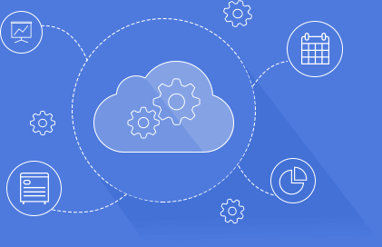
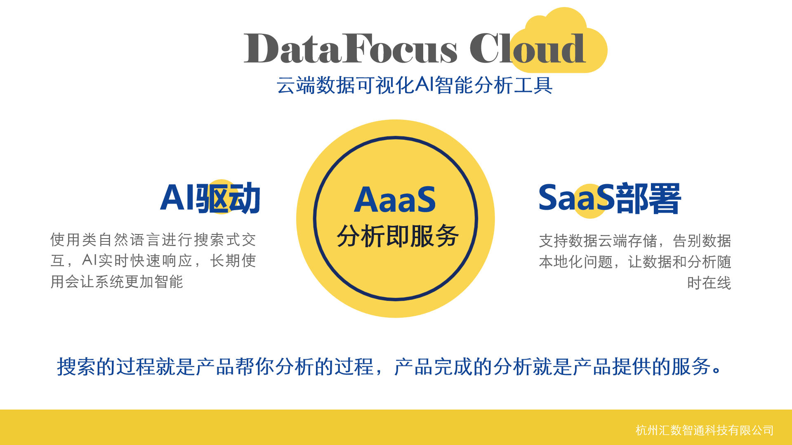

云计算有多火？

还记得在2009年3月深圳IT领袖峰会上，互联网大佬BAT掌门人们就对云计算的前景展开了公开辩论：**李彦宏认为云计算是“旧瓶装新酒”，马化腾说云计算还为时过早，而马云则表示要坚决做云计算。**

如今的云计算早已经渗透到了我们生活的方方面面。

需要时间提醒时，电子日历可以记录下事项并自动设定闹铃帮助提醒时间。多个邮件账号可以通过邮件服务商将多个不同的邮件整合起来，登录即可查看所有账号邮件。这些都是云计算的应用。

另外还有绝大多数协同办公软件，诸如腾讯会议、石墨文档，也都用到了云计算。

那么，云计算如今为何能够蓬勃发展？

### 云计算发展史

云计算的源头要追溯到1965年，Christopher Strachey 发表了一篇论文，论文中正式提出了「虚拟化」的概念。

但当时**这还只是个概念，是对未来的一种畅想，说云计算还真谈不上。**

到了上世纪90年代，计算机就开始爆发式增长，思科为代表的公司开始迅速发展。而此时，大多数企业都还用着自行采购的硬件和自行租用的IDC机房。

**2006年，这是云计算历史中非常重要的一年。**

2006年8月9日，谷歌的CEO埃里克·施密特在搜索引擎大会首次提出「云计算」的概念。而亚马逊正是那年推出了 IaaS 服务平台 AWS。

当时的云计算一度引发争议。

甲骨文掌门人Larry Ellison就没少在社交软件上对云计算表示不屑，“这不过是一时兴起的时尚潮流。“

没过两年，率先探索这片蛮荒之地的亚马逊已经建立了涵盖IaaS、PaaS的产品体系，确立了在云服务领域的全球领导地位。

随后几年间，世界级的供应商都无一例外地参与了云市场的竞争中，其中**IBM、VMWare、微软**等都加入了第二梯队。

行业竞争日益激烈之际，**亚马逊虽然在市场份额上仍遥遥领先，但差距的鸿沟已经逐渐缩小**。

云计算技术的进步速度之快可想而知。

### BI数据云计算后起之秀

后来，谁也不曾想到，当BI工具遇上云计算，效果拔群。

首先，企业发展离不开计算器，而计算器必须依托于服务器。

但是服务器价格昂贵，需求量要是很大，就会需要配备多台服务器。

这样的设备，其成本是相当高昂的。初期的建设成本就已经让许多中小型企业望而却步，更不必提后续的维护和管理成本。

因此，**云计算就成了中小型企业在数字化转型道路上的救命稻草**。

除掉复杂繁琐的本地部署，免掉高昂的配备，直接登录即可在线协作BI工具。

在众多云BI中，DataFocus作为搜索式云BI平台便脱颖而出，成为中小型企业的福音。

无需代码知识，网页一键注册登录，通过谷歌一样搜索关键词便可随时在线数据分析。

### 小结

2022年的BI市场，云计算已经成为了主流。

从某些意义上来说，我们已经站在了颠覆变革的新时代上。而云BI承载的时代使命，则是迎接 5G 时代下数据互联的星辰大海。
