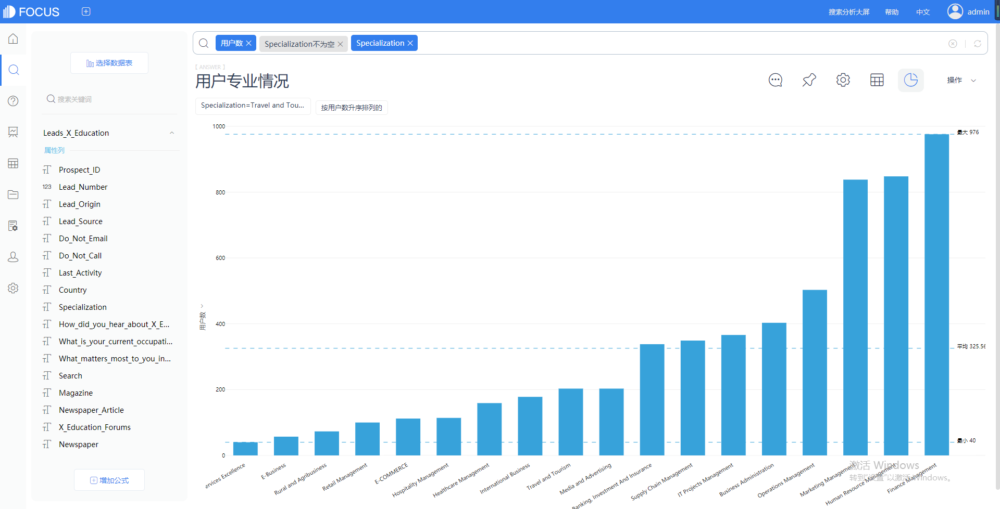

> “今年暑假，我们机构K12培训业务有所增长，采取线上和线下结合方式，线下授课，线上辅导作业，融合程度加深。”日前，国内一家线下[教育培训](https://www.datafocus.ai)机构人士对中国证券报记者表示,该机构现在重视推广在线教育课程。

“今年暑假，我们机构K12培训业务有所增长，采取线上和线下结合方式，线下授课，线上辅导作业，融合程度加深。”日前，国内一家线下[教育培训](https://www.datafocus.ai)机构人士对中国证券报记者表示,该机构现在重视推广在线教育课程。

根据艾瑞咨询统计，2020年在校教育市场规模预计4003.8亿元，同比增长24.1%。虽然疫情对刚需性的线上K12教培市场产生一定正向影响，但受制于诸多考试推迟或取消、出国留学受阻等原因，高等学历教育和职业教育的线上市场规模增速出现下降，不过依然不影响在线教育行业稳定高速地发展。

在2014年世界互联网大会上，李彦宏也特别指出：“公立机构占主流的行业移动互联网市场机会更大，比如医疗、教育等体制尚未健全的市场机遇更大，很多想不到的产业还有这种机会，是我们的后发机会。”

大数据时代，数据将成为公司的核心资产，而学习数据将成为核心中的核心，通过对现有教育O2O平台分析来看，掌握不到学生的学习数据，拥有再多的投资再多的人脉，最终还是被淘汰。

那么，在线教育行业该如何进行数据分析，抓住数据核心价值呢？

一、数据分析整理思路

1.分析目的

为产品或者课程改进提供参考依据，为运营提供数据支持。

2.分析过程

从三个角度来分析，分别是What、Why、How。

What：

产品所处什么阶段？萌芽期？发展期？还是成熟期？

目标用户是谁？

产品有哪些操作和流程？

核心业务流程是怎样的？

指标维度有哪些？

产品需要解决哪些问题？这些问题需要数据分析支持吗？

Why：

为什么重要的是这些指标？

为什么产品会出现这些问题？

为什么要从这些指标维度来分析问题？

How：

数据分析从哪些方面解决问题？

如何收集数据是有效真实的？

如何从这些方面解决问题？

1. 分析方法

确定产品核心业务关键指标、收集方式、数据分析的频率。

在线教育常见的参考指标有：

通用指标：每月活跃用户数、每日新增App用户数、个渠道销售额增长、本月销售目标完成率、各课程月销售额、各课程销售热度、用户粘度转化率、各课程支付观看率

课程付费指标：课程销售量、课程购买用户数、课程销售总额、各课程销售页预览量、各课程销量、课程付费转化率、试听引导成单率、各课程退课订单总金额

课程反馈指标：学习任务完成情况、课程学习完成情况、各教师受欢迎成都、各课程人均学习时长、课程学习频次分布、各等级学员学习时长分布、退课率

1. 如何获取数据
2. 搭建数据获取渠道

前端埋点 全埋点、可视化埋点、代码埋点、利用前端页面埋点统计

产品后台 后台管理系统，浏览、检索、购买数据库代码埋点、导入工具

业务数据 包括物流、进货、客服等数据，导入工具表搭建

1. 页面嵌入代码统计
2. 爬虫数据获取

注意：

数据收集尽量全面，数据来源多个渠道，需要做数据汇聚和汇总

数据收集做到准确

对照产品生命周期，形成合理的阶段性报告

1. 案例分析

一家名为 X 教育的教育公司向行业专业人士销售在线课程。在任何一天，许多对课程感兴趣的专业人士会登陆他们的网站并浏览课程。

该公司在谷歌等几家网站和搜索引擎上销售课程。一旦这些人登陆网站，他们可能会浏览课程或填写课程表格或观看一些视频。当这些人填写提供其电子邮件地址或电话号码的表单时，他们被分类为潜在顾客。此外，公司还通过过去的推荐获得线索。获得这些潜在顾客后，销售团队的员工开始打电话、写电子邮件等。通过此过程，一些潜在顾客得到转换，而大多数则不转换。

为提高流程效率，公司希望确定最潜在的潜在潜在线索，也称为"热线索"。如果他们成功识别出这组潜在顾客，潜在顾客转化率就会上升，因为销售团队现在将更专注于与潜在潜在潜在客户沟通，而不是给每个人打电话。

现在我们则可以通过数据分析来提高转化率。

首先建立好用户画像，了解用户来源，因此表单中出现了潜在顾客来源、用户专业、城市、职业、需求等等。

用户的主要操作流程还是在网上进行的，因此需要分析用户在登录网站后的活动路径，因此指标中出现转化情况、总访问量、网站上花费的时间、每次访问的页面量、上次用户活动情况等等。

这里以DataFocus来作为示例。

导入数据后，利用DataFocus，建立公式count(Lead Number)为用户数，在搜索栏输入Lead Origin、Lead Source、用户数。

我们可以看到所有统计的潜在顾客来源情况。大多数都来自于谷歌的着陆页以及API，直接流量中的着陆页、奥拉克聊天的API、自然搜索的着陆页以及API。

搜索栏输入用户数，以及country，了解到大部分潜在顾客都是来自印度。

搜索栏输入用户数，以及specialization，了解潜在用户各行各业都有，最多的是金融管理、人力资源管理、市场管理、商务管理等等。

搜索栏输入用户数，what is your current occupation，了解到大部分潜在用户都是待业状态，其次是工作状态和学生。

搜索栏输入用户数，converted，可以计算出付费用户的转化率是38.5%。

搜索栏输入总浏览量的平均值、每次浏览时间的平均值、用户浏览页数的平均值，可以看到平均每个用户的浏览量为3.45，平均每次浏览页数为2.36，网页平均花费时间为487.7。我们可以发现，用户浏览网页情况仍有优化的空间。

以上我们了解了用户画像、用户来源、产品/课程使用情况、转化情况。

这些数据在呈现之后，更重要的就是对数据的思考。当你发现数据有异常状况你可以先思考这称不称的上是一个问题，这问题情况算不算严重，有没有排除其它情况异常导致的数据异常，之后都思考妥当后再去分析问题，思考如何解决问题。

而当你具备优秀的分析思维后，你更需要一款优秀的工具匹配你的大脑，让你的行动快速跟上你的大脑。DataFocus正是这样一款软件，搜索输入问题，系统用图表给出答案，效率比传统方式高出100倍。10分钟即可学会，7分钟做出漂亮的可视化大屏！
