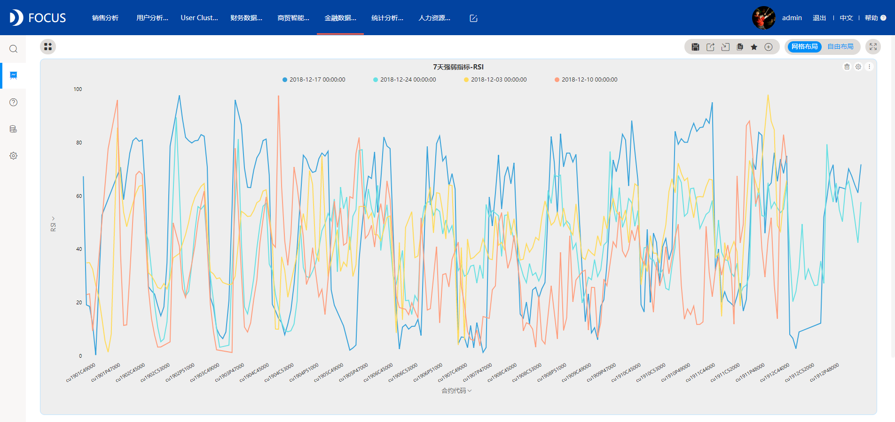
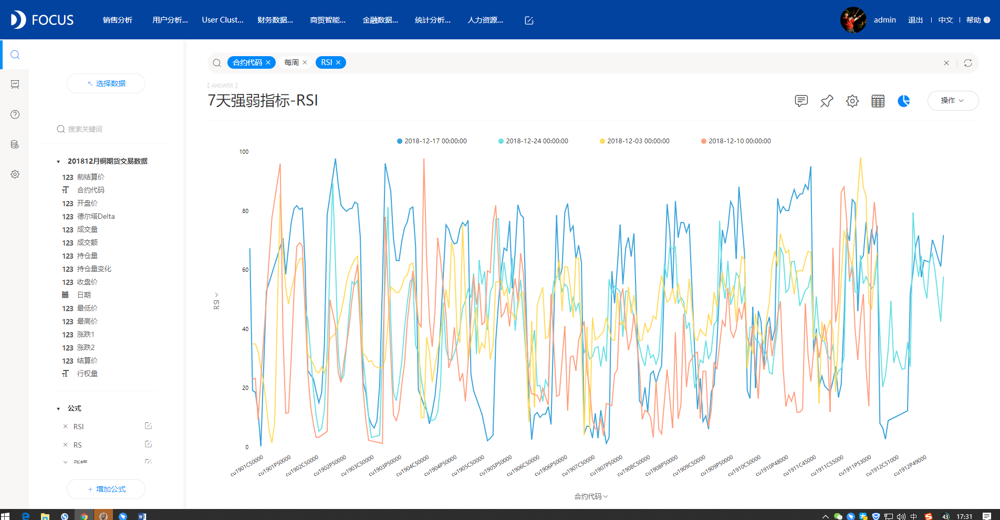

要进行数据分析，我们必须建立一个整体的认知方法。在互联网上的大量数据中，数据分析解决了问题并使用数据来指导 决策。在完整的数据分析过程中，按以下顺序，可以分为以下五个步骤：确定目标，收集数据，组织数据，分析数据以及可视化演示。

  
1.确定目标  
在进行数据分析之前，我们需要结合我们自己的业务确定数据分析的目标，可衡量的指标是什么，分割指标，找到可以收集数据的最小单位，以便我们可以有针对性地进行数据分析。方式。分析，提高数据运行效率，避免过度数据收集，浪费数据浪费。  
2.收集数据  
当我们确定目标时，我们需要以有针对性的方式收集数据。此处收集的数据包括通过隐藏点收集的用户生命周期数据，以及在线收集的数据，如行业数据报告，包括手动排序通过访问或电话获得的数据。至于要使用的具体数据，还需要基于数据分析的目标。  
3.组织数据  
收集好数据后，我们需要整理数据，最大可能提高数据的准确性。对数据进行清洗、筛选、关联等等。

（DataFocus中的全局关联）  

4.分析数据  
在分析数据的过程中，我们必须结合自己的产品，选择合适的数据分析模型，如有必要，我们需要定义自己的分析模型并灵活使用它，选用合适的数据分析工具可以帮助完后分析过程，目前市面上大多数为拖拽式的数据分析工具，也有新生代的搜索式分析工具，比如DataFocus，可以直接将分析问题输入，然后转化为可视化图表。

  
5.视觉演示  
作为数据分析师，数据分析的结果通常需要向领导层和整个团队报告。此时，我们需要直观地呈现数据分析的结果。通常，它可以以图表的形式呈现。通过数据分析找出业务问题，同时提出自己的解决方案，不仅要知道问题是什么，还需要知道如何解决。  

总结：上述五个步骤构成了一个完整的数据分析过程，从思考开始到最终的视觉呈现，从发现问题到提出解决方案。作为一名数据分析师，我们需要有一个整体思维，并能够从整个过程中掌握。数据分析方法还需要详细追求细节，并优化每个步骤。例如，如何收集数据更快，更准确，它可以用作优化目标。当我们能够从整体和细节分析数据时，就是一位合格的、甚至是优秀的数据分析师了。
