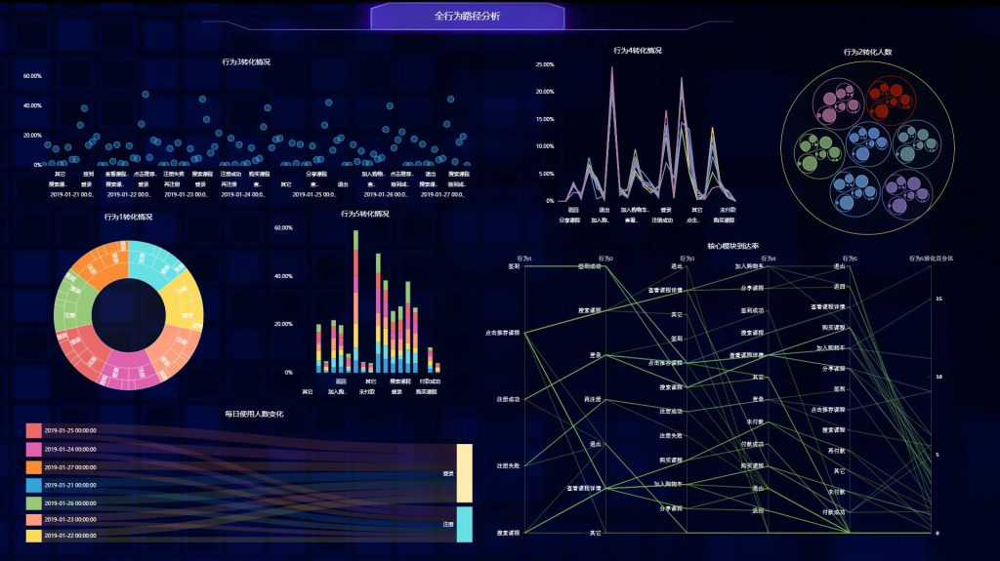

在这个大数据时代，无论是企业数字化还是管理者常常谈论的数据化管理思维，都在“大行其道”。更有行业内的诸子百家称其为企业管理的第一思维。大数据本身固然重要，概念本身也很重要，但是如何去可落地、可执行的操作却更为重要。所以当业内人士在谈论所谓数字化或数据思维的同时，我们应理解其本质。

依据DataFocus多年数据管理经验，何为数据化管理思维可以用一句话概括：企业在管理过程中，依靠数据发现问题、分析问题、解决问题、跟踪问题的管理方式，就是数据化管理。在此概念之上，什么是数据化思维？数据化思维可能对于很多人来说闻所未闻，但并不是一道新菜，而是新瓶装旧酒。酒还是数据本身，瓶子换成了较为科学或更为先进的思维模式。引用《企业数据化管理变革》一书中的概念：“数据思维是根据数据来思考事物的一种思维模式，是一种量化的思维模式，是重视事实、追求真理的思维模式。”

有人可能会问，是不是把所有能和业务联系上的都数字化就叫数据化思维？诚然，数字化本身的基础的确是让一切变成可分析的数据，但也不排除有文字性的内容甚至艺术性的推论，比如你让设计部的成品如何数字化？进一步说，很多数字化本身是需要文字描述或结论去支撑的，空有一张报表而没有结论也会让非专业人士难以解读。DataFocus曾经遇到过这样一个例子，2018年第四季度，某厨房用具品牌在北京地区的三个销售代理商分别完成销售200.7万、190.5万、78.6万，这就画上了句号。但这样一来内在的价值根本还未进行挖掘，比如和上一季度比如何？有没有达到预计KPI？和竞品的对比如何？所以只列出一堆数据，没有描述，是称不上数据化管理思维的。所以应该加上比如：同比上一季度增长8%，超出预计销售额20%，相比竞品同期销售少7%，需要对销售渠道进行优化等等。

我们要定性一些事物一般有多种途径，最常见的两种是通过对数据对比和分析以及根据长期的经验积累来“拍脑袋”。前者可以称为“数据思维”，后者可以称为“经验思维”。经验思维有时候也是一种数据思维，因为有时候它是根据长期数据分析的结论得出的，并进行过归纳总结。电商行业非常稀缺“老运营”的情况就在于此，老运营看到一个数字比如营销费用占比，就能知道是多还是少。像是武汉某知名鸭食品品牌，在2017年营销费用只占18%，一般需高于20%。当然也不是一竿子打翻所有船，费用低有可能是品牌口碑节省的或市场中竞品不给力。如若不然，就是费用不足或是战略有误，业绩有问题了。

管理本身大多依靠经验思维，根据多年的经验进行决策。但在这个时代，你会发现决策者越来越年轻化，他们并不具备所谓“10000小时成就大师”所具备的经验，而正是利用数据化管理思维，并配合DataFocus、微软等智能BI工具迅速分析数据并可视化，来辅助其决策。
