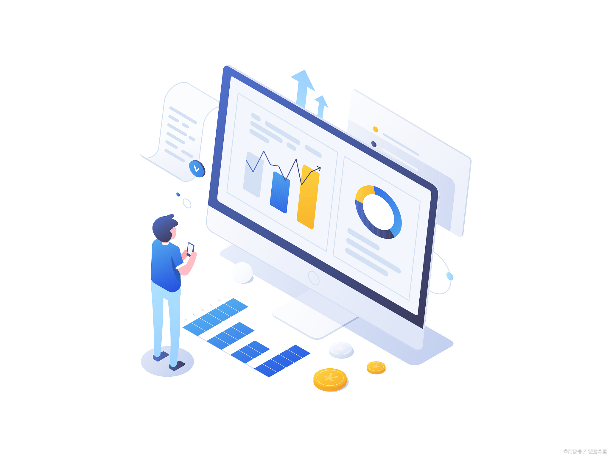
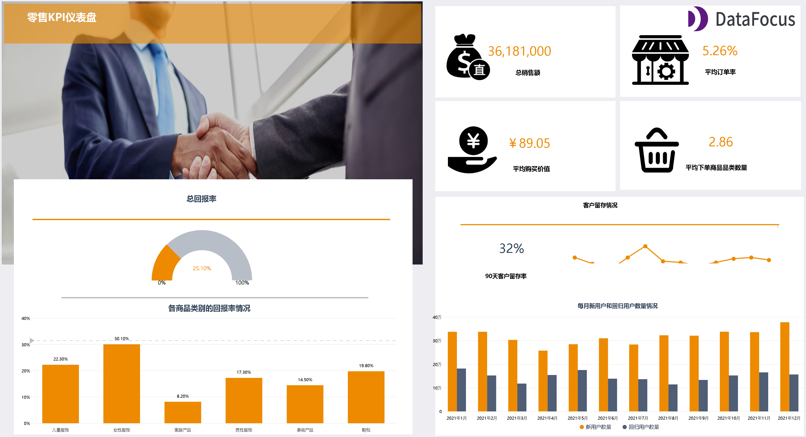

在我们这个数据丰富的时代，了解如何分析数据并提取业务数据洞察的真正含义是成功的主要驱动因素之一。

那么，什么是数据分析？数据分析的流程有哪些呢？

### 什么是数据分析？

数据分析是收集、建模和分析数据以提取支持决策的见解的过程。根据行业和调查目的，有多种方法和技术可以进行分析。

所有不同的分析方法，主要基于两个核心领域：定量和定性研究。

### 为什么数据分析很重要？

1. 明智的决策：从管理的角度来看，你可以从分析数据中受益，因为它可以帮助你根据事实而不是简单的直觉做出决策。例如，你可以了解在哪里投资你的资本、发现增长机会、预测你的收入或在不常见的情况成为问题之前解决它们。这样，你可以从组织的所有领域提取相关见解，并在仪表板软件的帮助下，以专业和互动的方式将信息呈现给不同的利益相关者。
2. 降低成本：另一个很大的好处是降低成本。借助预测分析等先进技术，企业可以发现数据中的改进机会、趋势和模式，并相应地规划策略。最终，帮助你在实施策略时节省金钱和资源。不仅如此，通过预测不同的情景，如销售和需求，你还可以预测生产和供应。
3. 更好地瞄准客户：客户可以说是任何业务中最关键的元素。通过分析可以全方位获得与客户相关的内容，你可以了解他们使用哪些渠道与你交流、他们的人口统计、兴趣、习惯、购买行为等。从长远来看，它将推动你的营销策略取得成功，使你能够识别新的潜在客户，并避免将资源浪费在针对错误的人或发送错误的信息上。你还可以通过分析客户的评论或客户服务部门的绩效来跟踪客户满意度。

### 什么是数据分析过程？

当我们分析数据时，为了得出所需的结论，需要遵循一个顺序。分析过程包括 5 个关键阶段。

1. 识别：在你着手处理数据之前，你首先需要确定为什么需要它。识别是确定你需要回答的问题的阶段。例如，客户对我们品牌的看法是什么？或者哪种类型的包装对我们的潜在客户更有吸引力？概述问题后，你就可以进行下一步了。
2. 收集：顾名思义，这是你开始收集所需数据的阶段。在这一步，你需要明确将使用哪些信息源以及如何使用它们。数据的收集可以采用不同的形式，例如内部或外部来源、调查、访谈、问卷调查、焦点小组等。这里需要注意的是，你收集信息的方式在定量和定性方案中会有所不同。
3. 清理：一旦你有了需要的数据，就该清理它并准备好进行分析了。你收集的所有数据并非都是有用的，在以不同格式收集大量信息时，你很可能会发现自己有重复或格式错误的数据。为避免这种情况，在开始处理数据之前，你需要确保删除所有空格、重复记录或格式错误的内容。这样你就可以避免使用不正确的数据而影响你的分析。
4. 分析：借助统计分析、回归、神经网络、文本分析等各种技术，你可以开始分析和操作数据以提取相关结论。在这个阶段，你会发现趋势、相关性、变化和模式，这些可以帮助你回答你在识别阶段首先想到的问题。市场上有各种技术来帮助研究人员和普通用户管理他们的数据。其中包括商业智能和可视化软件、预测分析、数据挖掘等。
5. 解释：最后但仍然很重要的一步是：解释你的结果。这个阶段是研究人员根据调查结果提出行动方案的阶段。例如，你将了解到你的客户喜欢红色还是绿色、喜欢塑料的还是纸质的包装。此外，在此阶段，你还可以找到一些局限性并加以解决。

现在，你对数据分析是否有了初步的了解了呢？欢迎一起讨论、交流~
