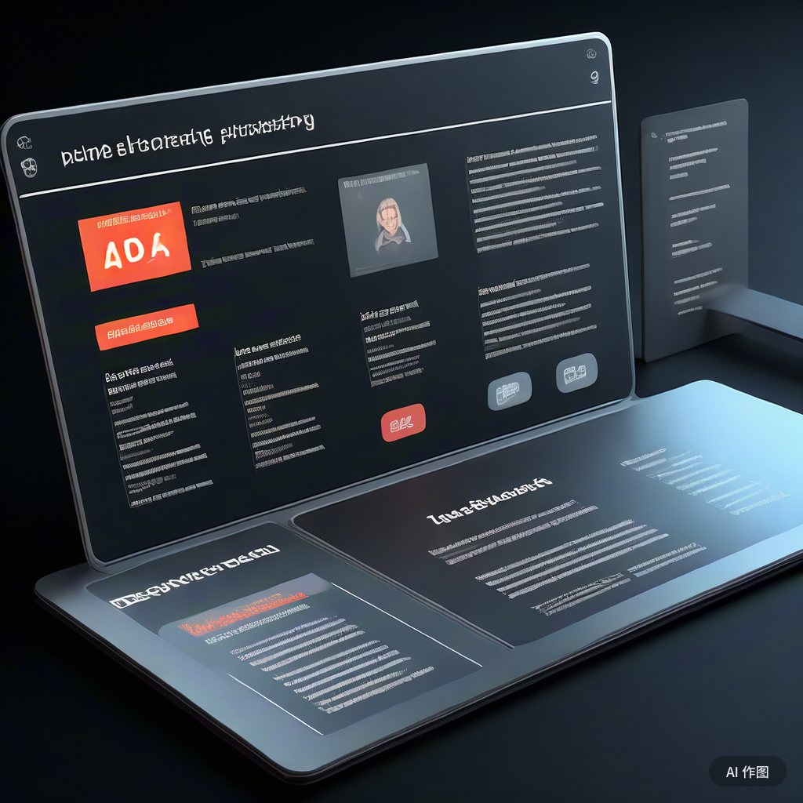

在当今数据驱动的世界里，企业和组织不断寻找更高效、更直观的方法来利用数据做出明智的决策。商业智能（BI）工具成为了数据分析和决策支持的关键。然而，传统的拖拽式BI工具在灵活性和易用性方面仍然存在一些局限。随着技术的发展，聊天式BI（ChatBI）应运而生，成为一种更具互动性和易用性的解决方案。其中，DataFocus BI作为这一领域的佼佼者，为用户提供了全新的数据分析体验。本文将深入探讨ChatBI的优势，并重点介绍DataFocus BI。

## 一、什么是ChatBI？

ChatBI，也称为搜索式BI，是一种采用对话交互方式的商业智能产品。与传统BI工具通过拖拽组件、创建仪表盘和报告不同，ChatBI允许用户通过自然语言查询数据。这种交互方式使得数据分析过程更加直观、灵活和高效。用户只需输入类似于与搜索引擎互动的自然语言问题，系统便能快速解析并返回相应的数据分析结果。

### ChatBI的核心特点

1. **自然语言处理**：利用先进的自然语言处理（NLP）技术，ChatBI能够理解用户的语言指令，并将其转化为数据查询。
2. **即问即答**：用户只需提出问题，系统即可实时返回结果，避免了繁琐的操作过程。
3. **可视化分析**：自动生成图表和报告，使数据分析结果更加直观易懂。
4. **灵活易用**：无需专业的技术背景，任何用户都能快速上手，极大地降低了使用门槛。

## 二、ChatBI的优势

### 1\. 提高数据分析的效率

传统的BI工具通常需要用户具备一定的技术知识，熟悉数据结构和操作方法。而ChatBI通过自然语言交互，大大简化了这一过程。用户不再需要进行复杂的拖拽操作，只需提出问题即可获得答案。这种高效的交互方式不仅节省了时间，还提高了数据分析的准确性和可靠性。

### 2\. 降低使用门槛

对于许多企业来说，培训员工使用复杂的BI工具是一项巨大的成本。ChatBI凭借其直观的交互方式，使得任何人都能轻松上手。这意味着企业可以更快地部署和应用BI工具，提升整体数据素养和决策能力。

### 3\. 实时数据访问

在现代商业环境中，快速响应市场变化至关重要。ChatBI支持实时数据访问，用户可以随时查询最新数据并做出及时决策。这种实时性使企业能够更灵活地应对市场变化，提高竞争力。

### 4\. 更直观的数据呈现

ChatBI不仅能够快速回答问题，还能自动生成各种图表和报告，帮助用户更好地理解数据。通过直观的可视化呈现，用户可以轻松发现数据中的趋势和模式，做出更明智的决策。

## 三、DataFocus BI：领先的ChatBI解决方案

在众多ChatBI产品中，DataFocus BI以其强大的功能和用户友好的设计脱颖而出。DataFocus BI不仅继承了ChatBI的所有优点，还在多个方面进行了创新和优化。

### DataFocus BI的主要特点

1. **智能搜索引擎**：DataFocus BI的核心是一款智能搜索引擎，能够快速理解用户的查询并返回准确的结果。无论是简单的统计数据还是复杂的数据分析，用户都能通过简单的自然语言查询获得所需信息。
    
2. **强大的可视化功能**：DataFocus BI内置了丰富的可视化工具，用户可以通过几次点击轻松生成各种图表和报告。这些图表不仅美观，而且具有高度的互动性，用户可以根据需要进行深度分析。
    
3. **全面的数据集成**：DataFocus BI支持与多种数据源的无缝集成，无论是数据库、Excel文件还是第三方应用程序的数据，都能方便地导入系统进行分析。这种灵活性使得企业能够充分利用现有数据资源。
    
4. **高度的安全性**：DataFocus BI非常重视数据安全，采用了多层次的安全机制，确保用户的数据得到充分保护。无论是数据传输还是存储，DataFocus BI都采用了最先进的加密技术。
    
5. **用户友好的界面**：DataFocus BI的界面设计简洁直观，用户无需专业培训即可快速上手。系统还提供了详细的使用指南和技术支持，帮助用户更好地利用工具进行数据分析。
    

### DataFocus BI的应用场景

DataFocus BI适用于各种行业和业务场景，从市场营销、销售管理到财务分析和运营优化，都能发挥重要作用。以下是几个典型的应用场景：

1. **市场营销**：通过分析市场数据，了解客户需求和市场趋势，优化营销策略，提高市场份额。
2. **销售管理**：实时跟踪销售数据，分析销售业绩，发现问题并及时调整销售策略，提高销售效率。
3. **财务分析**：全面监控财务数据，进行预算分析和成本控制，确保财务健康和可持续发展。
4. **运营优化**：分析运营数据，优化生产流程和资源配置，提高运营效率和降低成本。

### DataFocus BI的客户案例

DataFocus BI已经在众多企业中得到成功应用，以下是几个典型的客户案例：

1. **某大型零售企业**：该企业通过DataFocus BI分析销售数据，优化商品组合和库存管理，提高了销售额和库存周转率。
2. **某金融机构**：利用DataFocus BI进行风险分析和客户细分，优化了风险管理策略，提高了客户满意度和业务收益。
3. **某制造企业**：通过DataFocus BI监控生产数据，优化生产流程和资源配置，提高了生产效率和产品质量。

## 四、ChatBI的未来展望

随着人工智能和大数据技术的不断发展，ChatBI在未来将具有更加广阔的应用前景。以下是几个可能的发展方向：

1. **更加智能化的自然语言处理**：随着NLP技术的进步，ChatBI将能够更准确地理解用户意图，提供更精准的数据分析结果。
2. **更强大的数据集成能力**：未来的ChatBI将能够集成更多类型的数据源，包括物联网设备、社交媒体等，提供更全面的数据分析。
3. **更丰富的可视化工具**：随着数据可视化技术的发展，ChatBI将能够提供更多样化的可视化工具，帮助用户更好地理解和利用数据。
4. **更加个性化的用户体验**：未来的ChatBI将能够根据用户的使用习惯和需求，提供更加个性化的分析和建议，提高用户满意度。

## 五、结论

ChatBI作为一种新兴的商业智能工具，以其灵活、易用和高效的特点，正在逐渐改变数据分析的方式。DataFocus BI作为这一领域的领先产品，凭借其强大的功能和用户友好的设计，帮助企业更好地利用数据做出明智的决策。随着技术的不断进步，ChatBI将会在更多的行业和业务场景中发挥重要作用，推动数据分析的进一步发展。未来，ChatBI有望成为数据驱动决策的重要工具，为企业的数字化转型和持续发展提供强大支持。
