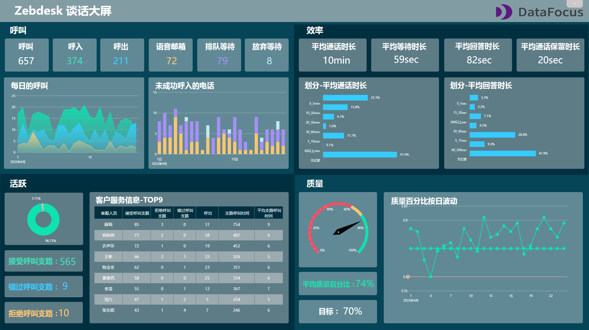

客户服务和支持(CSS-Customer Service and Support)是客户关系管理（CRM）的应用范围之一。一旦客户购买了产品或服务，CSS就负责保持和发展客户关系。CSS是与客户联系最频繁的部门而且对保持客户满意度至关重要。其中呼叫管理（Call Management）是CSS应用功能的核心。

从必须意义上说，只有在服务上的功夫做好了，才有可能保证企业的良性运转。客户服务⼯作的好坏代表着⼀个企业的⽂化修养、整体形象和综合素质，于企业利益直接挂勾；能否赢得价值客户，不仅仅是企业的产品质量，产品标准，产品价格等方面的问题，客户服务也是⼀个关键环节。

由于与消费者的互动关系变得日益复杂，所以客户服务部门需要一个可扩展的、伸缩性好的并且集成度高的高技术基础设施来及时准确地满足客户需求。这里介绍的工具就是Zendesk，可以帮助让客户问题跟踪变得更简单，包括优步和Airbnb在内的很多公司都使用Zendesk作为他们的问题跟踪软件。

但如同Zendesk的名字一般，这家企业风格较为“佛系”，也是一家在应对艰难经济环境、不懈努力、直至叩开成功大门的创业公司经典范例，他们生动的展现了一家创业公司居安思危的重要性。作为最早以做to C产品的理念做企业服务的公司之一，Zendesk提供SaaS客服管理软件，使企业可以更加轻松地管理终端客户的服务和支持需求。

Zendesk结合**DataFocus**的数据分析可视化功能，串联一套完整的客户服务和支持系统，将客户数据与公司其他数据结合分析，增加指标的联动性和交互性，同时能够展示出现代仪表板软件在监控、可视化、分析和优化所有相关客户支持流程方面的优势。

## **日常操作Zendesk大屏**

第一个大屏示例是Zendesk日常操作大屏，用于有效的日常客户支持管理，为团队负责人提供日常支持绩效的全面概览。这些关键指标主要展示为：工单数量和工单状态、首次响应时间(FRT)和平均解决时间(MTTR)。

在大屏的正上方，可以找到每种状态的工单数量，例如已创建、未分配、打开、已解决和升级的工单，以及这些关键指标与前一天相比的百分比。借助这种清晰的KPI指标实时概览，可以及早发现票务系统中的问题或增加的客户问题，并及时采取适当的对策。

在仪表板的中部，可以找到首次响应时间(FRT)、平均解决时间(MTTR)的月平均值和每日具体数值。FRT记录了从客户询问到客户支持的第一个响应之间的平均时间间隔；MTTR记录了客户支持在打开案例后完成解决方案所需的平均时间，这两个指标对客户满意度都有非常显著的影响。

现代动态数据看板解决方案（例如Datafocus）能帮助从不同角度对所有相关关键绩效指标进行日常监控和分析，这要归功于大量交互选项，例如向下钻取、放大和广泛的过滤选项，通过这些功能可以将手动分析和报告工作量降至最低。

## **Zendesk KPI大屏**

第二个大屏示例是Zendesk KPI大屏，和第一个大屏示例不同，Zendesk KPI大屏具有战略重点并考虑了更长的时间视角。统计上个月的客户满意度、不同工单类型、所有相关支持渠道的工单数量以及已讨论的第一响应时间(FRT)和平均解决时间(MTTR)的日常变化发展情况等。

在示例大屏的左上部分，可以找到上个月各个工单状态的表示。例如，我们可以看到在一个月内重新开放了19941张票中的412张。此类分析在较长时间内积累相对较大的样本量，可结合第一个操作大屏进行查看，帮助更好的评估每日关键绩效指标，同时确定在未来资源分配中可以考虑的模式和趋势。

接下来，大屏的左下部分，展示了按类型划分的不同工单的概览以及客户最常用的联系渠道。更具行业和商业模式的不同，类别划分存在较大差异，结果也各有不同，例如，在我们的案例中，大多数客户使用电子邮件与客户支持的工作人员进行联系。在这里，我们需要实现的目标应当是，用首选的联系方式提供最佳质量，以满足未来客户的需求。

## **Zendesk谈话大屏**

最后一个大屏示例是Zendesk谈话大屏，顾名思义，此大屏旨在衡量和监控与呼叫服务性能相关的关键指标。高效的呼叫管理应该是任何企业的首要任务，因为呼叫中心通常因等待时间长或结果不成功而遭到质疑，因此集中精力提供出色的呼叫中心体验可以为您的企业带来巨大的竞争优势。

大屏分成了4个主要类别，涵盖Zendesk呼叫中心数据性能的不同方面：不成功的呼入呼叫、效率、活动和质量。

从呼叫电话开始，首先我们看到这家公司有4种不成功呼入电话的概述：语音邮件、排队等待、放弃等待和没有回应。将这些指标进一步显示在一个按日期划分的堆积柱状图中，这样就可以定义具体原因，了解在哪些天失败了哪种类型的入站呼叫。

接下来，我们看效率部分，其中包含了基于时间的Zendesk谈话指标的组合，使您能够了解联络中心和客户支持在时间方面的效率。在效率部分的顶部，通过这些时间指标，可以衡量客户支持从开始响铃起到结束通话所花费的时间。其次，通过将通话时间和回答时间进行具体的时间划分，可以准确了解到呼叫占用的时间长度。理想情况下，还应该为每个指标设置一个目标时间，并不断监控它们用以发现问题。

然后是客户支持的活动部分。在这里，我们可以看到排名前8的客户支持的表现详细信息。也可以选择对表现不佳的代理进行此操作，并找到提高他们数量的方法，例如通过更多的培训实例或寻求来自表现优异的代理的帮助。

最后，大屏显示质量百分比的日常波动情况，通过查看Zendesk呼叫中心数据如何波动，您可以确定在哪些时期质量低下并深入挖掘，找出原因。

你还在等什么？不要犹豫，亲自探索，在30天内完全免费使用我们的软件，只需10分钟，就可以创建属于您的Zendesk数据看板！
