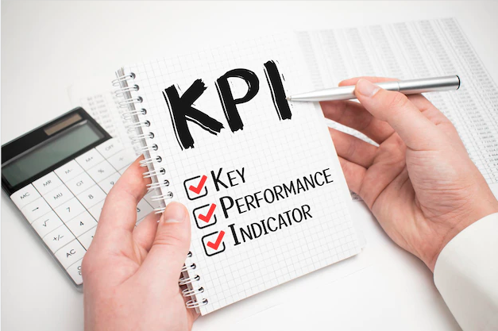

当代企业正在经历一场由数字化驱动的转型。企业管理需要不断创新，以适应这种新的环境，其中包括如何设定和追踪目标。在这种背景下，KPI（关键绩效指标）和OKR（目标与关键成果）两种管理框架成为了企业的重要选择。那么，作为一个企业，应该选择KPI还是OKR呢？这个问题并没有简单的答案，因为这取决于企业的特定情况。在本文中，我们将探讨KPI和OKR的特点，以及如何根据企业的特定情况做出合适的选择。

首先，让我们深入了解一下KPI和OKR。

## KPI（关键绩效指标）

KPI是一种量化的度量，用于衡量组织在实现其主要业务目标方面的效果。KPI通常用于衡量成功的程度，以及组织是否达到其业务和运营目标。例如，一家制造公司可能会使用生产量、废品率、交货时间等KPI。一家零售公司可能会关注销售额、存货周转率、客户满意度等KPI。

KPI的优点在于它们是具体的、度量的、可以被量化的，这使得管理者可以清楚地看到组织在实现目标方面的效果。此外，由于KPI是量化的，因此可以轻松地跟踪和比较它们，从而提供有关组织性能的实时反馈。

然而，KPI也有其局限性。首先，KPI过于关注数值和结果，可能忽视了达到这些结果的过程。其次，KPI可能鼓励过度的竞争，而不是合作，因为员工可能会更专注于达到自己的KPI，而不是实现组织的整体目标。

## OKR（目标与关键成果）

OKR是一种目标设定框架，由目标（O）和关键结果（KR）组成。目标是一个明确而有挑战性的目标，而关键结果则是衡量目标实现程度的指标。

OKR的优点在于它们强调目标和结果，而不仅仅是过程。因此，它们鼓励员工思考如何更好地实现目标，而不是仅仅关注日常工作。此外，OKR通常设定为季度目标，这使得组织可以在短期内快速地调整和适应。然而，OKR也有其局限性。首先，OKR需要明确的目标和清晰的追踪机制，否则可能会导致混乱和混乱。其次，如果关键结果设置得过于挑战性，可能会导致员工感到压力过大。

## 如何选择KPI还是OKR？

在选择KPI还是OKR时，企业需要考虑以下几个因素：

组织目标：如果企业的目标是确保日常运营的效率和稳定，那么KPI可能是一个更好的选择。然而，如果企业的目标是推动改变和创新，那么OKR可能更合适。

企业文化：如果企业文化更倾向于竞争和结果导向，那么KPI可能更适合。然而，如果企业文化更倾向于探索和创新，那么OKR可能更适合。

业务环境：如果企业处在一个稳定且可预见的环境，那么KPI可能更有效。然而，如果企业处在一个快速变化或不确定性较高的环境，那么OKR可能是更好的选择。

总的来说，KPI和OKR都是有用的管理工具，但是它们应该如何被使用，以及何时被使用，取决于企业的具体情况。这并不是一个非此即彼的决定。许多企业会同时使用KPI和OKR，使得他们可以在保证日常运营效率的同时，也能推动创新和改变。最重要的是，企业需要找到一种能够最大化其效益的方式来使用这些工具。

## KPI和OKR在实践中的应用

让我们通过一些实例来看看KPI和OKR是如何在实际中应用的。

### KPI的实际应用

设想一家电商公司，他们的目标是提高销售额和客户满意度。在这种情况下，他们可能会设定如下的KPI：

销售额：这是一个非常直观的KPI，可以直接衡量公司的销售业绩。

客户满意度：这可能是通过客户调查或在线评价来衡量的。高的客户满意度通常意味着客户忠诚度较高，回购率也会较高。

购物车放弃率：这是衡量客户在浏览产品并将其添加到购物车后，但最终没有完成购买的比例。如果购物车放弃率高，可能说明网站的购买过程需要改进。

在这个例子中，我们可以看到KPI如何帮助公司度量其业绩，并确定需要改进的区域。

### OKR的实际应用

假设一个初创公司，他们的目标是在一年内推出一个新的产品。在这种情况下，他们可能会设定如下的OKR：

目标（O）：在一年内推出新产品。

关键结果（KR）：

完成产品开发的90%。 完成市场调查和产品定位。 获得至少10家分销商的承诺。 在这个例子中，我们可以看到OKR如何帮助公司设定和跟踪其目标。

## KPI与OKR的选择

当我们回到最初的问题——企业应该选择KPI还是OKR时，我们可以看到，这取决于企业的具体情况和目标。如果你的目标是改进现有的运营和业绩，那么KPI可能是一个更好的选择。如果你的目标是推动新的创新和变革，那么OKR可能是更合适的。

对于大多数企业来说，最好的做法可能是同时使用KPI和OKR。例如，你可以使用KPI来度量和改进你的日常运营，同时使用OKR来推动新的项目和创新。这样，你既可以保证你的企业在短期内的运营效率，同时也可以确保你的企业在长期的发展和创新。

数字化转型为企业带来了许多新的挑战，但同时也带来了许多新的机会。作为企业，我们需要找到新的方式来设定和追踪我们的目标。无论是KPI还是OKR，或者是两者的结合，都可以帮助我们更好地实现这一目标。

最后，选择KPI还是OKR并不是最重要的，最重要的是如何使用它们。我们需要确保我们的目标是明确的，我们的度量是可量化的，我们的团队是参与其中的，我们的进度是可以追踪的。只有这样，我们才能真正实现我们的目标，并推动我们的企业向前发展。
