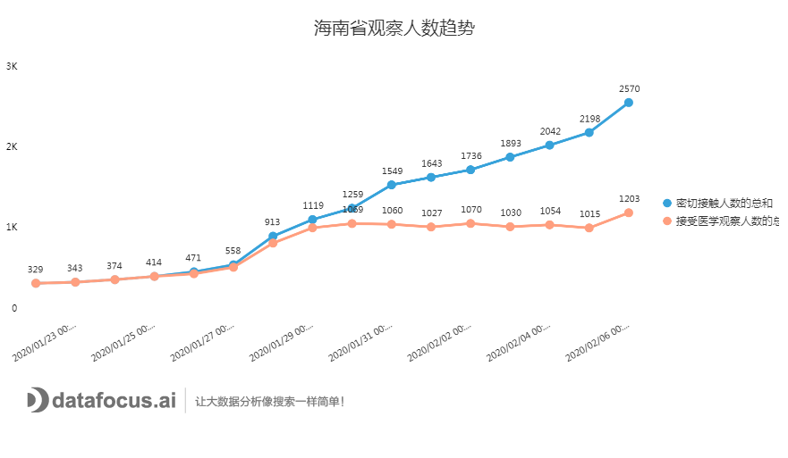

海南省是我国热门的旅游城市，作为“中国最大经济特区省份”+“国际旅游岛”，海南风景优美、生态丰富。然而在这次的疫情阻击战中，海南同样过得“不轻松”。今天，小编就带大家来分析下海南的新型冠状病毒感染的肺炎疫情的发展历程和现状。

1、现状

截至2月6日，海南省累计报告新型冠状病毒感染的肺炎确诊病例111例。如下图1所示，三亚市和海口市首当其冲，分别确诊病例32例和19例，两者总计占全省肺炎人数的50%。三亚市和海口市是热点旅游城市，人口流动量大，因此确诊病例最多。除此之外，白沙、屯昌、五指山三个地区目前暂无确诊病例出现。

海南省是我国最南边的省份，地理位置偏僻。在目前交通管制全面化和严格化的背景下，只要对已确诊病例进行严格管控、做好排查工作，疫情好转的速度应当是较快的。

图1：海南省各地级市确诊病例人数

加入时间轴，来看看海南省每日新增确诊病例的变化。从下图中可以看到，近几日的确诊病例依旧呈现出缓步上升的趋势，这说明疫情依旧在扩散，广大市民依旧需要加强自我防护。

图2：海南省确诊人数日增长量

确诊病例的日益上涨的趋势下，我们进一步来看看密切接触人数和接受医学观察人数的情况（如下图3）。可以看到密切接触的人数随着病例的确诊依旧在上升，但接受医学观察的人数开始平缓波动。

图3：海南省密切接触&接受医学观察人数的日趋势图

每个年龄段都有其不同的身体机理，那么新型冠状病毒比较“偏爱”哪类人群呢？小编对确证病例进行了年龄组的分布统计（如下图4）。从环图中可以看到，截至日前，60-69岁人群确诊34人，50-59岁确诊病例23人，30-39岁确诊病例20人。因此，可以大致判断出50-69岁人群最易感，青年人是第二大易感人群，儿童和青少年虽情况良好，但也有确证病例出现，不能掉以轻心。

图4：海南省确诊病例年龄分布图

1月27日，海南省出现第一例死亡病例，截止日前，共有死亡病例两例。小编计算了确诊人数中的治愈率和重症率，如下图5所示，可以看到重症率到目前为止开始稳定在0.13左右，且有下降的趋势，而治愈率开始波动上升，这都说明医疗救援工作到位、效果较佳。

图5：海南省重症率&治愈率日趋势图

据介绍，海南省新型冠状病毒感染的肺炎疫情中，聚集性疫情涉及15起，15起聚集性疫情均为小范围密切接触（或家庭聚集或朋友聚集或单位聚集）或共同暴露传播引起，其中只有1起为出入性疫情引起的本地聚集性疫情。因此广大市民需严格响应国家宣传，少聚集，勤洗手；严格落实灵活性复工、延期返学的有关规定，按规定做好健康管理工作。管好自己就是为疫情战斗做贡献。
