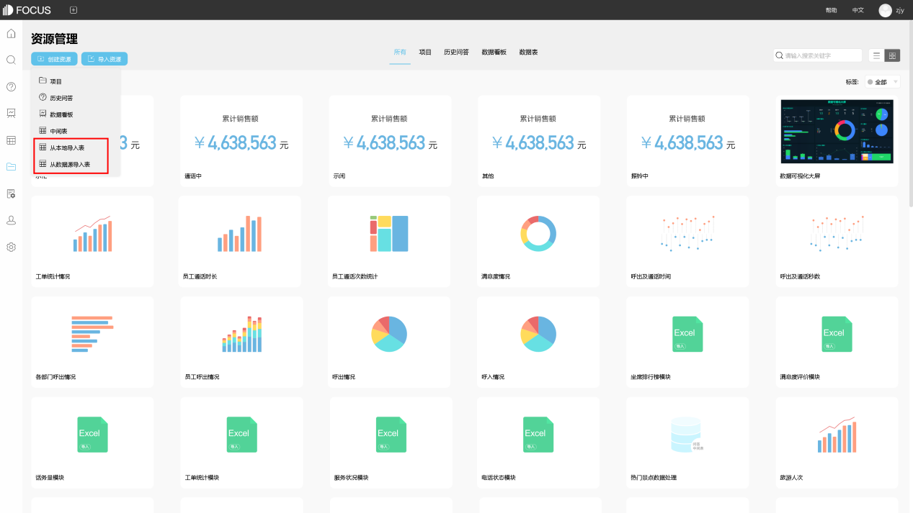
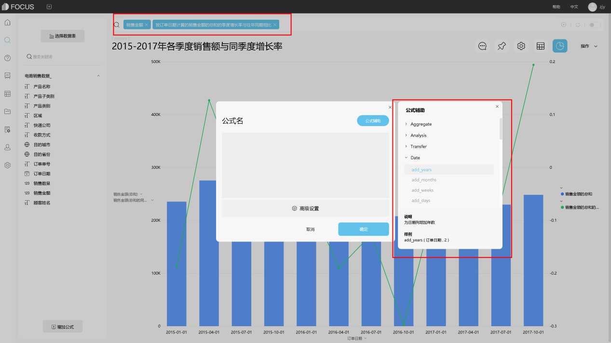

## 何为数据分析？

在如今这个大数据时代，大数据的应用越来越彰显它的优势，且占领的领域也越来越大。那么，如何对数据进行分析，以使其得到更好的应用呢？今天，我们借助DataFocus系统开启了解数据分析的里程。

## 一、什么是数据分析

数据分析，对数据有目的地进行分析以获取信息并使其更易于理解。对于从事数据分析工作的人员，除了借助数据发现事实存在的“经验和常识”，还应通过适当的统计、分析方法，发现数据潜在的价值，预知未来可能发生的某种情景，在为公司规避风险的同时抓住机遇，实现数据分析工作的价值。

## 二、数据分析步骤

数据分析一般包括六个阶段：明确需求、数据收集、数据处理、数据分析、数据展现、报告撰写。

### 2.1 数据需求与收集

明确需求是确保数据分析过程有效性的首要条件，为收集和分析数据提供清晰的目标；收集的数据涉及企业内部或企业外部两个数据来源，如产品中用户行为数据、问卷调查数据、新闻、贴吧、QQ群、爬取的数据等等。

### 2.2 数据处理与分析

收集好数据后，需要根据分析的需求对数据进行处理；进而采用适当的分析方法来分析数据。

数据的来源多样且存储格式各异，一般会占用较多的时间对数据进行处理。可以提前和研发、BI等相关部门做好沟通，也可以借助一些商业智能BI处理数据并对处理后的数据进行分析。

例如BI分析系统DataFocus，作为专业的数据分析工具，支持将不同来源的数据进行整合、分析。可以将数据导入到系统自带的数据仓库并设置定时导入，包括本地文件和不同业务数据库中的数据。当然，DataFocus也可以直接连接业务数据库。

图表 2. 1 DataFocus\_数据导入

图表 2. 2 DataFocus\_导入本地文件

在DataFocus系统中，可以直接进行数据清洗、 数据转换，数据抽取、数据分组、数据计算等操作。并采用搜索分析的方式对数据进行结构分析、对比分析、平均分析、交叉分析等等。

图表 2. 3 DataFocus搜索分析与公式计算

### 2.3 结果展现与应用

分析结果主要通过图表的形式来展现，可用于制作可视化大屏、撰写分析报告。

图表 2. 4 DataFocus系统图表

在制图时，需要先确定想要表达的信息，再根据数据关系选择合适的图表，并确保数据展现的真实性和表达的准确性。

在DataFocus系统中制作好的图表可直接用于可视化大屏的制作。

报告的撰写可采用总分结构，分为标题、导语、结论和详细分析四个内容。

## 三、数据分析的价值

数据的价值，往往在于通过数据驱动业务，以期给公司获得更多利润、增强用户体验、为行业发展提供更多可能等等。

例如游戏行业，通过对企业运营情况、畅销游戏类型、IP和题材等数据进行多层次、多角度分析，来了解行业动态、把握市场发展趋势；分析游戏测试数据，对产品的质量进行评估，并帮助产品进行定位；对用户进行画像，以有针对性地制定营销策略等等。

初步了解数据分析及其流程、价值后，接下来文章，我们将对数据分析进行更加细致的了解。
