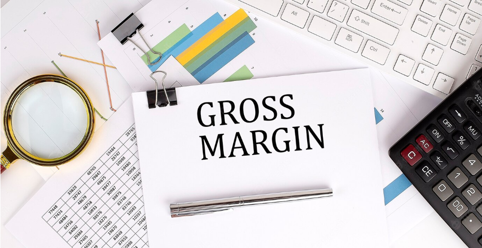
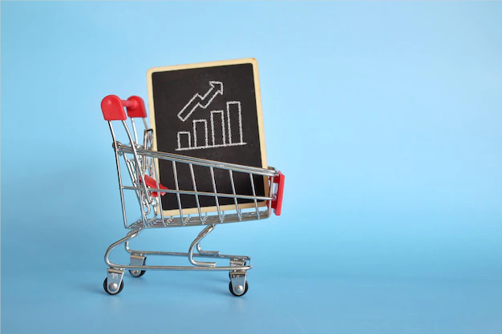

判断企业盈利能力的一个重要指标就是毛利率(GPM)，而决定毛利率的两个因素是收入和销货成本(COGS)。COGS是公司制造产品的直接成本，例如劳动力成本；同时COGS还包括随着产量增加或减少而变化的可变成本，例如原材料和包装。

### **什么是毛利率？**

毛利率(GPM)是在调整运营成本（如营销、间接费用和工资）之前实际利润占收入的百分比。一般情况下，上市公司的毛利率越高，则代表其盈利能力也就越强。

**毛利率计算公式：**

**【总收入($)-销售成本($)】/总收入($)\*100=毛利率(%)**

首先用总收入减去销售成本计算得到毛利润。然后，将得到的毛利润除以总收入，再乘以100得出毛利率(%)。

收入和销货成本数字的时间范围取决于产品的销售周期，可以选择每天、每周、每月或任何对您的公司最有意义的时间段；同样的，可以使用相同的基础公式来计算单个产品或整个公司的毛利率。

### **毛利率与加价**

需要强调的一点是，注意区别毛利率和加价。同样是使用总收入和COGS进行计算，但是这两个KPI会为您提供不同的信息：

- 毛利率是毛利润除以总收入。
- 加价是毛利润除以销售商品的成本。

举个例子，如果本周的总收入为1,000美元，销售成本为700美元，那么毛利率为30%，加价为42.9%。

毛利率：【(1,000-700)1,000】\*100=30%

加价：【(1,000-700)/700】\*100=42.9%

### **跟踪毛利率的优缺点**

**优点**

毛利率是一项重要的健康指标，值得定期检查，它代表了公司的盈利能力，始终关注利润的增长，而不仅仅是收入。与毛利润不同，毛利润显示的是绝对利润值，而毛利率显示的是利润的百分比

该指标还突出了潜在的改进领域。查看产品的盈利能力将有助于确定是提高价格、降低生产成本还是完全停产产品。

GPM还可以帮助决定投资营销支出。例如，假设您正在开展一项特别促销活动以增加产品购买量，跟踪毛利率是监控和衡量促销盈利能力的有效方法。如果此活动有利可图，您可能会延长促销活动或在以后再次运行它；如果没有，您可以进行更改或完全废弃它。

**缺点**

毛利率对公司整体是否盈利的看法有限，不能全面了解公司的财务状况。它没有考虑到巨大的运营成本，例如工资、间接费用和营销支出。

为了更全面地了解盈利能力，还需要计算净利润率(NPM)。NPM会考虑运营成本、税收和其他费用。

像任何单一利率一样，毛利率不能告诉你一切。当与其他指标一起跟踪时，它最有用。跟踪营业收入（也称为营业利润）以及GPM将帮助您更全面地了解您的产品或公司的盈利能力。

### **将毛利率添加到监控数据看板**

跟踪毛利率让可以帮助用户专注于盈利能力，而不仅仅是收入。将此KPI添加到您的DataFocus数据看板对于监控活动促销的成功特别有用，用时监控GPM变动可以了解其在整个生命周期中的变化趋势，分析公司的销售运营能力。

### **总结**

截至2020年初，在线零售的平均毛利率为45%。

通过行业平均值可以帮助企业大致了解毛利率的基准。一旦确定后，毛利率应该相对稳定（除非对业务模式进行了重大更改），频繁的变化可能意味着公司销售不稳定或者费用变化很频繁等。

毛利率表明了公司的销售和生产流程是否有效运行。如果GPM较低，则可能意味着您的COGS太高。然后，就可以分析和改进生产过程以降低成本。

**拥有低利润产品是可以的，但不知道哪些商品带来的利润不足是不对的。**

如果发现利润率低，不必惊慌。首先需要知道产品是否没有盈利，这样才可以采取措施降低成本或增加收入。

同时还可以查看特定产品的毛利率，看看哪些产品带来的利润最多。这对于选择将营销工作集中在哪里十分有帮助。
