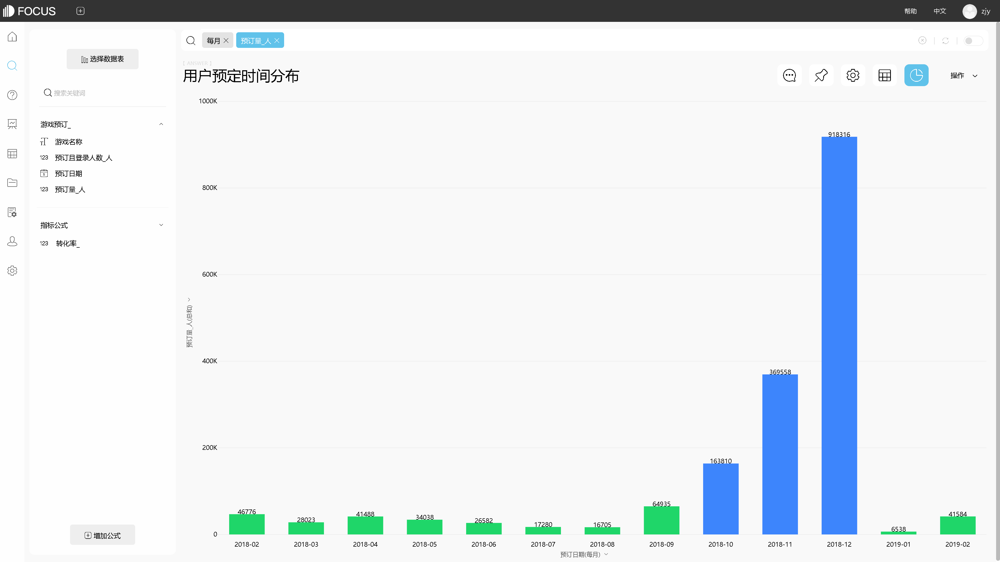
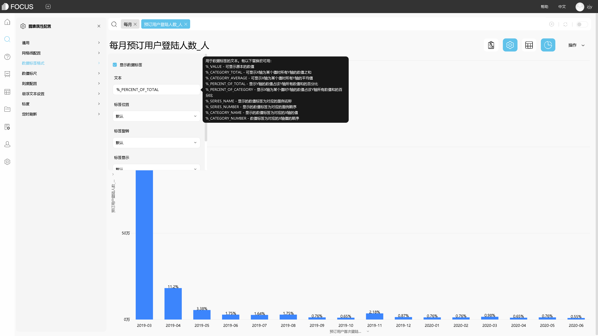

企业关键业绩指标（KPI – Key Process Indication）是通过对组织内部某一流程的输入输出端关键参数进行设置、取样、计算、分析，衡量流程绩效的一种目标式量化管理指标，是把企业的战略目标分解为可运作的远景目标的工具，是企业绩效管理系统的基础，可以使部门主管明确部门主要责任，并以此为基础，明确部门人员的业绩衡量指标。

我们来使用DataFocus数据分析工具，根据汽车制造的流程，针对生产与质管部门的业务需求，尝试制作一个汽车制造生产质管的KPI系统用来对生产业务的完成进度和效率进行有效分析。

1. 产品产值对比

产品产值是以货币形式表现的，工业企业一定周期内生产的最终产品和提供工业性劳务活动的总价值量。表明了企业生产的总规模和总水平，反应的是生产总成果。

2.产品生产计划完成率

生产计划完成率是按周期计算的实际生产完成量与计划完成量的一个比率。计划完成量应由企业参照前期数据指定一个合理的计划完成量，实际生产完成量因实际生产的状况而动态变化。

3.产品每日生产效率

生产效率是指固定投入量下，制程的实际产出与最大产出两者兼得比率，可反映出大成最大产出或预定目标的程度，可以用来衡量经济个体在目标下的绩效。

4．十二月产品一次合格率

一次检查合格率是在生产线上进行全部或特定的某个项目的检查时，按检查作业要求正常操作时，第一遍检查结果就能合格，一次检查合格总数占检查总数的比率。管理上，对于产品的某些重要特性，常用一次检查合格率来评价其品质特性，它能明显地反映工序中对该相关特性的质量保证能力。

5.设备利用率情况

设备利用率是指设备实际使用时间占计划用时的百分比，是反映设备工作状态及生产效率的技术经济指标。在一般的企业当中，设备投资常常在总投资中占较大的比例。

6.设备故障率情况

设备故障是指设备在其寿命周期内，由于磨损或操作使用等方面的原因，使设备暂时丧失其规定功能的状况。对设备采取状态维修，及时进行维修，就可以延长设备的服役寿命。

将所有问答放在同一个可视化看板中。

以上就是用DataFocus数据分析工具制作出的简单的质管数据板的效果。
