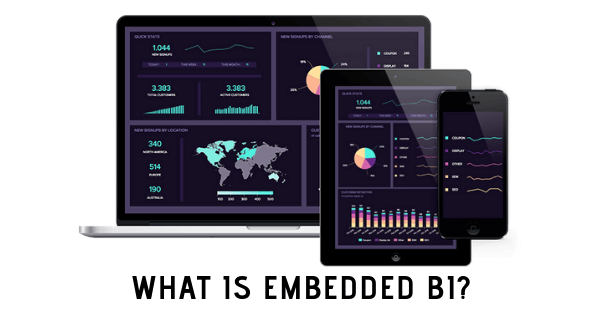
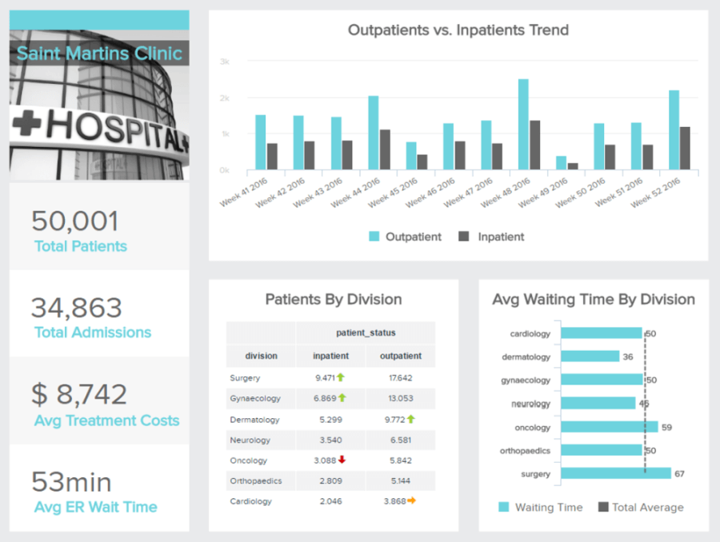
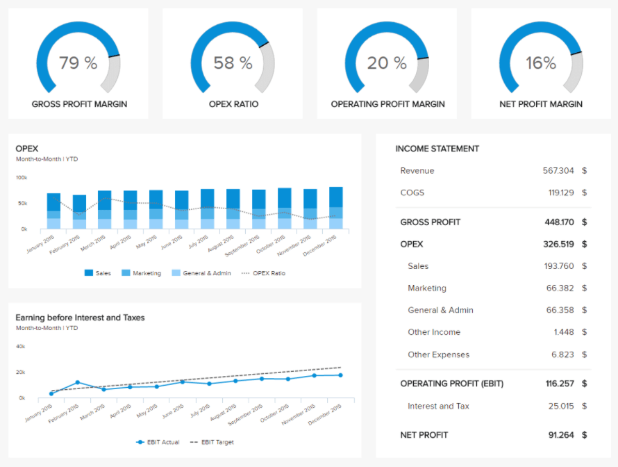

在现代商业世界中，数据是成功的关键——但前提是您知道如何利用它来发挥自己的优势。Forbes Insights的一项研究发现，低质量的数据或数据处理不当可能会使企业面临巨大失败的风险。此外，糟糕的[数据质量管理](https://www.datafocus.ai/infos/data-quality-management-and-metrics)目前使企业每年总共损失 970 万美元。

为了利用触手可及的洞察力，并将其转化为有别于竞争对手的举措，公司必须利用优越的分析工具、资源和平台。进入嵌入式分析和嵌入式商业智能。

如果企业想要充分利用他们的数据，就需要集成的[数据分析工具。](https://www.datafocus.ai/infos/data-analyst-tools-software)数据和分析环境可能难以驾驭，拥有合适的支持工具可以帮助公司获得他们所需的洞察力，以满足甚至超越他们的业务目标。能够基于无缝、易于阅读和用户友好的分析洞察做出实时决策，对于任何现代组织的持续成功都至关重要。

当我们探索嵌入式商业智能（或嵌入式 BI）时，我们也在谈论嵌入式分析。[这些工具和方法增强了解释能力，解决了有针对性的挑战，解决了风险，并通过智能现代实时仪表板](https://www.datafocus.ai/infos/live-dashboards)工具提供实时分析解决方案。

在这里，我们将更详细地研究嵌入式 BI 和分析，解释这些概念在实际环境中的力量和潜力。我们不仅将深入研究现代应用程序中的嵌入式分析、商业智能用例和嵌入式分析示例，还将讨论嵌入式商业分析、内部嵌入式分析等。

## 什么是嵌入式商业智能？

从根本上说，嵌入式 BI 将通常与[BI 工具](https://www.datafocus.ai/infos/best-bi-tools-software-review-list)（数据可视化、[仪表板报告](https://www.datafocus.ai/infos/dashboard-reporting)等）相关的功能添加到现有业务应用程序中。它结合了易于使用的分析工具，因此您可以直接读取数据模式。

当问自己“什么是嵌入式分析？” 时，从各个角度考虑这个概念是值得的。

另一种解释商业智能的方式是通过著名的独立研究公司Gartner提供的简明定义：_“在事务性业务应用程序中使用报告和分析功能。”_

由于环境的原因，分析的这个分支与传统的商业智能不同：嵌入式分析是一组集成到已经运行或存在的系统（CRM、ERP 等）中的功能，通过更好的报告、更好的交互性、更广泛的可访问性、增强的用户体验和更准确的[在线数据可视化](https://www.datafocus.ai/infos/data-visualization-tools)过程来改进这些功能。

在决策或行动发生的情况下，嵌入式BI以支持决策或特定行动的集中信息为中心。

根据您选择的[嵌入式仪表板](https://www.datafocus.ai/infos/embedded-dashboards)解决方案，有很多选项可用。许多嵌入式 BI 供应商提供交互性选项（向下钻取、放大、过滤），提供特定于用户的内容，同时限制对更深层数据的访问；其他人则深入品牌建设；有些公司将[在线仪表板](https://www.datafocus.ai/infos/online-dashboard)的更新和维护外包出去 等等。

凭借这些丰富的选择，您可以创建解决方案、解决挑战、做出预测并为您的组织提供新的价值，同时达到或超越您的核心业务目标。

## 为什么嵌入式 BI 很重要？

_资料来源：__百叶窗_

我们已经回答了问题：“什么是嵌入式分析？” 现在，让我们考虑一下它在业务环境中的重要性。

BI 应用程序和业务流程应用程序具有不同或独立的界面，这一事实迫使用户不断地在它们之间切换，以分析并从数据中获得价值。这种人工处理商业智能的方法常常变得碎片化且耗时。

Logi Analytics 的一份报告发现，83% 的受访者不喜欢在独立的分析应用程序之间切换，宁愿只使用一个。此外，应用程序团队中 93% 的人员目前正在使用嵌入式分析。

**那么，为什么嵌入式商业智能软件如此热门呢？**归根结底，业务用户希望在他们现有的应用程序中与分析驱动的洞察进行交互。绝大多数用户根本不想访问单独的程序来获得有价值的业务洞察。这种分析将数据驱动的智能与业务流程应用程序集成在一起，使用户能够享受最终更加高效、可预测和繁荣的无缝体验。

让我们深入研究嵌入式 BI 工具如何帮助您的业务在日益受技术驱动的数字环境中更有效地运作，尤其是通过白标和定制解决方案。

## 白标和嵌入式分析

对于大多数形式的嵌入式 BI 软件或嵌入式 BI 报告，可以自定义界面并添加您或客户的配色方案、样式或徽标。这被称为白标。在将商业智能嵌入现有应用程序时，这通常是首要的要求，可以让其看起来像是您自己的解决方案，而不是其他人的解决方案。将分析扩展到品牌应用程序提供了匹配组织品牌和集成强大分析解决方案的机会，而组织或公司的任何品牌要求或一致性保持不变。然后，报告、数据可视化或仪表板变得更快，业务决策更加敏捷。

嵌入 BI 软件的白标不仅使应用程序或软件看起来更具凝聚力；熟悉的设计还可以提高参与度并增强可用性。以下是其他一些关键的白标优势：

- 减少实施所需的开发时间和资源。
- 提高客户或员工的用户满意度。
- 一种使自己与竞争对手区分开来的可行方法。

当您考虑实施嵌入式 BI 工具时，需要考虑以下关键因素：

- **大小：** 您需要处理多少数据？千兆字节，兆字节？大型数据集可能会导致某些工具的性能出现问题，因此这一点应作为重点关注的问题之一。
- **报告：** 该工具是否足够灵活，使用户能够生成自己的报告、自定义查询和分析所需的数据？通过使每个业务用户都能执行他们的分析，从部门员工到管理级别，该工具必须足够灵活，以便在整个公司的每个级别使用。
- **数据结构和集成：** 您是否有多个数据源并且需要不同的[数据集成连接器](https://www.datafocus.ai/infos/data-connectors)来组织您的报告和分析？

这些是关于白标的一些主要问题和要点，以及在实施此类解决方案时要记住什么，但公司可以获得哪些具体好处，以及有哪些真实的例子？这些是我们接下来要重点关注的方面。

## 嵌入式分析的 6 大好处

嵌入式商业智能软件很有吸引力，因为它可以缓解人与数据之间的交互。为了证明这一点，这里列出了这种分析在当今高度互联的数字环境中变得越来越流行的关键原因。

### 1\. 用户体验

由于指标和洞察力的巨大财富，数据和分析可能特别令人望而生畏。但是，通过将分析工具嵌入到您最关键的业务平台或应用程序中，您将使一切变得更加无缝且压力更小。仅提高可用性就能让人们放心，并让他们更有信心从数据中获得洞察力。根据 Capterra 的说法，当您已经知道如何使用某个软件并且可以简单地添加新工具来帮助您更好地完成工作时，它会带来非常出色的用户体验。

借助嵌入式商业智能，您可以改进应用程序的报告功能，并让您的客户更好地了解您为他们收集的数据。还可以使用客户的徽标和颜色为工具贴上白标或品牌，以获得更加个性化的用户体验。

### 2\. 更快的开发过程和更低的总成本

BI 部署需要大量时间，从规划到开发，此外还需要大量的资源用于更重要的项目。得益于嵌入式分析，开发时间和上市速度可以显着减少，并且以前分配给自定义代码应用程序或创建可视化的内部资源可以用于其他关键的内部需求或任务。

同样，嵌入式 BI 工具的维护和支持成本也很低，因为您不负责它们。用户可以在内部开发人员几乎没有帮助的情况下继续受益。此外，当您考虑到可以定制应用程序的内部开发人员通常也是开发和维护公司网站、销售和人力资源系统、应付账款和应收账款系统的同一个人时，这些功能都将受益于内部支持，而不是创建报告和可视化。

### 3\. 人们花更多时间在软件上

当您在现有应用程序上花费大量时间和金钱以帮助为您的组织提供基于信息的洞察力时，您会希望每个人都尽可能多地花时间在这些应用程序上。当新的分析工具出现时，如果每个人都必须从头开始学习如何使用新软件，您的生产力水平将会直线下降。根据 Capterra 的说法，直接结果是，人们在他们已经知道的应用程序上花费了更多时间。根据之前提到的 Logi Analytics 调查，84% 的人表示他们花在使用软件程序上的时间比做任何其他事情的时间更多。

### 4\. 获得竞争优势

使用第三方的嵌入式分析，其唯一重点是开发尖端分析技术，不仅可以节省您的时间和金钱；您还将在功能和质量方面受益。

### 5\. 嵌入式分析促进更好的决策

通过对现有应用程序中的分析功能进行高级访问，业务用户能够从他们的数据中获得更智能的洞察力。无论您是在应对业务挑战、在组织内创造机会，还是在开发有助于推动业务成功的解决方案，嵌入式 BI 解决方案都可以帮助您访问能够带来所需结果的数据类型。

### 6\. 跨部门团队合作

当分析数据触手可及并且在整个组织中都可以访问时，它开始创建一个业务环境，在这种环境中，洞察和决策在所有部门和团队中传播。很容易看出嵌入式商业智能如何为您的企业未来的成功铺平道路。

_简单明了地说_：它使企业中的人们可以轻松使用分析工具，从而培养仪表板文化——但也鼓励人们深入了解他们需要的数据驱动的见解，以便在组织内创建解决方案、管理风险和解决挑战。

现在我们已经确定了嵌入式 BI 解决方案的优势，让我们来看看实施这些解决方案的过程。

## 嵌入式分析的过程 - 如何？

就其本质而言，嵌入式商业智能软件是直观、易于实施和通用可导航的，这意味着组织内的每个人都可以从增加对关键见解的访问中受益。但是您如何着手实施这种分析以及需要注意什么？

为确保您从一开始就获得内部分析，你需要考虑以下几点:

- **当前解决方案：**在为您的集成数据需求决定嵌入式 BI 供应商之前，您应该了解您在整个业务中使用的所有当前软件解决方案和平台，并确保您选择的嵌入式分析工具与所有这些应用程序无缝集成。如果不这样做，可能会花费您大量的时间和金钱。
- **定义要求：**在做出任何承诺或采取任何内部行动之前，您应该与来自每个部门的关键成员会面，并根据以下参数定义您的核心嵌入式分析要求：大小（以兆字节、千兆字节等为单位）、报告需求（预定义的嵌入式分析模板是否足够，或者您是否需要生成自定义查询和报告？）、安全权限（您需要在整个业务中设置多少限制和权限？）以及数据复杂性（您当前数据的结构如何？）。一旦您考虑了所有这些元素，您就可以根据自己的需要选择合适的嵌入式 BI 软件。
- **展望未来：**商业智能有能力让不确定变得更加确定。当您决定开始集成此类分析并为您的业务选择正确的嵌入式分析工具时，您需要考虑您未来可能的需求以及您选择的工具是否可以随您一起扩展和发展。不这样做也可能会花费您的时间和金钱。

花时间仔细考虑这些非常重要的决定，以确保您的嵌入式解决方案在未来几年内为您服务。

## 利用这些嵌入式 BI 示例

既然我们已经详细讨论了这个主题，让我们从销售开始探讨这种分析的一些关键类型、嵌入式分析的示例和嵌入式分析模板。

### 1\. 销售部门的嵌入式分析

使用嵌入式 BI ，您_将_有更多机会与客户进行销售。通过使用像 SugarCRM 或 Salesforce 这样的客户关系管理软件，您可以根据您的客户以及您的销售代表收集数据，然后从这些数据中获得大量宝贵的见解。但是，以有意义的方式分析和可视化这些数据会更好，因为它可以帮助您创建交互式仪表板和[销售报告](https://www.datafocus.ai/infos/sales-report-kpi-examples-for-daily-reports)，从而以可理解的方式提供正确的信息。

这个嵌入式分析示例是一个[销售仪表板](https://www.datafocus.ai/infos/dashboard-examples-and-templates-sales)，详细介绍了销售周期长度以及不同销售经理在将潜在客户转化为交易方面的表现。使用这个最有价值的嵌入式分析模板，您可以轻松地以视觉上可理解的格式理解这些数据：

_\*\*点击放大\*\*_

### 2\. 针对医疗保健的嵌入式分析

医疗保健行业充斥着大量数据，但由于部门和机构承受着如此大的压力，处理这些数据的时间非常有限。将软件集成到医院的日常流程中是最近才引入的；医生、护士和其他从业人员并不总是具备处理多种不同软件的技术 IT 背景，因为他们接受过护理和治疗方面的培训。他们也没有时间或精力投入学习使用新软件。

然而，监管框架已经产生了对报告和分析的需求——因此它们无法逃避这一责任。这就是嵌入式 BI 的价值所在：在使用相同的软件收集患者数据的同时，医疗保健专业人员可以生成有意义的[管理报告](https://www.datafocus.ai/infos/management-reporting-best-practices-and-examples)和仪表板，这对设施的顺利运行至关重要。

这个嵌入式分析示例是一个[医院 KPI 仪表板](https://www.datafocus.ai/infos/dashboard-examples-and-templates-healthcare#hospital-kpi-dashboard)，可以为您的设施的有效管理提供很大帮助。它有助于识别潜在的瓶颈并概述随时间发生的趋势，从而使您能够调整资源分配：

_\*\*点击放大\*\*_

### 3\. 嵌入式金融分析

[对商业智能](https://www.datafocus.ai/infos/bi-skills-for-business-intelligence-career)用例的另一个宝贵洞察来自金融部门。

金融行业充斥着大量的事实、数据和指标，需要以极其精确的精度来处理——即使是最轻微的计算错误也会让公司或银行的客户、合作伙伴和投资者损失大量的时间和金钱。这就是[财务报告和分析](https://www.datafocus.ai/infos/financial-reporting-and-analysis)需要嵌入式 BI 帮助的地方。

嵌入式分析模板和软件不仅有助于减少财务数据的碎片化，使其处理更加准确，而且由于其可访问性，它允许整个财务组织的各部门通过简单地利用一份全面、智能的[财务报告](https://www.datafocus.ai/infos/daily-weekly-monthly-financial-report-examples)，利用新的、更具凝聚力的见解，发挥其优势。

凭借这种级别的访问和可用性，金融机构可以做出更快、更明智的投资决策，提高内部经济效率，改善消费者关系等等。

下面是嵌入式 BI 模板，一个[财务仪表板](https://www.datafocus.ai/infos/dashboard-examples-and-templates-finance)，它使用有价值的[财务 KPI](https://www.datafocus.ai/infos/kpi-examples-and-templates-finance)组合来更准确地计算收入和支出，同时获得一定程度的洞察力，最终可以每年为金融业务和部门节省大量资金，这些成本可以投资到业务的其他地方。

_\*\*点击放大\*\*_

## 实时决策驱动程序

如上面的三个嵌入式分析示例所示，嵌入式 BI 具有直接影响组织的实际应用程序。反过来，这可以帮助协调工作流程、准确记录员工的工作时间、为劳动力部署提供额外帮助等等。不难看出，嵌入式分析的现代应用程序不仅对您的组织而言不可思议，而且在当今竞争异常激烈的商业世界中也是一种必需品。

嵌入式商业智能使企业能够跨部门和团队做出更好的、实时的、 [数据驱动的决策。](https://www.datafocus.ai/infos/data-driven-decision-making-in-businesses)不再需要成为 IT 专家或阅读代码来理解数据并使用它来制定明智的决策，从而在各种业务活动中影响您的组织。

通过这种分析，就有了一种用户友好的方式来读取数据模式，并进一步促进更好的决策制定，这样每个人都可以回到工作中做他们最擅长的事情，同时读取数据并基于分析轻松获取信息并应用这些知识来创建解决方案、解决挑战和管理组织内的风险。

还想知道嵌入式业务分析或想知道嵌入式报告定义在实践中是什么样子的吗?免费试用 DataFocus的 [30天试用版](https://www.datafocus.ai/console/) ，亲自查看，或联系我们，讨论为您的应用定制解决方案。
