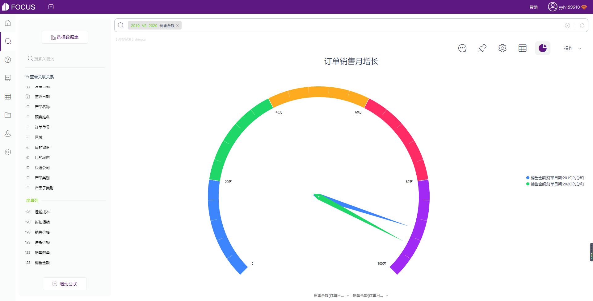

随着数据时代的到来，各行各业的经营发展开始注重数据思维。而在平时工作中，很多新手数据分析师容易犯的问题是，把数据孤立，不去找合适的参考指标和对比关系，只盯着分析结果，这样的分析不仅不全面，也很难找到数据的价值。

当解读数据时，就需要结合现实的情况做评估，而最好用也最实用的方法就是对比分析。没有对比，就不能说明问题，这也是对比分析法经久不衰的原因之一。

主管让你分析一下本月某产品的销售现状，你发现整个公司的本月销售额下降了20%，但该产品部门的销售额仅下降了8%。这就是不同的对比标准，但是这样能证明这个部门没有问题吗？也不全是，假如同行业的销售额不降反增，可以看出其中还是出现了问题。这就是对比分析的作用，没有对比就没有数据结论！

**对比分析和谁比？**

确定对比的对象，是对比分析的第一步。可以进行横向对比和纵向对比。

横向对比：可以和对手比。可以通过行业趋势与业务发展趋势进行对比，来衡量业务发展是否健康，也可以和行业标准、竞品现状进行对比，以判断业务是否赶超竞品，达到行业标准，以调整业务发展方向和策略。

纵向对比：可以和自己比。可以通过某段时间的业务指标数值来衡量业务情况，也可以通过同比、环比等指标来衡量业务变化趋势。

**对比分析怎么比？**

有了对比对象，我们接下来就要考虑怎么比。这里以DataFocus工具使用为例。

一共有三种方式，对比数据整体大小、整体波动、趋势变化。

1、对比数据整体大小，可以将业务数据和某段时间内的平均值、目标值做对比，当然也可以和行业标准数值对比。

例如电商大促活动月，GMV一定是高于全年月均值的。那这时候就可以和目标值进行对比，看今年的大促活动是否达到目标，如果没有达到可以继续分析是哪个区域、哪个品类、哪个环节出现问题，当然你也可以和行业标准值进行对比，看是否高于行业标准值。

2、衡量数据整体波动

可以看是周期性波动、业务内部因素波动、外部波动还是其它意外因素引起的数据波动。

3、衡量数据趋势变化

可以从时间和空间两个不同维度展开考虑，时间维度可以考虑同比、环比、定比等等，空间维度可以考虑产品、用户、区域等多个层面进行对比。

例如通过DataFocus搜索式分析，搜索框直接输入 2019VS2020 销售额，就可以看到这两年销售额对比情况。

**对比分析还需注意可比性**

当然我们还需注意对比对象必须是同类型，同领域的，例如抖音和快手平台数据对比、淘宝和京东数据对比，例如拿淘宝GMV和抖音GMV相比就不太合适了。

对比分析更重要的是分析和追踪数据，将分析结果落地，并让数据产生价值。
