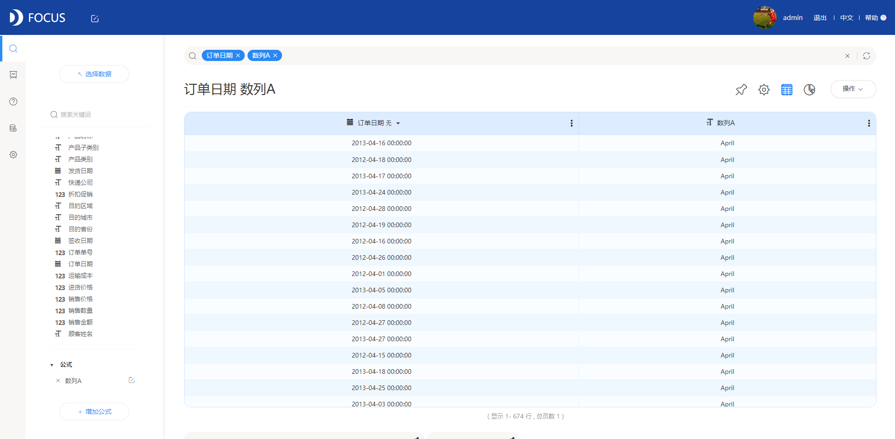
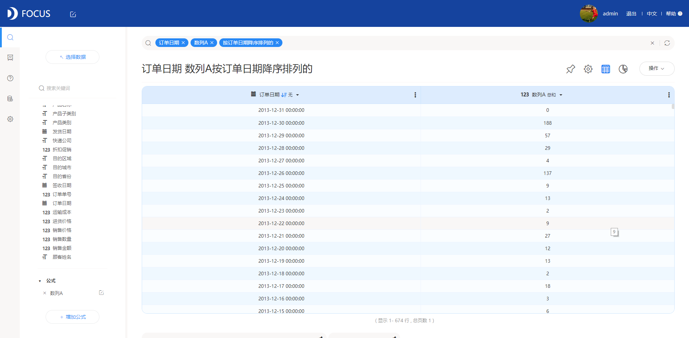

在数据分析中，同样的数据场景采用不同的图表会带来很大的信息差距。正确的匹配数据与图表不仅要有对数据结构的理解、业务的理解，还需要对图形语言学的一定了解和实际可视化项目中的经验，每一个元素背后都有着很深的学问，这里总结了一些常用图表的特性，可以帮助用户更高效的选择合适的图表类型。

数据场景千千万，每个不同的场景都有不同的数据结构、数据记录数和业务需求，这里先不论具体的业务要求，单说不同的数据结构和数据量，大致能够分为四类数据场景：对比/结构分析/分布/关联。

今天先来说一说分布分析场景。

1、说到分布型就想到散点图，散点图可以说是是很典型的双变量分布图表了，尤其是在双数轴的情况下，用两组数据构成多个坐标点，考察坐标点的分布，判断两变量之间是否存在某种关联或总结坐标点的分布模式。搭配辅助线可以很有效的看出相关性、异常数值和集群趋势，多用于进行数据分析中常用的回归分析。

2、DataFocus还有添加了时间维度的时序散点图，可以动态连续的观察时间轴变化情况下的散点分布情况。

3、除了散点图，箱型图在筛选异常值方面也很方便有效。箱型图又称为盒须图、盒式图或箱线图，是一种用作显示一组数据分散情况资料的统计图。因形状如箱子而得名。在各种领域也经常被使用，常见于品质管理。它主要用于反映原始数据分布的特征，还可以进行多组数据分布特征的比较。

4、气泡图则常用于三维变量的分布分析。

