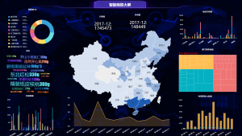

　　可视化大屏设计原则最基本和最经典的原则来自于设计师爱德华·R·塔夫特，他在《量化信息的视觉表现》中概述了数据墨水比例的原则，该原则核心思想就是可视化大屏所显示的内容要简洁、图标要简洁、数据要简洁等。对客户需求的场景，在理解数据复杂性的基础上，通过各种手段，形成一个高度提炼显示形式。在项目的调研和设计上都要简洁、为客户真正的结局问题。今天，我们就来看看datafocus品牌下的可视化大屏都有哪些优势吧。

　**什么是可视化大屏？**

可视化大屏是主要通过借助于图形化手段，清晰地传达和沟通信息。

可视化大屏通俗的讲就是通过图形来讲故事，在可视化大屏上看到的是设计样式，看到的是一些指标数据信息，但再细想一下，人们关心的从来不是数据，数据不是重点，它只是达到目的的手段 ，人们关心的是数据背后的意义。

可视化大屏的过程主要分为以下几个部分，界定问题、探索研究、达成共识、检查测试、原型设计等五个部分。我们了解了客户的需求之后，要提炼出故事信息的关键词，关键词越简单我们理解的就越透彻，datafocus可视化大屏的核心在于对内容的提炼，内容提炼得越精确，设计出来的图形结构就越紧凑，传达的效率就越高。反之，会导致图形结构臃肿散乱，关键信息无法高效地传达给读者。

在可视化大屏运用广泛的时代，简单明了清晰的数据形式是可视化大屏的宗旨。每个用户为了达到自己的工作目的对datafocus品牌下可视化大屏的要求也不同。但是总体来说，datafocus可视化大屏的表现在现阶段的市场中还是十分优异的。
